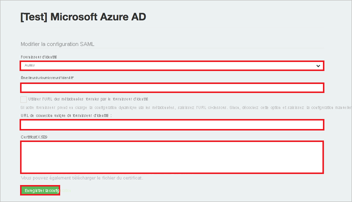

# Tutoriel : Intégration de l’authentification unique Azure AD à GaggleAMP

Dans ce tutoriel, vous allez apprendre à intégrer GaggleAMP à Azure Active Directory (Azure AD). Quand vous intégrez GaggleAMP à Azure AD, vous pouvez :

* Contrôler dans Azure AD qui a accès à GaggleAMP.
* Permettre à vos utilisateurs de se connecter automatiquement à GaggleAMP avec leur compte Azure AD.
* Gérer vos comptes à un emplacement central : le Portail Azure.

## Prérequis

Pour commencer, vous devez disposer de ce qui suit :

* Un abonnement Azure AD Si vous ne disposez d’aucun abonnement, vous pouvez obtenir [un compte gratuit](https://azure.microsoft.com/free/).
* Un abonnement GaggleAMP pour lequel l’authentification unique est activée.

## Description du scénario

Dans ce didacticiel, vous configurez et testez l’authentification unique Azure AD dans un environnement de test.

* GaggleAMP prend en charge l’authentification unique lancée par le **fournisseur de services** et le **fournisseur d’identité**.

* GaggleAMP prend en charge l’attribution d’utilisateurs **juste-à-temps**.

> [!NOTE]
> L’identificateur de cette application étant une valeur de chaîne fixe, une seule instance peut être configurée dans un locataire.

## Ajouter GaggleAMP à partir de la galerie

Pour configurer l’intégration de GaggleAMP à Azure AD, vous devez ajouter GaggleAMP à partir de la galerie à votre liste d’applications SaaS gérées.

1. Connectez-vous au portail Azure avec un compte professionnel ou scolaire ou avec un compte personnel Microsoft.
1. Dans le panneau de navigation gauche, sélectionnez le service **Azure Active Directory**.
1. Accédez à **Applications d’entreprise**, puis sélectionnez **Toutes les applications**.
1. Pour ajouter une nouvelle application, sélectionnez **Nouvelle application**.
1. Dans la section **Ajouter à partir de la galerie**, saisissez **GaggleAMP** dans la zone de recherche.
1. Sélectionnez **GaggleAMP** dans le volet de résultats, puis ajoutez l’application. Patientez quelques secondes pendant que l’application est ajoutée à votre locataire.

## Configurer et tester l’authentification unique Azure AD pour GaggleAMP

Configurez et testez l’authentification unique Azure AD avec GaggleAMP à l’aide d’un utilisateur test appelé **B.Simon**. Pour que l’authentification unique fonctionne, vous devez établir un lien entre un utilisateur Azure AD et l’utilisateur GaggleAMP associé.

Pour configurer et tester l’authentification unique Azure AD avec GaggleAMP, effectuez les étapes suivantes :

1. **[Configurer l’authentification unique Azure AD](#configure-azure-ad-sso)** pour permettre à vos utilisateurs d’utiliser cette fonctionnalité.
    1. **[Créer un utilisateur de test Azure AD](#create-an-azure-ad-test-user)** pour tester l’authentification unique Azure AD avec B. Simon.
    1. **[Affecter l’utilisateur de test Azure AD](#assign-the-azure-ad-test-user)** pour permettre à B. Simon d’utiliser l’authentification unique Azure AD.
1. **[Configurer l’authentification unique GaggleAMP](#configure-gaggleamp-sso)** pour configurer les paramètres de l’authentification unique côté application.
    1. **[Créer un utilisateur de test GaggleAMP](#create-gaggleamp-test-user)** pour avoir un équivalent de B.Simon dans GaggleAMP lié à la représentation Azure AD associée.
1. **[Tester l’authentification unique](#test-sso)** pour vérifier si la configuration fonctionne.

## Configurer l’authentification unique Azure AD

Effectuez les étapes suivantes pour activer l’authentification unique Azure AD dans le Portail Azure.

1. Dans le portail Azure, accédez à la page d’intégration de l’application **GaggleAMP**, recherchez la section **Gérer**, puis sélectionnez **Authentification unique**.
1. Dans la page **Sélectionner une méthode d’authentification unique**, sélectionnez **SAML**.
1. Dans la page **Configurer l’authentification unique avec SAML**, cliquez sur l’icône de crayon de **Configuration SAML de base** afin de modifier les paramètres.

   

4. Dans la section **Configuration SAML de base**, si vous souhaitez configurer l’application en mode lancé par le **fournisseur d’identité**, effectuez les étapes suivantes :

    Dans la zone de texte **Identificateur**, tapez l’URL : `https://accounts.gaggleamp.com/auth/saml/callback`

5. Si vous souhaitez configurer l’application en **mode démarré par le fournisseur de services**, cliquez sur **Définir des URL supplémentaires**, puis effectuez les étapes suivantes :

    Dans la zone de texte **URL de connexion**, tapez une URL au format suivant : `https://gaggleamp.com/i/<customerid>`

    > [!NOTE]
    > Cette valeur n’est pas la valeur réelle. Mettez à jour la valeur avec l’URL de connexion réelle. Pour obtenir cette valeur, contactez l’[équipe du support technique de GaggleAMP](mailto:sales@gaggleamp.com). Vous pouvez également consulter les modèles figurant à la section **Configuration SAML de base** dans le portail Azure.

6. Dans la page **Configurer l’authentification unique avec SAML**, dans la section **Certificat de signature SAML**, cliquez sur **Télécharger** pour télécharger le **Certificat (Base64)** en fonction des options définies par rapport à vos besoins, puis enregistrez-le sur votre ordinateur.

    

7. Dans la section **Configurer GaggleAMP**, copiez la ou les URL appropriées en fonction de vos besoins.

    

### Créer un utilisateur de test Azure AD 

Dans cette section, vous allez créer un utilisateur de test appelé B. Simon dans le portail Azure.

1. Dans le volet gauche du Portail Azure, sélectionnez **Azure Active Directory**, **Utilisateurs**, puis **Tous les utilisateurs**.
1. Sélectionnez **Nouvel utilisateur** dans la partie supérieure de l’écran.
1. Dans les propriétés **Utilisateur**, effectuez les étapes suivantes :
   1. Dans le champ **Nom**, entrez `B.Simon`.  
   1. Dans le champ **Nom de l’utilisateur**, entrez username@companydomain.extension. Par exemple : `B.Simon@contoso.com`.
   1. Cochez la case **Afficher le mot de passe**, puis notez la valeur affichée dans le champ **Mot de passe**.
   1. Cliquez sur **Créer**.

### Affecter l’utilisateur de test Azure AD

Dans cette section, vous allez autoriser B.Simon à utiliser l’authentification unique Azure en lui accordant l’accès à GaggleAMP.

1. Dans le portail Azure, sélectionnez **Applications d’entreprise**, puis **Toutes les applications**.
1. Dans la liste des applications, sélectionnez **GaggleAMP**.
1. Dans la page de vue d’ensemble de l’application, recherchez la section **Gérer** et sélectionnez **Utilisateurs et groupes**.
1. Sélectionnez **Ajouter un utilisateur**, puis **Utilisateurs et groupes** dans la boîte de dialogue **Ajouter une attribution**.
1. Dans la boîte de dialogue **Utilisateurs et groupes**, sélectionnez **B. Simon** dans la liste Utilisateurs, puis cliquez sur le bouton **Sélectionner** au bas de l’écran.
1. Si vous attendez qu’un rôle soit attribué aux utilisateurs, vous pouvez le sélectionner dans la liste déroulante **Sélectionner un rôle** . Si aucun rôle n’a été configuré pour cette application, vous voyez le rôle « Accès par défaut » sélectionné.
1. Dans la boîte de dialogue **Ajouter une attribution**, cliquez sur le bouton **Attribuer**.

## Configurer l’authentification unique GaggleAMP

1. Dans une autre instance de navigateur, accédez à la page d’authentification unique SML que l’équipe du support technique Gaggle aura créée pour vous (par exemple : *https://accounts.gaggleamp.com/saml_configurations/oXH8sQcP79dOzgFPqrMTyw/edit* ).

2. Sur la page **SAML SSO** (Authentification unique SAML), procédez comme suit :  
   
    

    a. Sélectionnez **Autres** dans le menu déroulant **Fournisseur d’identité**.
    
    b. Dans la zone de texte **Identity Provider Issuer** (Émetteur du fournisseur d’identité), collez la valeur de l’**identificateur Azure AD** que vous avez copiée à partir du portail Azure.
    
    c. Dans la zone de texte **Identity Provider Single Sign-On URL** (URL d’authentification unique du fournisseur d’identité), collez la valeur de l’**URL de connexion** que vous avez copiée dans le portail Azure.
    
    d. Ouvrez dans le Bloc-notes votre fichier **Certificate(Base64)** téléchargé, copiez son contenu dans le Presse-papiers, puis collez-le dans la zone de texte **Certificat X.509**.
    
    e. Cliquez sur **Enregistrer**.

### Créer un utilisateur de test GaggleAMP

Dans cette section, un utilisateur appelé Britta Simon est créé dans GaggleAMP. GaggleAMP prend en charge l’attribution d’utilisateurs juste-à-temps, qui est une option activée par défaut. Vous n’avez aucune opération à effectuer dans cette section. S’il n’existe pas encore d’utilisateur dans GaggleAMP, il en est créé un après l’authentification.

## Tester l’authentification unique (SSO) 

Dans cette section, vous allez tester votre configuration de l’authentification unique Azure AD avec les options suivantes. 

#### Lancée par le fournisseur de services :

* Cliquez sur **Tester cette application** dans le portail Azure. Vous êtes alors redirigé vers l’URL de connexion de GaggleAMP, à partir de laquelle vous pouvez lancer le flux de connexion.  

* Accédez directement à l’URL de connexion de GaggleAMP pour lancer le flux de connexion.

#### Lancée par le fournisseur d’identité :

* Cliquez sur **Tester cette application** dans le portail Azure. Vous êtes alors automatiquement connecté automatiquement à l’instance de GaggleAMP pour laquelle vous avez configuré l’authentification unique. 

Vous pouvez aussi utiliser Mes applications de Microsoft pour tester l’application dans n’importe quel mode. Si, quand vous cliquez sur la vignette GaggleAMP dans Mes applications, le mode Fournisseur de services est configuré, vous êtes redirigé vers la page de connexion de l’application pour initier le flux de connexion ; s’il s’agit du mode Fournisseur d’identité, vous êtes automatiquement connecté à l’instance de GaggleAMP pour laquelle vous avez configuré l’authentification unique. Pour plus d’informations sur Mes applications, consultez [Présentation de Mes applications](../user-help/my-apps-portal-end-user-access.md).

## Étapes suivantes

Après avoir configuré GaggleAMP, vous pouvez appliquer le contrôle de session, qui protège contre l’exfiltration et l’infiltration des données sensibles de votre organisation en temps réel. Le contrôle de session est étendu à partir de l’accès conditionnel. [Découvrez comment appliquer un contrôle de session avec Microsoft Defender for Cloud Apps](/cloud-app-security/proxy-deployment-aad).
