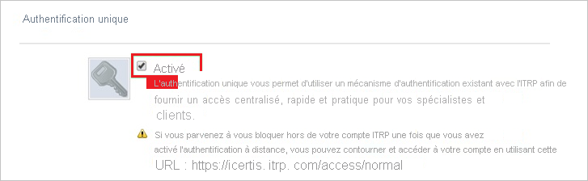
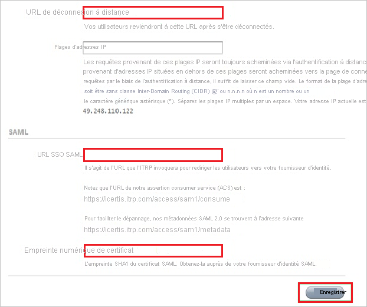
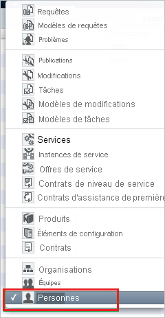

# Tutoriel : Intégration de l’authentification unique Azure AD à ITRP

Dans ce tutoriel, vous allez apprendre à intégrer ITRP à Azure Active Directory (Azure AD). Quand vous intégrez ITRP à Azure AD, vous pouvez :

* Contrôler dans Azure AD qui a accès à ITRP.
* Permettre à vos utilisateurs de se connecter automatiquement à ITRP avec leur compte Azure AD.
* Gérer vos comptes à un emplacement central : le Portail Azure.

## Prérequis

Pour configurer l’intégration d’Azure AD à ITRP, vous devez disposer de ce qui suit :

* Un abonnement Azure AD Si vous n’avez pas d’environnement Azure AD, vous pouvez obtenir un [compte gratuit](https://azure.microsoft.com/free/).
* Un abonnement ITRP pour lequel l’authentification unique est activée

## Description du scénario

Dans ce tutoriel, vous allez configurer et tester l’authentification unique Azure AD dans un environnement de test.

* ITRP prend en charge l’authentification unique lancée par le fournisseur de services.

## Ajouter ITRP à partir de la galerie

Pour configurer l’intégration d’ITRP à Azure AD, vous devez ajouter ITRP à votre liste d’applications SaaS managées, à partir de la galerie.

1. Connectez-vous au portail Azure avec un compte professionnel ou scolaire ou avec un compte personnel Microsoft.
1. Dans le panneau de navigation gauche, sélectionnez le service **Azure Active Directory**.
1. Accédez à **Applications d’entreprise**, puis sélectionnez **Toutes les applications**.
1. Pour ajouter une nouvelle application, sélectionnez **Nouvelle application**.
1. Dans la section **Ajouter à partir de la galerie**, saisissez **ITRP** dans la zone de recherche.
1. Sélectionnez **ITRP** dans le volet de résultats, puis ajoutez l’application. Patientez quelques secondes pendant que l’application est ajoutée à votre locataire.

## Configurer et tester l’authentification unique Azure AD pour ITRP

Configurez et testez l’authentification unique Azure AD avec ITRP à l’aide d’un utilisateur de test appelé **B.Simon**. Pour que l’authentification unique fonctionne, vous devez établir un lien entre un utilisateur Azure AD et l’utilisateur ITRP associé.

Pour configurer et tester l’authentification unique Azure AD avec ITRP, effectuez les étapes suivantes :

1. **[Configurer l’authentification unique Azure AD](#configure-azure-ad-sso)** pour permettre à vos utilisateurs d’utiliser cette fonctionnalité.
    1. **[Créer un utilisateur de test Azure AD](#create-an-azure-ad-test-user)** pour tester l’authentification unique Azure AD avec B. Simon.
    1. **[Affecter l’utilisateur de test Azure AD](#assign-the-azure-ad-test-user)** pour permettre à B. Simon d’utiliser l’authentification unique Azure AD.
1. **[Configurer l’authentification unique ITRP](#configure-itrp-sso)** pour configurer les paramètres de l’authentification unique côté application.
    1. **[Créer un utilisateur de test ITRP](#create-an-itrp-test-user)** pour avoir un équivalent de B.Simon dans ITRP lié à la représentation Azure AD associée.
1. **[Tester l’authentification unique](#test-sso)** pour vérifier si la configuration fonctionne.

## Configurer l’authentification unique Azure AD

Effectuez les étapes suivantes pour activer l’authentification unique Azure AD dans le Portail Azure.

1. Dans le portail Azure, accédez à la page d’intégration de l’application **ITRP**, recherchez la section **Gérer**, puis sélectionnez **Authentification unique**.
1. Dans la page **Sélectionner une méthode d’authentification unique**, sélectionnez **SAML**.
1. Dans la page **Configurer l’authentification unique avec SAML**, cliquez sur l’icône de crayon de **Configuration SAML de base** afin de modifier les paramètres.

   

4. Dans la boîte de dialogue **Configuration SAML de base**, effectuez les étapes suivantes.

    1. Dans la zone de texte **Identificateur (ID d’entité)**, entrez une URL au format suivant :

       `https://<tenant-name>.itrp.com`

    1. Dans la zone de texte **URL de connexion**, tapez une URL au format suivant :
    
       `https://<tenant-name>.itrp.com`   

    > [!NOTE]
    > Ces valeurs sont des espaces réservés. Vous devez les remplacer par les valeurs réelles de l’identificateur et de l’URL de connexion. Pour obtenir ces valeurs, contactez l’[équipe du support technique ITRP](https://www.4me.com/support/). Vous pouvez aussi vous référer aux modèles figurant dans la boîte de dialogue **Configuration SAML de base** dans le portail Azure.

5. Dans la section **Certificat de signature SAML**, sélectionnez le bouton **Modifier** pour ouvrir la boîte de dialogue **Certificat de signature SAML** :

    

6. Dans la boîte de dialogue **Certificat de signature SAML**, copiez la valeur **Thumbprint** du certificat et enregistrez-la :

    

7. Dans la section **Configurer ITRP**, copiez la ou les URL appropriées, en fonction de vos besoins :

    

### Créer un utilisateur de test Azure AD

Dans cette section, vous allez créer un utilisateur de test appelé B. Simon dans le portail Azure.

1. Dans le volet gauche du Portail Azure, sélectionnez **Azure Active Directory**, **Utilisateurs**, puis **Tous les utilisateurs**.
1. Sélectionnez **Nouvel utilisateur** dans la partie supérieure de l’écran.
1. Dans les propriétés **Utilisateur**, effectuez les étapes suivantes :
   1. Dans le champ **Nom**, entrez `B.Simon`.  
   1. Dans le champ **Nom de l’utilisateur**, entrez username@companydomain.extension. Par exemple : `B.Simon@contoso.com`.
   1. Cochez la case **Afficher le mot de passe**, puis notez la valeur affichée dans le champ **Mot de passe**.
   1. Cliquez sur **Créer**.

### Affecter l’utilisateur de test Azure AD

Dans cette section, vous allez autoriser B.Simon à utiliser l’authentification unique Azure en lui accordant l’accès à ITRP.

1. Dans le portail Azure, sélectionnez **Applications d’entreprise**, puis **Toutes les applications**.
1. Dans la liste des applications, sélectionnez **ITRP**.
1. Dans la page de vue d’ensemble de l’application, recherchez la section **Gérer** et sélectionnez **Utilisateurs et groupes**.
1. Sélectionnez **Ajouter un utilisateur**, puis **Utilisateurs et groupes** dans la boîte de dialogue **Ajouter une attribution**.
1. Dans la boîte de dialogue **Utilisateurs et groupes**, sélectionnez **B. Simon** dans la liste Utilisateurs, puis cliquez sur le bouton **Sélectionner** au bas de l’écran.
1. Si vous attendez qu’un rôle soit attribué aux utilisateurs, vous pouvez le sélectionner dans la liste déroulante **Sélectionner un rôle** . Si aucun rôle n’a été configuré pour cette application, vous voyez le rôle « Accès par défaut » sélectionné.
1. Dans la boîte de dialogue **Ajouter une attribution**, cliquez sur le bouton **Attribuer**.

## Configurer l’authentification unique ITRP

1. Dans une nouvelle fenêtre de navigateur web, connectez-vous à votre site d’entreprise ITRP en tant qu’administrateur.

1. En haut de la fenêtre, sélectionnez l’icône **Settings** (Paramètres ) :

    

1. Dans le volet gauche, sélectionnez **Single Sign-On** (Authentification unique) :

    

1. Dans la section de configuration **Single Sign-On**, effectuez les étapes suivantes.

    

    .

    1. Sélectionnez **Enabled**.

    1. Dans la zone **URL de déconnexion distante**, collez la valeur de l’**URL de déconnexion** que vous avez copiée à partir du portail Azure.

    1. Dans la zone **URL SSO SAML**, collez la valeur de l’**URL de connexion** que vous avez copiée à partir du portail Azure.

    1. Dans la zone **Empreinte du certificat**, collez la valeur du certificat **Empreinte** que vous avez copiée à partir du portail Azure.

    1. Sélectionnez **Enregistrer**.

### Créer un utilisateur de test ITRP

Pour autoriser les utilisateurs Azure AD à se connecter à ITRP, vous devez les ajouter dans ITRP. Vous devez les ajouter manuellement.

Pour créer un compte d’utilisateur, procédez comme suit :

1. Connectez-vous à votre locataire ITRP.

1. En haut de la fenêtre, sélectionnez l’icône **Enregistrements** :

    

1. Dans le menu, sélectionnez **Personnes** :

    

1. Sélectionnez le signe plus ( **+** ) pour ajouter une nouvelle personne :

    

1. Dans la boîte de dialogue **Ajouter une nouvelle personne**, effectuez les étapes suivantes.

    

    1. Entrez l’adresse e-mail d’un compte Azure AD valide que vous souhaitez ajouter.

    1. Sélectionnez **Enregistrer**.

> [!NOTE]
> Vous pouvez utiliser n’importe quel API ou outil de création de compte d’utilisateur fourni par ITRP pour provisionner des comptes d’utilisateurs Azure AD.

## Tester l’authentification unique (SSO)

Dans cette section, vous allez tester votre configuration de l’authentification unique Azure AD avec les options suivantes. 

* Cliquez sur **Tester cette application** dans le portail Azure. Vous êtes alors redirigé vers l’URL de connexion d’ITRP, à partir de laquelle vous pouvez lancer le flux de connexion. 

* Accédez directement à l’URL de connexion d’ITRP pour lancer le flux de connexion.

* Vous pouvez utiliser Mes applications de Microsoft. Lorsque vous cliquez sur la vignette ITRP dans Mes applications, vous êtes redirigé vers l’URL de connexion d’ITRP. Pour plus d’informations sur Mes applications, consultez [Présentation de Mes applications](../user-help/my-apps-portal-end-user-access.md).

## Étapes suivantes

Après avoir configuré ITRP, vous pouvez appliquer le contrôle de session, qui protège contre l’exfiltration et l’infiltration des données sensibles de votre organisation en temps réel. Le contrôle de session est étendu à partir de l’accès conditionnel. [Découvrez comment appliquer un contrôle de session avec Microsoft Defender for Cloud Apps](/cloud-app-security/proxy-deployment-aad).
