# Tutoriel : Intégration de l’authentification unique Azure AD à Kantega SSO pour Bitbucket

Dans ce tutoriel, vous allez apprendre à intégrer Kantega SSO pour Bitbucket à Azure Active Directory (Azure AD). Quand vous intégrez Kantega SSO pour Bitbucket à Azure AD, vous pouvez :

* Contrôler dans Azure AD qui a accès à Kantega SSO pour Bitbucket.
* Permettre à vos utilisateurs de se connecter automatiquement à Kantega SSO pour Bitbucket avec leur compte Azure AD.
* Gérer vos comptes à un emplacement central : le Portail Azure.

## Prérequis

Pour configurer l’intégration d’Azure AD avec Kantega SSO pour Bitbucket, vous avez besoin des éléments suivants :

* Un abonnement Azure AD Si vous n’avez pas d’environnement Azure AD, vous pouvez obtenir un [compte gratuit](https://azure.microsoft.com/free/).
* Un abonnement Kantega SSO pour Bitbucket pour lequel l’authentification unique est activée.

## Description du scénario

Dans ce didacticiel, vous configurez et testez l’authentification unique Azure AD dans un environnement de test.

* Kantega SSO pour Bitbucket prend en charge l’authentification unique lancée par le **fournisseur de services et le fournisseur d’identité**.

## Ajouter Kantega SSO pour Bitbucket à partir de la galerie

Pour configurer l’intégration de Kantega SSO pour Bitbucket dans Azure AD, vous devez ajouter Kantega SSO pour Bitbucket à partir de la galerie à la liste des applications SaaS managées.

1. Connectez-vous au portail Azure avec un compte professionnel ou scolaire ou avec un compte personnel Microsoft.
1. Dans le panneau de navigation gauche, sélectionnez le service **Azure Active Directory**.
1. Accédez à **Applications d’entreprise**, puis sélectionnez **Toutes les applications**.
1. Pour ajouter une nouvelle application, sélectionnez **Nouvelle application**.
1. Dans la section **Ajouter à partir de la galerie**, saisissez **Kantega SSO pour Bitbucket** dans la zone de recherche.
1. Sélectionnez **Kantega SSO pour Bitbucket** dans le volet de résultats, puis ajoutez l’application. Patientez quelques secondes pendant que l’application est ajoutée à votre locataire.

## Configurer et tester l’authentification unique Azure AD pour Kantega SSO pour Bitbucket

Configurez et testez l’authentification unique Azure AD avec Kantega SSO pour Bitbucket pour un utilisateur de test appelé **B.Simon**. Pour que l’authentification unique fonctionne, vous devez établir un lien entre un utilisateur Azure AD et l’utilisateur Kantega SSO pour Bitbucket associé.

Pour configurer et tester l’authentification unique Azure AD avec Kantega SSO pour Bitbucket, effectuez les étapes suivantes :

1. **[Configurer l’authentification unique Azure AD](#configure-azure-ad-sso)** pour permettre à vos utilisateurs d’utiliser cette fonctionnalité.
    1. **[Créer un utilisateur de test Azure AD](#create-an-azure-ad-test-user)** pour tester l’authentification unique Azure AD avec B. Simon.
    1. **[Affecter l’utilisateur de test Azure AD](#assign-the-azure-ad-test-user)** pour permettre à B. Simon d’utiliser l’authentification unique Azure AD.
1. **[Configurer l’authentification unique Kantega SSO pour Bitbucket](#configure-kantega-sso-for-bitbucket-sso)** pour configurer les paramètres de l’authentification unique côté application.
    1. **[Créer un utilisateur de test Kantega SSO pour Bitbucket](#create-kantega-sso-for-bitbucket-test-user)** pour avoir un équivalent de B.Simon dans Kantega SSO pour Bitbucket lié à la représentation Azure AD de l’utilisateur.
1. **[Tester l’authentification unique](#test-sso)** pour vérifier si la configuration fonctionne.

## Configurer l’authentification unique Azure AD

Effectuez les étapes suivantes pour activer l’authentification unique Azure AD dans le Portail Azure.

1. Dans le portail Azure, accédez à la page d’intégration de l’application **Kantega SSO pour Bitbucket**, recherchez la section **Gérer** et sélectionnez **Authentification unique**.
1. Dans la page **Sélectionner une méthode d’authentification unique**, sélectionnez **SAML**.
1. Dans la page **Configurer l’authentification unique avec SAML**, cliquez sur l’icône de crayon de **Configuration SAML de base** afin de modifier les paramètres.

   

4. À la section **Configuration SAML de base**, si vous souhaitez configurer l’application en mode initié par **IDP**, suivez les étapes ci-dessous :

    a. Dans la zone de texte **Identificateur**, tapez une URL au format suivant : `https://<server-base-url>/plugins/servlet/no.kantega.saml/sp/<uniqueid>/login`

    b. Dans la zone de texte **URL de réponse**, tapez une URL au format suivant : `https://<server-base-url>/plugins/servlet/no.kantega.saml/sp/<uniqueid>/login`

5. Si vous souhaitez configurer l’application en **mode démarré par le fournisseur de services**, cliquez sur **Définir des URL supplémentaires**, puis effectuez les étapes suivantes :

    Dans la zone de texte **URL de connexion**, tapez une URL au format suivant : `https://<server-base-url>/plugins/servlet/no.kantega.saml/sp/<uniqueid>/login`

    > [!NOTE]
    > Il ne s’agit pas de valeurs réelles. Mettez à jour ces valeurs avec l’identificateur, l’URL de réponse et l’URL de connexion réels. Ces valeurs sont reçues durant la configuration du plug-in Bitbucket qui est décrite plus loin dans le tutoriel.

6. Sur la page **Configurer l’authentification unique avec SAML**, dans la section **Certificat de signature SAML**, cliquez sur **Télécharger** pour télécharger le fichier **XML de métadonnées de fédération** en fonction des options définies selon vos besoins, puis enregistrez-le sur votre ordinateur.

    

7. Dans la section **Configurer Kantega SSO pour Bitbucket**, copiez la ou les URL appropriée(s) selon vos besoins.

    

### Créer un utilisateur de test Azure AD

Dans cette section, vous allez créer un utilisateur de test appelé B. Simon dans le portail Azure.

1. Dans le volet gauche du Portail Azure, sélectionnez **Azure Active Directory**, **Utilisateurs**, puis **Tous les utilisateurs**.
1. Sélectionnez **Nouvel utilisateur** dans la partie supérieure de l’écran.
1. Dans les propriétés **Utilisateur**, effectuez les étapes suivantes :
   1. Dans le champ **Nom**, entrez `B.Simon`.  
   1. Dans le champ **Nom de l’utilisateur**, entrez username@companydomain.extension. Par exemple : `B.Simon@contoso.com`.
   1. Cochez la case **Afficher le mot de passe**, puis notez la valeur affichée dans le champ **Mot de passe**.
   1. Cliquez sur **Créer**.

### Affecter l’utilisateur de test Azure AD

Dans cette section, vous allez autoriser B.Simon à utiliser l’authentification unique Azure en lui accordant l’accès à Kantega SSO pour Bitbucket.

1. Dans le portail Azure, sélectionnez **Applications d’entreprise**, puis **Toutes les applications**.
1. Dans la liste des applications, sélectionnez **Kantega SSO pour Bitbucket**.
1. Dans la page de vue d’ensemble de l’application, recherchez la section **Gérer** et sélectionnez **Utilisateurs et groupes**.
1. Sélectionnez **Ajouter un utilisateur**, puis **Utilisateurs et groupes** dans la boîte de dialogue **Ajouter une attribution**.
1. Dans la boîte de dialogue **Utilisateurs et groupes**, sélectionnez **B. Simon** dans la liste Utilisateurs, puis cliquez sur le bouton **Sélectionner** au bas de l’écran.
1. Si vous attendez qu’un rôle soit attribué aux utilisateurs, vous pouvez le sélectionner dans la liste déroulante **Sélectionner un rôle** . Si aucun rôle n’a été configuré pour cette application, vous voyez le rôle « Accès par défaut » sélectionné.
1. Dans la boîte de dialogue **Ajouter une attribution**, cliquez sur le bouton **Attribuer**.

## Configurer l’authentification unique Kantega SSO pour Bitbucket

1. Dans une autre fenêtre de navigateur web, connectez-vous à votre portail d’administration Bitbucket en tant qu’administrateur.

1. Cliquez sur le roue dentée, puis cliquez sur **Find new add-ons (Trouver de nouveaux modules complémentaires)** .

    

1. Recherchez **Kerberos SAML Kantega SSO pour Bitbucket**, puis cliquez sur le bouton **Installer** pour installer le nouveau plug-in SAML.

    

1. L’installation du plug-in démarre.

    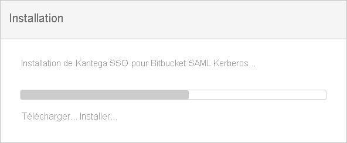

1. Une fois l’installation terminée. Cliquez sur **Fermer**.

    

1. Cliquez sur **Gérer**.

    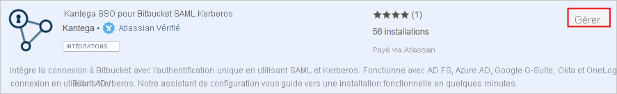

1. Cliquez sur **Configurer** pour configurer le nouveau plug-in.

    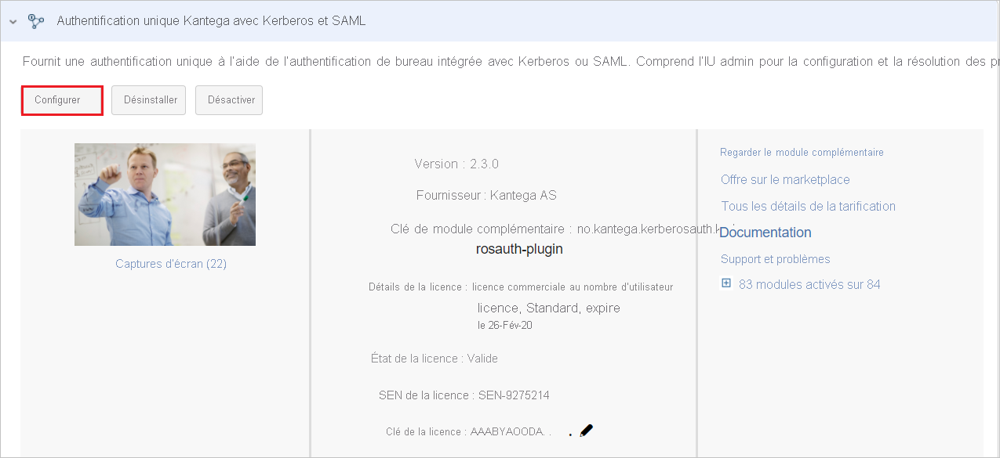

1. Dans la section **SAML**. Dans le menu déroulant **Ajouter le fournisseur d’identité**, sélectionnez **Azure Active Directory (Azure AD)** .

    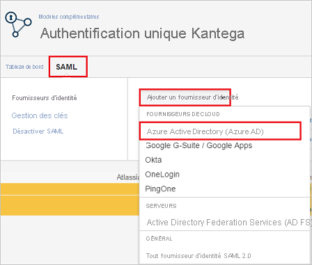

1. Sélectionnez le niveau d’abonnement **De base**.

    

1. Dans la section **Propriétés de l’application**, procédez comme suit :

    

    a. Copiez la valeur de **URI ID d’application** et utilisez-la en tant que **Identificateur, URL de réponse et URL de connexion** dans la section **Configuration SAML de base** du portail Azure.

    b. Cliquez sur **Suivant**.

1. Dans la section **Metadata import** (Importation des métadonnées), procédez comme suit :

    

    a. Sélectionnez **Metadata file on my computer** (Fichier de métadonnées sur mon ordinateur), puis chargez le fichier de métadonnées que vous avez téléchargé à partir du portail Azure.

    b. Cliquez sur **Suivant**.

1. Dans la section **Name and SSO location** (Nom et emplacement de l’authentification unique), procédez comme suit :

    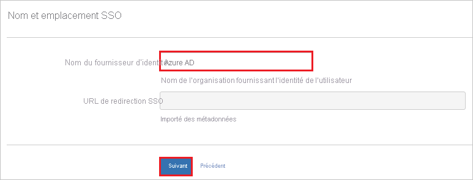

    a. Ajoutez le nom du fournisseur d’identité dans la zone de texte **Identity provider name** (Nom du fournisseur d’identité) (par exemple, Azure AD).

    b. Cliquez sur **Suivant**.

1. Vérifiez le certificat de signature, puis cliquez sur **Suivant**.

    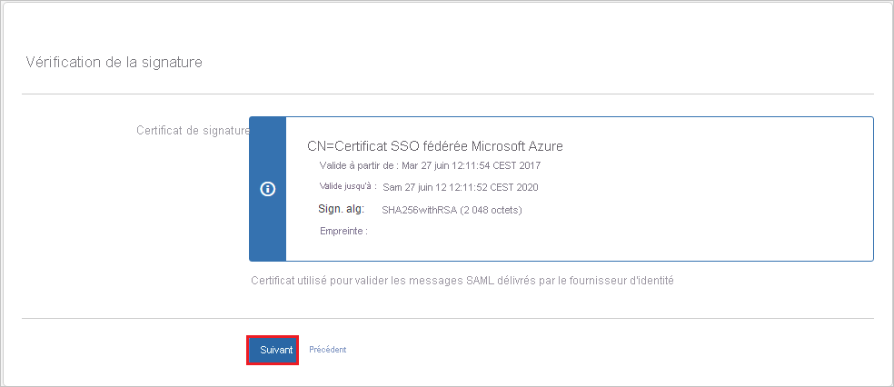

1. Dans la section **Bitbucket user accounts** (Comptes d’utilisateur Bitbucket), procédez comme suit :

    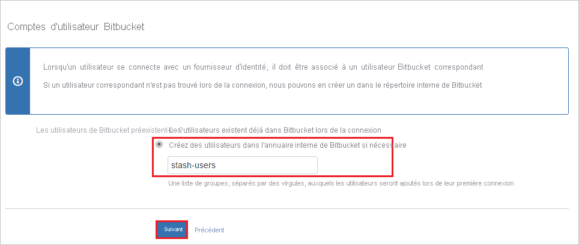

    a. Sélectionnez **Create users in Bitbucket's internal Directory if needed** (Créer des utilisateurs dans l’annuaire interne de JIRA si nécessaire) et entrez le nom de groupe approprié pour les utilisateurs (peut être plusieurs groupes séparés par des virgules).

    b. Cliquez sur **Suivant**.

1. Cliquez sur **Terminer**.

    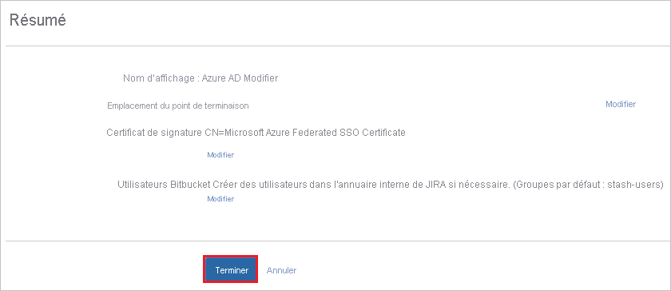

1. Dans la section **Known domains for Azure AD** (Domaines connus pour Azure AD), procédez comme suit :

    

    a. Sélectionnez **Known domains** (Domaines connus) dans le volet gauche de la page.

    b. Entrez le nom de domaine dans la zone de texte **Known domains** (Domaines connus).

    c. Cliquez sur **Enregistrer**.

### Créer un utilisateur de test Kantega SSO pour Bitbucket

Pour permettre aux utilisateurs Azure AD de se connecter à Bitbucket, vous devez les attribuer dans Bitbucket. Pour Kantega SSO pour Bitbucket, cet approvisionnement est une tâche manuelle.

**Pour approvisionner un compte d’utilisateur, procédez comme suit :**

1. Connectez-vous à votre site d’entreprise Bitbucket en tant qu’administrateur.

1. Cliquez sur l’icône Paramètres.

    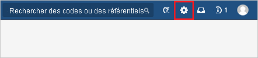 

1. Sous la section **Administration**, cliquez sur **Users (Utilisateurs)** .

    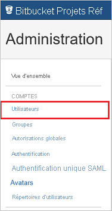

1. Cliquez sur **Create User** (Créer un utilisateur).

    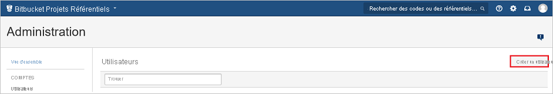     

1. Dans la page de boîte de dialogue **Create User** (Créer un utilisateur), procédez comme suit :

    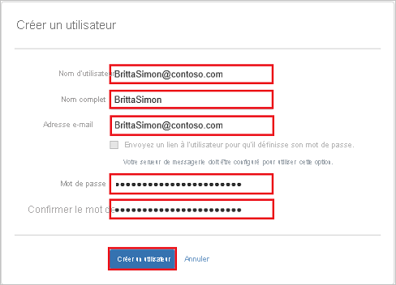 

    a. Dans la zone de texte **Username** (Nom d’utilisateur), tapez l’e-mail d’un utilisateur, par exemple, Brittasimon@contoso.com.

    b. Dans la zone de texte **Full Name** (Nom complet), tapez le nom complet d’un utilisateur, par exemple, Britta Simon.

    c. Dans la zone de texte **Email address** (Adresse e-mail), tapez l’adresse e-mail d’un utilisateur, par exemple, Brittasimon@contoso.com.

    d. Dans la zone de texte **Password** (Mot de passe), tapez le mot de passe de l’utilisateur.

    e. Dans la zone de texte **Confirm Password** (Confirmer le mot de passe), entrez à nouveau le mot de passe de l’utilisateur.

    f. Cliquez sur **Create User** (Créer un utilisateur).

## Tester l’authentification unique (SSO)

Dans cette section, vous allez tester votre configuration de l’authentification unique Azure AD avec les options suivantes. 

#### Lancée par le fournisseur de services :

* Cliquez sur **Tester cette application** dans le portail Azure. Vous êtes alors redirigé vers l’URL de connexion de Kantega SSO pour Bitbucket, à partir de laquelle vous pouvez lancer le flux de connexion.  

* Accédez directement à l’URL de connexion de Kantega SSO pour Bitbucket pour lancer le flux de connexion.

#### Lancée par le fournisseur d’identité :

* Cliquez sur **Tester cette application** dans le portail Azure. Vous êtes alors automatiquement connecté à l’instance de Kantega SSO pour Bitbucket pour laquelle vous avez configuré l’authentification unique. 

Vous pouvez aussi utiliser Mes applications de Microsoft pour tester l’application dans n’importe quel mode. Si, quand vous cliquez sur la vignette Kantega SSO pour Bitbucket dans Mes applications, le mode Fournisseur de services est configuré, vous êtes redirigé vers la page de connexion de l’application pour initier le flux de connexion ; s’il s’agit du mode Fournisseur d’identité, vous êtes automatiquement connecté à l’instance de Kantega SSO pour Bitbucket pour laquelle vous avez configuré l’authentification unique. Pour plus d’informations sur Mes applications, consultez [Présentation de Mes applications](../user-help/my-apps-portal-end-user-access.md).

## Étapes suivantes

Après avoir configuré Kantega SSO pour Bitbucket, vous pouvez appliquer le contrôle de session, qui protège contre l’exfiltration et l’infiltration des données sensibles de votre organisation en temps réel. Le contrôle de session est étendu à partir de l’accès conditionnel. [Découvrez comment appliquer un contrôle de session avec Microsoft Cloud App Security](/cloud-app-security/proxy-deployment-aad).