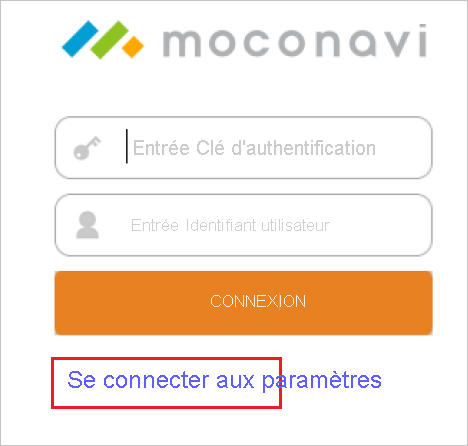
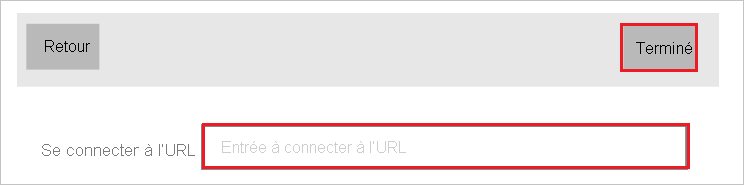
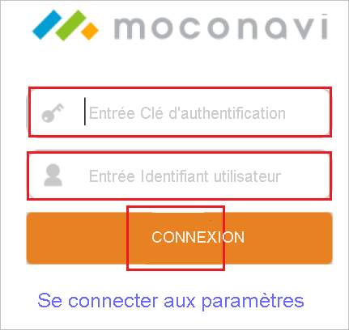
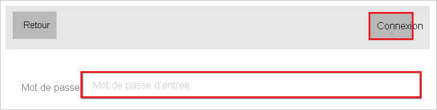
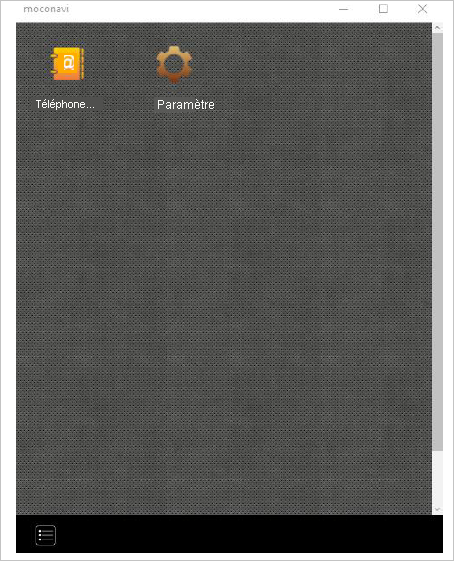

# Tutoriel : Intégration de l’authentification unique Azure AD à moconavi

Dans ce tutoriel, vous allez apprendre à intégrer moconavi à Azure Active Directory (Azure AD). Quand vous intégrez moconavi à Azure AD, vous pouvez :

* Contrôler dans Azure AD qui a accès à moconavi.
* Permettre à vos utilisateurs de se connecter automatiquement à moconavi avec leur compte Azure AD.
* Gérer vos comptes à un emplacement central : le Portail Azure.

## Prérequis

Pour commencer, vous devez disposer de ce qui suit :

* Un abonnement Azure AD Si vous ne disposez d’aucun abonnement, vous pouvez obtenir [un compte gratuit](https://azure.microsoft.com/free/).
* Un abonnement moconavi pour lequel l’authentification unique est activée.

## Description du scénario

Dans ce didacticiel, vous configurez et testez l’authentification unique Azure AD dans un environnement de test.

* monocavi prend en charge l’authentification unique lancée par le **fournisseur de services**.

## Ajouter moconavi à partir de la galerie

Pour configurer l’intégration de moconavi à Azure AD, vous devez ajouter moconavi à votre liste d’applications SaaS gérées à partir de la galerie.

1. Connectez-vous au portail Azure avec un compte professionnel ou scolaire ou avec un compte personnel Microsoft.
1. Dans le panneau de navigation gauche, sélectionnez le service **Azure Active Directory**.
1. Accédez à **Applications d’entreprise**, puis sélectionnez **Toutes les applications**.
1. Pour ajouter une nouvelle application, sélectionnez **Nouvelle application**.
1. Dans la section **Ajouter à partir de la galerie**, saisissez **moconavi** dans la zone de recherche.
1. Sélectionnez **moconavi** dans le volet de résultats, puis ajoutez l’application. Patientez quelques secondes pendant que l’application est ajoutée à votre locataire.

## Configurer et tester l’authentification unique Azure AD pour moconavi

Configurez et testez l’authentification unique Azure AD avec moconavi à l’aide d’un utilisateur de test appelé **B.Simon**. Pour que l’authentification unique fonctionne, vous devez établir un lien entre un utilisateur Azure AD et l’utilisateur moconavi associé.

Pour configurer et tester l’authentification unique Azure AD avec moconavi, effectuez les étapes suivantes :

1. **[Configurer l’authentification unique Azure AD](#configure-azure-ad-sso)** pour permettre à vos utilisateurs d’utiliser cette fonctionnalité.
    1. **[Créer un utilisateur de test Azure AD](#create-an-azure-ad-test-user)** pour tester l’authentification unique Azure AD avec B. Simon.
    1. **[Affecter l’utilisateur de test Azure AD](#assign-the-azure-ad-test-user)** pour permettre à B. Simon d’utiliser l’authentification unique Azure AD.
1. **[Configurer l’authentification unique moconavi](#configure-moconavi-sso)** pour configurer les paramètres de l’authentification unique côté application.
    1. **[Créer un utilisateur de test moconavi](#create-moconavi-test-user)** pour avoir un équivalent de B.Simon dans moconavi lié à la représentation Azure AD associée.
1. **[Tester l’authentification unique](#test-sso)** pour vérifier si la configuration fonctionne.

## Configurer l’authentification unique Azure AD

Effectuez les étapes suivantes pour activer l’authentification unique Azure AD dans le Portail Azure.

1. Dans le portail Azure, accédez à la page d’intégration de l’application **moconavi**, recherchez la section **Gérer**, puis sélectionnez **Authentification unique**.
1. Dans la page **Sélectionner une méthode d’authentification unique**, sélectionnez **SAML**.
1. Dans la page **Configurer l’authentification unique avec SAML**, cliquez sur l’icône de crayon de **Configuration SAML de base** afin de modifier les paramètres.

   

4. Dans la section **Configuration SAML de base**, effectuez les étapes suivantes :

    a. Dans la zone de texte **Identificateur**, tapez une URL en utilisant le format suivant : `https://<yourserverurl>/moconavi-saml2`

    b. Dans la zone de texte **URL de réponse**, tapez une URL au format suivant : `https://<yourserverurl>/moconavi-saml2/saml/SSO`

    c. Dans la zone de texte **URL de connexion**, tapez une URL au format suivant : `https://<yourserverurl>/moconavi-saml2/saml/login`.

    > [!NOTE]
    > Il ne s’agit pas de valeurs réelles. Mettez à jour ces valeurs avec l’identificateur, l’URL d’authentification et l’URL de réponse réels. Pour obtenir ces valeurs, contactez [l’équipe de support client de moconavi](mailto:support@recomot.co.jp). Vous pouvez également consulter les modèles figurant à la section **Configuration SAML de base** dans le portail Azure.

5. Sur la page **Configurer l’authentification unique avec SAML**, dans la section **Certificat de signature SAML**, cliquez sur **Télécharger** pour télécharger le fichier **XML de métadonnées de fédération** en fonction des options définies selon vos besoins, puis enregistrez-le sur votre ordinateur.

    

6. Dans la section **Configurer moconavi**, copiez la ou les URL appropriées en fonction de vos besoins.

    

### Créer un utilisateur de test Azure AD 

Dans cette section, vous allez créer un utilisateur de test appelé B. Simon dans le portail Azure.

1. Dans le volet gauche du Portail Azure, sélectionnez **Azure Active Directory**, **Utilisateurs**, puis **Tous les utilisateurs**.
1. Sélectionnez **Nouvel utilisateur** dans la partie supérieure de l’écran.
1. Dans les propriétés **Utilisateur**, effectuez les étapes suivantes :
   1. Dans le champ **Nom**, entrez `B.Simon`.  
   1. Dans le champ **Nom de l’utilisateur**, entrez username@companydomain.extension. Par exemple : `B.Simon@contoso.com`.
   1. Cochez la case **Afficher le mot de passe**, puis notez la valeur affichée dans le champ **Mot de passe**.
   1. Cliquez sur **Créer**.

### Affecter l’utilisateur de test Azure AD

Dans cette section, vous allez autoriser B.Simon à utiliser l’authentification unique Azure en lui accordant l’accès à moconavi.

1. Dans le portail Azure, sélectionnez **Applications d’entreprise**, puis **Toutes les applications**.
1. Dans la liste des applications, sélectionnez **moconavi**.
1. Dans la page de vue d’ensemble de l’application, recherchez la section **Gérer** et sélectionnez **Utilisateurs et groupes**.
1. Sélectionnez **Ajouter un utilisateur**, puis **Utilisateurs et groupes** dans la boîte de dialogue **Ajouter une attribution**.
1. Dans la boîte de dialogue **Utilisateurs et groupes**, sélectionnez **B. Simon** dans la liste Utilisateurs, puis cliquez sur le bouton **Sélectionner** au bas de l’écran.
1. Si vous attendez qu’un rôle soit attribué aux utilisateurs, vous pouvez le sélectionner dans la liste déroulante **Sélectionner un rôle** . Si aucun rôle n’a été configuré pour cette application, vous voyez le rôle « Accès par défaut » sélectionné.
1. Dans la boîte de dialogue **Ajouter une attribution**, cliquez sur le bouton **Attribuer**.

## Configurer l’authentification unique moconavi

Pour configurer l’authentification unique côté **moconavi**, vous devez envoyer le **XML des métadonnées de fédération** téléchargé et les URL copiées dans le portail Azure à l’[équipe du support technique moconavi](mailto:support@recomot.co.jp). Celles-ci configurent ensuite ce paramètre pour que la connexion SSO SAML soit définie correctement des deux côtés.

### Créer un utilisateur de test moconavi

Dans cette section, vous allez créer un utilisateur nommé Britta Simon dans moconavi. Rapprochez-vous de [l’équipe de support de moconavi](mailto:support@recomot.co.jp) pour ajouter les utilisateurs sur la plateforme moconavi. Les utilisateurs doivent être créés et activés avant que vous utilisiez l’authentification unique.

## Tester l’authentification unique (SSO)

1. Installez moconavi à partir de Microsoft Store.

2. Lancez moconavi.

3. Cliquez sur le bouton **Paramètre de connexion**.

    

4. Entrez `https://mcs-admin.moconavi.biz/gateway` dans la zone de texte **Se connecter à l’URL**, puis cliquez sur le bouton **Terminé**.

    

5. Dans la capture d’écran suivante, suivez les étapes ci-dessous :

    

    a. Entrez la **clé d’authentification**`azureAD` dans la zone de texte **Entrer la clé d’authentification**.

    b. Entrez **l’ID d’utilisateur**`your ad account` dans la zone de texte **Entrer l’ID d’utilisateur**.

    c. Cliquez sur **CONNEXION**.

6. Entrez votre mot de passe Azure AD dans la zone de texte **Mot de passe**, puis cliquez sur le bouton **Connexion**.

    

7. L’authentification Azure AD est réussie lorsque le menu s’affiche.

    

## Étapes suivantes

Après avoir configuré moconavi, vous pouvez appliquer le contrôle de session, qui protège contre l’exfiltration et l’infiltration des données sensibles de votre organisation en temps réel. Le contrôle de session est étendu à partir de l’accès conditionnel. [Découvrez comment appliquer un contrôle de session avec Microsoft Defender for Cloud Apps](/cloud-app-security/proxy-deployment-aad).
