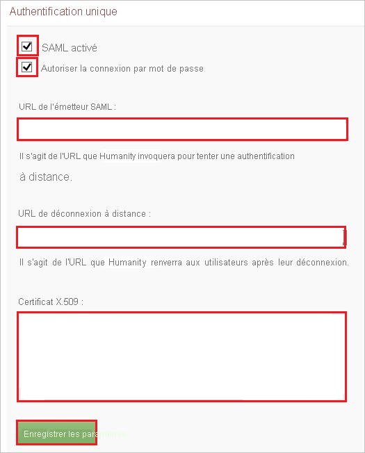
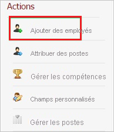
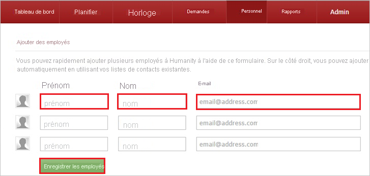

# Tutoriel : Intégration de l’authentification unique Azure AD à Humanity

Dans ce tutoriel, vous allez apprendre à intégrer Humanity à Azure Active Directory (Azure AD). Quand vous intégrez Humanity à Azure AD, vous pouvez :

* Contrôler dans Azure AD qui a accès à Humanity.
* Permettre à vos utilisateurs de se connecter automatiquement à Humanity avec leur compte Azure AD.
* Gérer vos comptes à un emplacement central : le Portail Azure.

## Prérequis

Pour commencer, vous devez disposer de ce qui suit :

* Un abonnement Azure AD Si vous ne disposez d’aucun abonnement, vous pouvez obtenir [un compte gratuit](https://azure.microsoft.com/free/).
* Un abonnement Humanity pour lequel l’authentification unique est activée.

## Description du scénario

Dans ce didacticiel, vous configurez et testez l’authentification unique Azure AD dans un environnement de test.

* Humanity prend en charge l’authentification unique lancée par le **fournisseur de services**.

> [!NOTE]
> L’identificateur de cette application étant une valeur de chaîne fixe, une seule instance peut être configurée dans un locataire.

## Ajouter Humanity à partir de la galerie

Pour configurer l’intégration de Humanity à Azure AD, vous devez ajouter Humanity, disponible à partir de la galerie, à votre liste d’applications SaaS gérées.

1. Connectez-vous au portail Azure avec un compte professionnel ou scolaire ou avec un compte personnel Microsoft.
1. Dans le panneau de navigation gauche, sélectionnez le service **Azure Active Directory**.
1. Accédez à **Applications d’entreprise**, puis sélectionnez **Toutes les applications**.
1. Pour ajouter une nouvelle application, sélectionnez **Nouvelle application**.
1. Dans la section **Ajouter à partir de la galerie**, saisissez **Humanity** dans la zone de recherche.
1. Sélectionnez **Humanity** dans le volet de résultats, puis ajoutez l’application. Patientez quelques secondes pendant que l’application est ajoutée à votre locataire.

## Configurer et tester l’authentification unique Azure AD pour Humanity

Configurez et testez l’authentification unique Azure AD avec Humanity pour un utilisateur de test nommé **B.Simon**. Pour que l’authentification unique fonctionne, vous devez établir un lien entre un utilisateur Azure AD et l’utilisateur Humanity associé.

Pour configurer et tester l’authentification unique Azure AD avec Humanity, effectuez les étapes suivantes :

1. **[Configurer l’authentification unique Azure AD](#configure-azure-ad-sso)** pour permettre à vos utilisateurs d’utiliser cette fonctionnalité.
    1. **[Créer un utilisateur de test Azure AD](#create-an-azure-ad-test-user)** pour tester l’authentification unique Azure AD avec B. Simon.
    1. **[Affecter l’utilisateur de test Azure AD](#assign-the-azure-ad-test-user)** pour permettre à B. Simon d’utiliser l’authentification unique Azure AD.
1. **[Configurer l’authentification unique Humanity](#configure-humanity-sso)** pour configurer les paramètres de l’authentification unique côté application.
    1. **[Créer un utilisateur de test Humanity](#create-humanity-test-user)** pour avoir un équivalent de B.Simon dans Humanity lié à la représentation Azure AD associée.
1. **[Tester l’authentification unique](#test-sso)** pour vérifier si la configuration fonctionne.

## Configurer l’authentification unique Azure AD

Effectuez les étapes suivantes pour activer l’authentification unique Azure AD dans le Portail Azure.

1. Dans le portail Azure, accédez à la page d’intégration de l’application **Humanity**, recherchez la section **Gérer**, puis sélectionnez **Authentification unique**.
1. Dans la page **Sélectionner une méthode d’authentification unique**, sélectionnez **SAML**.
1. Dans la page **Configurer l’authentification unique avec SAML**, cliquez sur l’icône de crayon de **Configuration SAML de base** afin de modifier les paramètres.

   

4. Dans la section **Configuration SAML de base**, effectuez les étapes suivantes :

    a. Dans la zone de texte **Identificateur (ID d’entité)** , tapez l’URL suivante : `https://company.humanity.com/app/`

    b. Dans la zone de texte **URL de connexion**, tapez l’URL : `https://company.humanity.com/includes/saml/`

    > [!NOTE]
    > Il ne s’agit pas de valeurs réelles. Mettez à jour ces valeurs avec l’identificateur et l’URL de connexion réels. Pour obtenir ces valeurs, contactez l’[équipe de support aux clients Humanity](https://www.humanity.com/support/). Vous pouvez également consulter les modèles figurant à la section **Configuration SAML de base** dans le portail Azure.

4. Dans la page **Configurer l’authentification unique avec SAML**, dans la section **Certificat de signature SAML**, cliquez sur **Télécharger** pour télécharger le **Certificat (Base64)** en fonction des options définies par rapport à vos besoins, puis enregistrez-le sur votre ordinateur.

    

6. Dans la section **Configurer Humanity**, copiez la ou les URL appropriées en fonction de vos besoins.

    

### Créer un utilisateur de test Azure AD

Dans cette section, vous allez créer un utilisateur de test appelé B. Simon dans le portail Azure.

1. Dans le volet gauche du Portail Azure, sélectionnez **Azure Active Directory**, **Utilisateurs**, puis **Tous les utilisateurs**.
1. Sélectionnez **Nouvel utilisateur** dans la partie supérieure de l’écran.
1. Dans les propriétés **Utilisateur**, effectuez les étapes suivantes :
   1. Dans le champ **Nom**, entrez `B.Simon`.  
   1. Dans le champ **Nom de l’utilisateur**, entrez username@companydomain.extension. Par exemple : `B.Simon@contoso.com`.
   1. Cochez la case **Afficher le mot de passe**, puis notez la valeur affichée dans le champ **Mot de passe**.
   1. Cliquez sur **Créer**.

### Affecter l’utilisateur de test Azure AD

Dans cette section, vous allez autoriser B.Simon à utiliser l’authentification unique Azure en lui accordant l’accès à Humanity.

1. Dans le portail Azure, sélectionnez **Applications d’entreprise**, puis **Toutes les applications**.
1. Dans la liste des applications, sélectionnez **Humanity**.
1. Dans la page de vue d’ensemble de l’application, recherchez la section **Gérer** et sélectionnez **Utilisateurs et groupes**.
1. Sélectionnez **Ajouter un utilisateur**, puis **Utilisateurs et groupes** dans la boîte de dialogue **Ajouter une attribution**.
1. Dans la boîte de dialogue **Utilisateurs et groupes**, sélectionnez **B. Simon** dans la liste Utilisateurs, puis cliquez sur le bouton **Sélectionner** au bas de l’écran.
1. Si vous attendez qu’un rôle soit attribué aux utilisateurs, vous pouvez le sélectionner dans la liste déroulante **Sélectionner un rôle** . Si aucun rôle n’a été configuré pour cette application, vous voyez le rôle « Accès par défaut » sélectionné.
1. Dans la boîte de dialogue **Ajouter une attribution**, cliquez sur le bouton **Attribuer**.

## Configurer l’authentification unique Humanity

1. Dans une autre fenêtre de navigateur web, ouvrez une session sur votre site d’entreprise **Humanity** en tant qu’administrateur.

2. Dans le menu situé en haut, cliquez sur **Admin**.

    

3. Sous **Integration**, cliquez sur **Single Sign-On**.

    

4. Dans la section **Single Sign-On** , procédez comme suit :

    

    a. Sélectionnez **SAML Enabled**.

    b. Sélectionnez **Allow Password Login**.

    c. Dans la zone de texte **SAML Issuer URL** (URL de l’émetteur SAML), collez la valeur **URL de connexion** que vous avez copiée à partir du portail Azure.

    d. Dans la zone de texte **Remote Logout URL** (URL de déconnexion distante), collez la valeur **URL de déconnexion** que vous avez copiée à partir du portail Azure.

    e. Ouvrez votre certificat codé en base 64 dans le Bloc-notes, copiez son contenu dans le Presse-papiers, puis collez-le dans la zone de texte **X.509 Certificate** .

    f. Cliquez sur **Save Settings**.

### Créer un utilisateur de test Humanity

Pour permettre aux utilisateurs Azure AD de se connecter à Humanity, vous devez les approvisionner dans Humanity. Dans le cas de Humanity, l’approvisionnement est une tâche manuelle.

**Pour approvisionner un compte d’utilisateur, procédez comme suit :**

1. Ouvrez une session en tant qu’administrateur sur votre site d’entreprise **Humanity**.

2. Cliquez sur **Admin**.

    

3. Cliquez sur **Staff**.

    

4. Sous **Actions**, cliquez sur **Ajouter des employés**.

    

5. Dans la section **Add employees** , procédez comme suit :

    

    a. Tapez le **Prénom**, le **Nom** et l’**E-mail** d’un compte Azure AD valide que vous voulez provisionner dans les zones de texte correspondantes.

    b. Cliquez sur **Save Employees**.

> [!NOTE]
> Vous pouvez utiliser tout autre outil ou API de création de compte d’utilisateur Humanity fourni par Humanity pour provisionner des comptes d’utilisateur Azure AD.

## Tester l’authentification unique (SSO)

Dans cette section, vous allez tester votre configuration de l’authentification unique Azure AD avec les options suivantes. 

* Cliquez sur **Tester cette application** dans le portail Azure. Vous êtes alors redirigé vers l’URL de connexion de Humanity, à partir de laquelle vous pouvez lancer le flux de connexion. 

* Accédez directement à l’URL de connexion de Humanity pour lancer le flux de connexion.

* Vous pouvez utiliser Mes applications de Microsoft. Lorsque vous cliquez sur la vignette Humanity dans Mes applications, vous êtes redirigé vers l’URL de connexion de Humanity. Pour plus d’informations sur Mes applications, consultez [Présentation de Mes applications](../user-help/my-apps-portal-end-user-access.md).

## Étapes suivantes

Après avoir configuré Humanity, vous pouvez appliquer le contrôle de session, qui protège contre l’exfiltration et l’infiltration des données sensibles de votre organisation en temps réel. Le contrôle de session est étendu à partir de l’accès conditionnel. [Découvrez comment appliquer un contrôle de session avec Microsoft Cloud App Security](/cloud-app-security/proxy-deployment-aad).