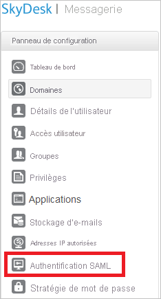

# Tutoriel : Intégration de l’authentification unique Azure AD à SkyDesk Email

Dans ce tutoriel, vous allez apprendre à intégrer Azure Active Directory (Azure AD) à SkyDesk Email. Lorsque vous intégrez Azure AD à SkyDesk Email, vous pouvez :

* Contrôler dans Azure AD qui a accès à SkyDesk Email.
* Permettre à vos utilisateurs de se connecter automatiquement à SkyDesk Email avec leur compte Azure AD.
* Gérer vos comptes à un emplacement central : le Portail Azure.

## Prérequis

Pour commencer, vous devez disposer de ce qui suit :

* Un abonnement Azure AD Si vous ne disposez d’aucun abonnement, vous pouvez obtenir [un compte gratuit](https://azure.microsoft.com/free/).
* Un abonnement SkyDesk Email pour lequel l’authentification unique (SSO) est activée.

## Description du scénario

Dans ce didacticiel, vous configurez et testez l’authentification unique Azure AD dans un environnement de test.

* SkyDesk Email prend en charge l’authentification unique lancée par le **fournisseur de services**.

> [!NOTE]
> L’identificateur de cette application étant une valeur de chaîne fixe, une seule instance peut être configurée dans un locataire.

## Ajouter SkyDesk Email à partir de la galerie

Pour configurer l’intégration de SkyDesk Email à Azure AD, vous devez ajouter SkyDesk Email disponible dans la galerie à votre liste d’applications SaaS gérées.

1. Connectez-vous au portail Azure avec un compte professionnel ou scolaire ou avec un compte personnel Microsoft.
1. Dans le panneau de navigation gauche, sélectionnez le service **Azure Active Directory**.
1. Accédez à **Applications d’entreprise**, puis sélectionnez **Toutes les applications**.
1. Pour ajouter une nouvelle application, sélectionnez **Nouvelle application**.
1. Dans la section **Ajouter à partir de la galerie**, tapez **SkyDesk Email** dans la zone de recherche.
1. Sélectionnez **SkyDesk Email** dans le volet de résultats, puis ajoutez l’application. Patientez quelques secondes pendant que l’application est ajoutée à votre locataire.

## Configurer et tester l’authentification unique Azure AD pour SkyDesk Email

Configurez et testez l’authentification unique Azure AD avec SkyDesk Email à l’aide d’un utilisateur test appelé **B.Simon**. Pour que l’authentification unique fonctionne, vous devez établir un lien entre un utilisateur Azure AD et l’utilisateur SkyDesk Email associé.

Pour configurer et tester l’authentification unique Azure AD avec SkyDesk Email, effectuez les étapes suivantes :

1. **[Configurer l’authentification unique Azure AD](#configure-azure-ad-sso)** pour permettre à vos utilisateurs d’utiliser cette fonctionnalité.
    1. **[Créer un utilisateur de test Azure AD](#create-an-azure-ad-test-user)** pour tester l’authentification unique Azure AD avec B. Simon.
    1. **[Affecter l’utilisateur de test Azure AD](#assign-the-azure-ad-test-user)** pour permettre à B. Simon d’utiliser l’authentification unique Azure AD.
1. **[Configurer l’authentification unique de SkyDesk Email](#configure-skydesk-email-sso)** pour configurer les paramètres de l’authentification unique côté application.
    1. **[Créer un utilisateur test SkyDesk Email](#create-skydesk-email-test-user)** pour avoir un équivalent de B.Simon dans SkyDesk Email lié à la représentation Azure AD de l’utilisateur.
1. **[Tester l’authentification unique](#test-sso)** pour vérifier si la configuration fonctionne.

## Configurer l’authentification unique Azure AD

Effectuez les étapes suivantes pour activer l’authentification unique Azure AD dans le Portail Azure.

1. Dans le portail Azure, accédez à la page d’intégration de l’application **SkyDesk Email**, recherchez la section **Gérer** et sélectionnez **Authentification unique**.
1. Dans la page **Sélectionner une méthode d’authentification unique**, sélectionnez **SAML**.
1. Dans la page **Configurer l’authentification unique avec SAML**, cliquez sur l’icône de crayon de **Configuration SAML de base** afin de modifier les paramètres.

   

4. Dans la section **Configuration SAML de base**, effectuez l’étape suivante :

    Dans la zone de texte **URL de connexion**, tapez une URL au format suivant : `https://mail.skydesk.jp/portal/<companyname>`

    > [!NOTE]
    > Cette valeur n’est pas la valeur réelle. Mettez à jour la valeur avec l’URL de connexion réelle. Contactez l’[équipe de support client SkyDesk Email](https://www.skydesk.jp/apps/support/) pour obtenir la valeur. Vous pouvez également consulter les modèles figurant à la section **Configuration SAML de base** dans le portail Azure.

5. Dans la page **Configurer l’authentification unique avec SAML**, dans la section **Certificat de signature SAML**, cliquez sur **Télécharger** pour télécharger le **Certificat (Base64)** en fonction des options définies par rapport à vos besoins, puis enregistrez-le sur votre ordinateur.

    

6. Dans la section **Configurer SkyDesk Email**, copiez l’URL ou les URL appropriées en fonction de vos besoins.

    

### Créer un utilisateur de test Azure AD

Dans cette section, vous allez créer un utilisateur de test appelé B. Simon dans le portail Azure.

1. Dans le volet gauche du Portail Azure, sélectionnez **Azure Active Directory**, **Utilisateurs**, puis **Tous les utilisateurs**.
1. Sélectionnez **Nouvel utilisateur** dans la partie supérieure de l’écran.
1. Dans les propriétés **Utilisateur**, effectuez les étapes suivantes :
   1. Dans le champ **Nom**, entrez `B.Simon`.  
   1. Dans le champ **Nom de l’utilisateur**, entrez username@companydomain.extension. Par exemple : `B.Simon@contoso.com`.
   1. Cochez la case **Afficher le mot de passe**, puis notez la valeur affichée dans le champ **Mot de passe**.
   1. Cliquez sur **Créer**.

### Affecter l’utilisateur de test Azure AD

Dans cette section, vous allez autoriser B.Simon à utiliser l’authentification unique Azure en lui accordant l’accès à SkyDesk Email.

1. Dans le portail Azure, sélectionnez **Applications d’entreprise**, puis **Toutes les applications**.
1. Dans la liste des applications, sélectionnez **SkyDesk Email**.
1. Dans la page de vue d’ensemble de l’application, recherchez la section **Gérer** et sélectionnez **Utilisateurs et groupes**.
1. Sélectionnez **Ajouter un utilisateur**, puis **Utilisateurs et groupes** dans la boîte de dialogue **Ajouter une attribution**.
1. Dans la boîte de dialogue **Utilisateurs et groupes**, sélectionnez **B. Simon** dans la liste Utilisateurs, puis cliquez sur le bouton **Sélectionner** au bas de l’écran.
1. Si vous attendez qu’un rôle soit attribué aux utilisateurs, vous pouvez le sélectionner dans la liste déroulante **Sélectionner un rôle** . Si aucun rôle n’a été configuré pour cette application, vous voyez le rôle « Accès par défaut » sélectionné.
1. Dans la boîte de dialogue **Ajouter une attribution**, cliquez sur le bouton **Attribuer**.

## Configurer l’authentification unique de SkyDesk Email

1. Dans un autre navigateur web, connectez-vous à votre compte SkyDesk Email en tant qu’administrateur.

1. Dans le menu situé en haut, cliquez sur **Setup**, puis sélectionnez **Org**.

    
  
1. Cliquez sur **Domains** dans le volet de gauche.

    

1. Cliquez sur **Add Domain**.

    

1. Entrez votre nom de domaine et vérifiez le domaine.

    

1. Cliquez sur **Authentification SAML** dans le panneau de gauche.

    

1. Dans la page de boîte de dialogue **SAML Authentication** , procédez comme suit :

    

    > [!NOTE]
    > Pour utiliser l’authentification SAML, un **domaine vérifié** ou **l’URL du portail** doit être configuré. Vous pouvez définir l’URL du portail avec un nom unique.

    

    a. Dans la zone de texte **Login URL** (URL de connexion), collez la valeur **URL de connexion** que vous avez copiée dans le portail Azure.

    b. Dans la zone de texte **Logout URL** (URL de déconnexion), collez la valeur de l’**URL de déconnexion** que vous avez copiée à partir du portail Azure.

    c. **Modifier l’URL de mot de passe** est facultative, vous pouvez donc laisser cette valeur vide.

    d. Cliquez sur **Get Key From File (Obtenir la clé à partir d’un fichier)** pour sélectionner votre certificat téléchargé à partir du portail Azure, puis sur **Ouvrir** pour charger le certificat.

    e. Comme **Algorithme**, sélectionnez **RSA**.

    f. Cliquez sur **OK** pour enregistrer les modifications.

### Créer un utilisateur de test SkyDesk Email

Dans cette section, vous allez créer un utilisateur appelé Britta Simon dans SkyDesk Email.

Cliquez sur **User Access** (Accès utilisateur) dans le panneau de gauche de SkyDesk Email, puis entrez votre nom d’utilisateur.

> [!NOTE]
> Si vous avez besoin de créer des utilisateurs en bloc, contactez l’[équipe de support client SkyDesk Email](https://www.skydesk.jp/apps/support/).

## Tester l’authentification unique (SSO)

Dans cette section, vous allez tester votre configuration de l’authentification unique Azure AD avec les options suivantes. 

* Cliquez sur **Tester cette application** dans le portail Azure. Vous êtes alors redirigé vers l’URL d’authentification de SkyDesk Email, à partir de laquelle vous pouvez lancer le processus de connexion. 

* Accédez directement à l’URL d’authentification de SkyDesk Email pour lancer le processus de connexion.

* Vous pouvez utiliser Mes applications de Microsoft. Quand vous cliquez sur la vignette SkyDesk Email dans Mes applications, vous êtes redirigé vers l’URL d’authentification de SkyDesk Email. Pour plus d’informations sur Mes applications, consultez [Présentation de Mes applications](../user-help/my-apps-portal-end-user-access.md).

## Étapes suivantes

Après avoir configuré SkyDesk Email, vous pouvez appliquer le contrôle de session, qui protège contre l’exfiltration et l’infiltration des données sensibles de votre organisation en temps réel. Le contrôle de session est étendu à partir de l’accès conditionnel. [Découvrez comment appliquer un contrôle de session avec Microsoft Defender for Cloud Apps](/cloud-app-security/proxy-deployment-aad).
