# <a name="issue-azure-ad-verifiable-credentials-from-an-application-preview"></a>Émettre des justificatifs vérifiables Azure AD à partir d’une application (préversion)

Dans ce tutoriel, vous exécutez un exemple d’application à partir de votre ordinateur local qui se connecte à votre locataire Azure Active Directory (Azure AD). À l’aide de l’application, vous allez émettre et vérifier une carte d’expert Justificatif vérifié.

Dans cet article, vous apprendrez comment :

> [!div class="checklist"]
>
> - Configurer le Stockage Blob Azure pour stocker vos fichiers de configuration de justificatifs vérifiables Azure AD.
> - Créer et charger vos fichiers de configuration de justificatifs vérifiables.
> - Créer la carte d’expert Justificatif vérifié dans Azure.
> - Collecter les justificatifs et les détails de l’environnement pour configurer l’exemple d’application.
> - Télécharger l’exemple de code d’application sur votre ordinateur local.
> - Mettre à jour l’exemple d’application avec votre carte d’expert Justificatif vérifié et les détails de l’environnement.
> - Exécuter l’exemple d’application et émettre votre première carte d’expert Justificatif vérifié.
> - Vérifier votre carte d’expert Justificatif vérifié.

Le diagramme suivant illustre l’architecture d’Azure AD Verifiable Credentials et le composant que vous configurez.

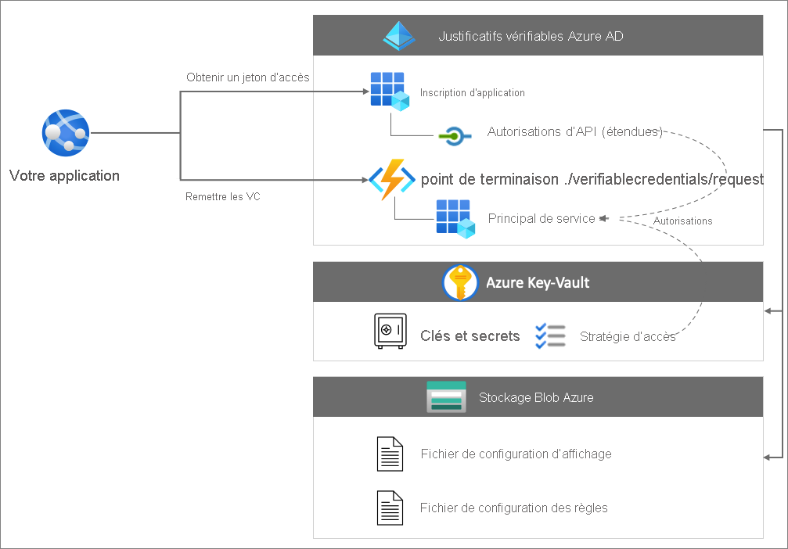

## <a name="prerequisites"></a>Prérequis

- [Configurez un locataire pour Azure AD Verifiable Credentials](./verifiable-credentials-configure-tenant.md).
- Pour cloner le dépôt qui héberge l’exemple d’application, installez [GIT](https://git-scm.com/downloads).
- [Visual Studio Code](https://code.visualstudio.com/Download) ou un éditeur de code similaire.
- [.NET 5.0](https://dotnet.microsoft.com/download/dotnet/5.0).
- [ngrok](https://ngrok.com/) (gratuit).
- Un appareil mobile avec Microsoft Authenticator :
  - Android version 6.2108.5654 ou ultérieure installé.
  - iOS version 6.5.82 ou ultérieure installé.

## <a name="create-a-storage-account"></a>Créez un compte de stockage.

Le Stockage Blob Azure est la solution de stockage d’objets pour le cloud. Azure AD Verifiable Credentials utilise le [Stockage Blob Azure](../../storage/blobs/storage-blobs-introduction.md) pour stocker les fichiers de configuration quand le service émet des justificatifs vérifiables.

Créez et configurez le Stockage Blob en suivant ces étapes :

1. Si vous n’avez pas de compte Stockage Blob Azure, [créez-en un](../../storage/common/storage-account-create.md).
1. Après avoir créé le compte de stockage, créez un conteneur. Dans le menu de gauche du compte de stockage, faites défiler jusqu’à la section **Stockage de données** et sélectionnez **Conteneurs**.
1. Sélectionnez **+ Conteneur**.
1. Entrez un nom pour votre nouveau conteneur. Le nom du conteneur doit être en minuscules, commencer par une lettre ou un chiffre, et peut comporter uniquement des lettres, des chiffres et des tirets (-). Par exemple, *vc-container*.
1. Définissez **Niveau d’accès public** sur **Privé** (aucun accès anonyme).
1. Sélectionnez **Create** (Créer).  

   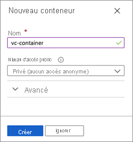

## <a name="grant-access-to-the-container"></a>Accorder l’accès au conteneur

Après avoir créé votre conteneur, accordez à l’utilisateur connecté le rôle qui convient pour lui permettre d’accéder aux fichiers dans Stockage Blob.

1. Dans la liste des conteneurs, sélectionnez **vc-container**.

1. Dans le menu, sélectionnez **Contrôle d’accès (IAM)** .

1. Sélectionnez **+ Ajouter**, puis **Ajouter une attribution de rôle**.

     

1. Dans **Ajouter une attribution de rôle** :

    1. Pour **Rôle**, sélectionnez **Lecteur des données blob du stockage**.

    1. Pour **Attribuer l’accès à**, sélectionnez **Utilisateur, groupe ou principal de service**.

    1. Ensuite, recherchez le compte que vous utilisez pour effectuer ces étapes et sélectionnez-le.

        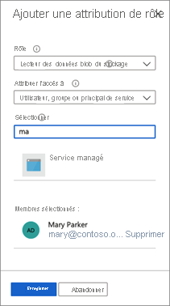

>[!IMPORTANT]
>Par défaut, les créateurs de conteneurs se voient attribuer le rôle de propriétaire. Le rôle de propriétaire n’est pas suffisant en lui-même. Votre compte doit disposer du rôle de lecteur des données blob du stockage. Pour plus d’informations, consultez [Utiliser le portail Azure afin d’attribuer un rôle Azure pour l’accès aux données de blob et de file d’attente](../../storage/blobs/assign-azure-role-data-access.md).

### <a name="upload-the-configuration-files"></a>Charger les fichiers de configuration

Azure AD Verifiable Credentials utilise deux fichiers de configuration JSON, les fichiers de règles et le fichier d’affichage. 

- Le fichier de *règles* décrit les propriétés importantes des justificatifs vérifiables. En particulier, il décrit les revendications que les sujets (utilisateurs) doivent fournir avant qu’un justificatif vérifiable soit émis pour eux. 
- Le fichier d’*affichage* contrôle la personnalisation des justificatifs et le style des revendications.

Dans cette section, vous chargez des exemples de fichiers de règles et d’affichage dans votre stockage. Pour plus d’informations, consultez [Guide pratique pour personnaliser vos justificatifs vérifiables](credential-design.md).

Pour charger les fichiers de configuration, effectuez les étapes suivantes :

1. Copiez le code JSON suivant et enregistrez le contenu dans un fichier appelé *VerifiedCredentialExpertDisplay.json*.

    ```json
    {
      "default": {
        "locale": "en-US",
        "card": {
          "title": "Verified Credential Expert",
          "issuedBy": "Microsoft",
          "backgroundColor": "#2E4053",
          "textColor": "#ffffff",
          "logo": {
            "uri": "https://didcustomerplayground.blob.core.windows.net/public/VerifiedCredentialExpert_icon.png",
            "description": "Verified Credential Expert Logo"
          },
          "description": "Use your verified credential to prove to anyone that you know all about verifiable credentials."
        },
        "consent": {
          "title": "Do you want to get your Verified Credential?",
          "instructions": "Sign in with your account to get your card."
        },
        "claims": {
          "vc.credentialSubject.firstName": {
            "type": "String",
            "label": "First name"
          },
          "vc.credentialSubject.lastName": {
            "type": "String",
            "label": "Last name"
          }
        }
      }
    }
    ```

1. Copiez le code JSON suivant et enregistrez le contenu dans un fichier appelé *VerifiedCredentialExpertRules.json*. Le justificatif vérifiable suivant définit quelques revendications simples : `firstName` et `lastName`.

    ```json
    {
      "attestations": {
        "idTokens": [
          {
            "id": "https://self-issued.me",
            "mapping": {
              "firstName": { "claim": "$.given_name" },
              "lastName": { "claim": "$.family_name" }
            },
            "configuration": "https://self-issued.me",
            "client_id": "",
            "redirect_uri": ""
          }
        ]
      },
      "validityInterval": 2592001,
      "vc": {
        "type": [ "VerifiedCredentialExpert" ]
      }
    }
    ```
    
1. Dans le portail Azure, accédez au conteneur Stockage Blob Azure que [vous avez créé](#create-a-storage-account).

1. Dans le menu de gauche, sélectionnez **Conteneurs** pour afficher la liste des objets blob qu’il contient. Ensuite, sélectionnez le conteneur **vc-container** que vous avez créé précédemment.

1. Sélectionnez **Charger** pour ouvrir le volet Charger et parcourez votre système de fichiers local pour rechercher un fichier à charger. Sélectionnez les fichiers **VerifiedCredentialExpertDisplay.json** et **VerifiedCredentialExpertRules.json**. Ensuite, sélectionnez **Charger** pour charger les fichiers dans votre conteneur.

## <a name="create-the-verified-credential-expert-card-in-azure"></a>Créer la carte d’expert Justificatif vérifié dans Azure

Au cours de cette étape, vous allez créer la carte d’expert Justificatif vérifié en utilisant Azure AD Verifiable Credentials. Après avoir créé un justificatif vérifié, votre locataire Azure AD peut émettre ce justificatif aux utilisateurs qui lancent le processus.

1. Utilisez le [portail Azure](https://portal.azure.com/) pour rechercher des *justificatifs vérifiables*. Ensuite, sélectionnez **Justificatifs vérifiables (préversion)** .
1. Une fois que vous avez [configuré votre locataire](verifiable-credentials-configure-tenant.md), la fenêtre **Créer un justificatif** doit s’afficher. Si ce n’est pas le cas ou si vous souhaitez créer d’autres justificatifs, dans le menu de gauche, sélectionnez **Justificatifs vérifiables**. Ensuite, sélectionnez **+ Justificatif**.
1. Dans **Créer un justificatif**, procédez comme suit :

    1. Pour le **nom**, entrez **VerifiedCredentialExpert**. Ce nom est utilisé dans le Portail pour identifier vos justificatifs vérifiables. Il est inclus dans le cadre du contrat des justificatifs vérifiables.

    1. Pour **Abonnement**, sélectionnez votre abonnement Azure AD dans lequel vous avez créé le Stockage Blob.

    1. Sous **Fichier d’affichage**, sélectionnez un **Sélectionner un fichier d’affichage**. Dans la section Comptes de stockage, sélectionnez **vc-container**. Ensuite, sélectionnez le fichier **VerifiedCredentialExpertDisplay.json** et cliquez sur **Sélectionner**.

    1. Sous **Fichier de règles**, sélectionnez un **fichier de règles**. Dans la section Comptes de stockage, sélectionnez **vc-container**. Ensuite, sélectionnez le fichier **VerifiedCredentialExpertRules.json** et choisissez **Sélectionner**.

    1. Sélectionnez **Create** (Créer).    

La capture d’écran suivante montre comment créer un nouveau justificatif :

  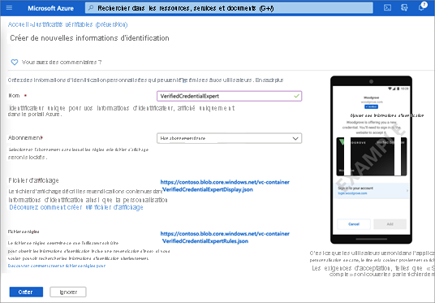

## <a name="gather-credentials-and-environment-details"></a>Collecter les détails des justificatifs et de l’environnement

Maintenant que vous avez un nouveau justificatif, vous allez collecter des informations sur votre environnement et le justificatif que vous avez créé. Vous utilisez ces informations pour configurer votre exemple d’application.

1. Dans Justificatifs vérifiables, sélectionnez **Justificatifs**. Dans la liste des justificatifs, sélectionnez **VerifiedCredentialExpert**, que vous avez créé précédemment.

    

1. Copiez l’**URL d’émission de justificatifs**. Cette URL est la combinaison des fichiers de règles et d’affichage. Il s’agit de l’URL évaluée par Authenticator avant d’afficher pour l’utilisateur les exigences d’émission des justificatifs vérifiables. Prenez-en note pour une utilisation ultérieure.

1. Copiez l’**identificateur décentralisé** et prenez-en note pour l’utiliser plus tard.

1. Copiez votre **ID de locataire** et prenez-en note pour l’utiliser plus tard.

   

## <a name="download-the-sample-code"></a>Télécharger l’exemple de code

L’exemple d’application est disponible dans .NET et le code est conservé dans un dépôt GitHub. Téléchargez l’exemple de code à partir de [GitHub](https://github.com/Azure-Samples/active-directory-verifiable-credentials-dotnet), ou clonez le dépôt sur votre ordinateur local :


```bash
git clone https://github.com/Azure-Samples/active-directory-verifiable-credentials-dotnet.git
```

## <a name="configure-the-verifiable-credentials-app"></a>Configurer l’application de justificatifs vérifiables

Créez un secret client pour l’application inscrite que vous avez créée. L’exemple d’application utilise le secret client pour prouver son identité lorsqu’elle demande des jetons.

1. Accédez à la page **Inscriptions d’applications** située dans **Azure Active Directory**.

1. Sélectionnez l’application **verifiable-credentials-app** que vous avez créée précédemment.

1. Sélectionnez le nom à afficher dans les détails d’inscription.

1. Copiez l’**ID d’application (client)** et stockez-le pour l’utiliser plus tard.  

     

1. Dans le menu principal, sous **Gérer**, sélectionnez **Certificats et secrets**.

1. Sélectionnez **Nouveau secret client** et procédez comme suit :

    1. Dans **Description**, entrez une description pour le secret client (par exemple, **vc-sample-secret**).

    1. Sous **Expire**, sélectionnez une durée pendant laquelle le secret est valide (par exemple, six mois). Sélectionnez ensuite **Ajouter**.

    1. Enregistrez la **Valeur** du secret. Vous utiliserez cette valeur pour la configuration dans une étape ultérieure. La valeur du secret ne réapparaîtra plus, et ne pourra être récupérée par aucun autre moyen. Notez-la dès que vous la voyez.

À ce stade, vous devez disposer de toutes les informations nécessaires pour configurer votre exemple d’application.

## <a name="update-the-sample-application"></a>Mettre à jour l’exemple d’application

À présent, vous apportez des modifications au code émetteur de l’exemple d’application pour le mettre à jour avec votre URL de justificatifs vérifiables. Vous pouvez ainsi émettre des justificatifs vérifiables à l’aide de votre propre abonné.

1. Sous le dossier *active-directory-verifiable-credentials-dotnet-main*, ouvrez Visual Studio Code et sélectionnez le projet figurant dans le dossier *1.asp-net-core-api-idtokenhint*.

1. Dans le dossier racine du projet, ouvrez le fichier *appsettings.json*. Ce fichier contient des informations sur vos justificatifs vérifiables Azure AD. Mettez à jour les propriétés suivantes avec les informations que vous avez notées lors des étapes précédentes :

    1. **ID de locataire :** votre ID de locataire
    1. **ID client :** votre ID client
    1. **Secret client** : votre secret client
    1. **IssuerAuthority** : votre identificateur décentralisé
    1. **VerifierAuthority** : votre identificateur décentralisé
    1. **Manifeste des justificatifs** : votre URL d’émission de justificatifs

1. Enregistrez le fichier *appsettings.json*.

Le code JSON suivant illustre un fichier *appsettings.json* complet :

```json
{
  "AppSettings": {
    "Endpoint": "https://beta.did.msidentity.com/v1.0/{0}/verifiablecredentials/request",
    "VCServiceScope": "bbb94529-53a3-4be5-a069-7eaf2712b826/.default",
    "Instance": "https://login.microsoftonline.com/{0}",

    "TenantId": "12345678-0000-0000-0000-000000000000",
    "ClientId": "33333333-0000-0000-0000-000000000000",
    "ClientSecret": "123456789012345678901234567890",
    "CertificateName": "[Or instead of client secret: Enter here the name of a certificate (from the user cert store) as registered with your application]",
    "IssuerAuthority": "did:ion:EiCcn9dz_OC6HY60AYBXF2Dd8y5_2UYIx0Ni6QIwRarjzg:eyJkZWx0YSI6eyJwYXRjaGVzIjpbeyJhY3Rpb24iOiJyZXBsYWNlIiwiZG9jdW1lbnQiOnsicHVibGljS2V5cyI6W3siaWQiOiJzaWdfN2U4MmYzNjUiLCJwdWJsaWNLZXlKd2siOnsiY3J2Ijoic2VjcDI1NmsxIiwia3R5IjoiRUMiLCJ4IjoiaUo0REljV09aWVA...",
    "VerifierAuthority": " did:ion:EiCcn9dz_OC6HY60AYBXF2Dd8y5_2UYIx0Ni6QIwRarjzg:eyJkZWx0YSI6eyJwYXRjaGVzIjpbeyJhY3Rpb24iOiJyZXBsYWNlIiwiZG9jdW1lbnQiOnsicHVibGljS2V5cyI6W3siaWQiOiJzaWdfN2U4MmYzNjUiLCJwdWJsaWNLZXlKd2siOnsiY3J2Ijoic2VjcDI1NmsxIiwia3R5IjoiRUMiLCJ4IjoiaUo0REljV09aWVA...",
    "CredentialManifest":  "https://beta.did.msidentity.com/v1.0/12345678-0000-0000-0000-000000000000/verifiableCredential/contracts/VerifiedCredentialExpert"
  }
}
```

## <a name="issue-your-first-verified-credential-expert-card"></a>Émettre votre première carte d’expert Justificatif vérifié

Vous êtes maintenant prêt à émettre votre première carte d’expert Justificatif vérifié en exécutant cet exemple d’application.

1. Dans Visual Studio Code, exécutez le projet *Verifiable_credentials_DotNet*. Ou, dans l’interpréteur de commandes, exécutez les commandes suivantes :

    ```bash
    cd active-directory-verifiable-credentials-dotnet/1-asp-net-core-api-idtokenhint  dotnet build "AspNetCoreVerifiableCredentials.csproj" -c Debug -o .\\bin\\Debug\\netcoreapp3.  dotnet run
    ```

1. Dans un autre terminal, exécutez la commande ci-dessous. Cette commande exécute [ngrok](https://ngrok.com/) pour configurer une URL sur 3000 et la rendre disponible publiquement sur Internet.

    ```bash
    ngrok http 5000
    ```

    >[!NOTE]
    > Sur certains ordinateurs, vous devrez probablement exécuter la commande dans le format `./ngrok http 3000`

1. Ouvrez l’URL HTTPS générée par ngrok.

     

1. Dans un navigateur web, sélectionnez **Obtenir un justificatif**.

     

1. Utilisez votre appareil mobile pour analyser le code QR avec l’application Authenticator. Vous pouvez également scanner le code QR directement à partir de votre appareil photo, ce qui ouvre l’application Authenticator pour vous.

    

1. À ce stade, vous verrez un message indiquant que cette application ou ce site web peut présenter des risques. Sélectionnez **Avancé**.

     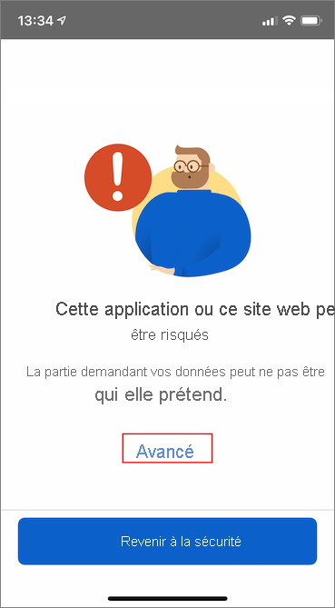

1. Lors de l’avertissement concernant un site web risqué, sélectionnez **Continuer quand même (non sécurisé)** . Vous voyez cet avertissement, car votre domaine n’est pas lié à votre identificateur décentralisé (DID). Pour vérifier votre domaine, suivez les instructions fournies dans [Lier votre domaine à votre identificateur décentralisé (DID)](how-to-dnsbind.md). Pour ce tutoriel, vous pouvez ignorer l’inscription du domaine et sélectionner **Continuer quand même (non sécurisé)** .

     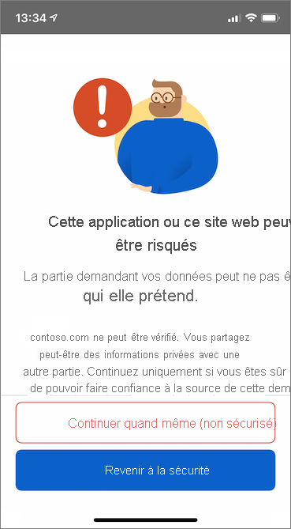

1. Vous serez invité à entrer un code PIN qui s’affiche dans l’écran où vous avez scanné le code QR. Le code PIN ajoute une couche supplémentaire de protection à l’émission. Le code PIN est généré de manière aléatoire chaque fois qu’un code QR d’émission est affiché.

     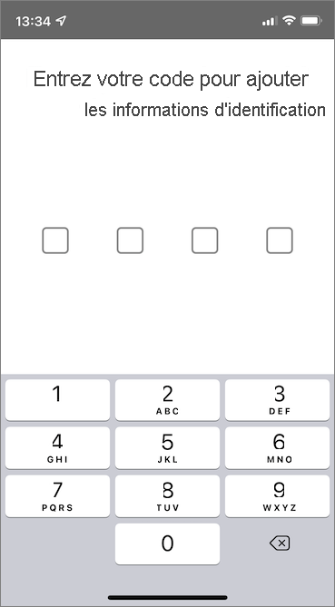

1. Après avoir entré le numéro PIN, l’écran **Ajouter un justificatif** apparaît. En haut de l’écran, vous voyez un message **Non vérifié** (en rouge). Cet avertissement est lié à l’avertissement de validation de domaine mentionné plus tôt.

1. Sélectionnez **Ajouter** pour accepter votre nouveau justificatif vérifiable.

    

Félicitations ! Vous disposez maintenant d’un justificatif vérifiable d’expert Justificatif vérifié.

  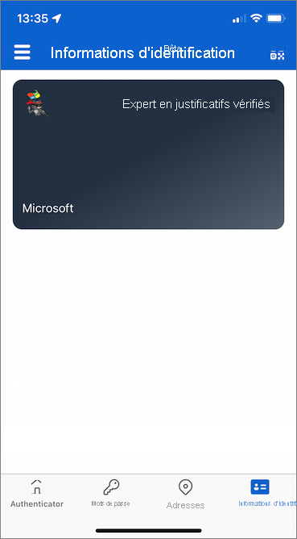

Revenez à l’exemple d’application. Il vous indique qu’un justificatif a été correctement émis.

  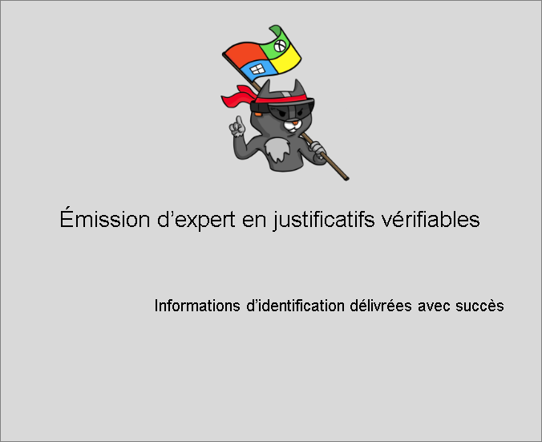

## <a name="verify-the-verified-credential-expert-card"></a>Vérifier la carte d’expert Justificatif vérifié

Vous êtes maintenant prêt à vérifier votre carte d’expert Justificatif vérifié en exécutant à nouveau l’exemple d’application.

1. Appuyez sur le bouton Précédent de votre navigateur pour revenir à la page d’accueil de l’exemple d’application.

1. Sélectionnez **Vérifier les justificatifs**.  

   

1. Utilisez l’application Authenticator pour scanner le code QR ou scannez-le directement avec votre appareil photo mobile.

1. Quand vous voyez le message d’avertissement, sélectionnez **Avancé**. Ensuite, sélectionnez **Continuer quand même (non sécurisé)** .

1. Approuvez la demande de présentation en sélectionnant **Autoriser**.

    

1. Une fois que vous avez approuvé la demande de présentation, vous pouvez voir que la demande a été approuvée. Vous pouvez également vérifier le journal. Pour voir le journal, sélectionnez le justificatif vérifiable.  

    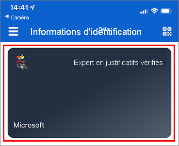

1. Ensuite, sélectionnez **Activité récente**.  

    

1. Vous pouvez maintenant voir les activités récentes de votre justificatif vérifiable.

    

1. Revenez à l’exemple d’application. Il vous indique que la présentation des justificatifs vérifiables a été reçue.  
    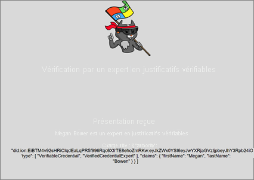

## <a name="verifiable-credential-names"></a>Noms des justificatifs vérifiables 

Votre justificatif vérifiable contient **Megan Bowen** comme valeurs de prénom et de nom dans le justificatif. Ces valeurs étaient codées en dur dans l’exemple d’application et ont été ajoutées au justificatif vérifiable au moment de l’émission dans la charge utile. 

Dans des scénarios concrets, votre application extrait les détails de l’utilisateur à partir d’un fournisseur d’identité. L’extrait de code suivant indique où le nom est défini dans l’exemple d’application. 

```csharp
//file: IssuerController.cs
[HttpGet("/api/issuer/issuance-request")]
public async Task<ActionResult> issuanceRequest()
  {
    ...

    // Here you could change the payload manifest and change the first name and last name.
    payload["issuance"]["claims"]["given_name"] = "Megan";
    payload["issuance"]["claims"]["family_name"] = "Bowen";
    ...
}
  ```

## <a name="next-steps"></a>Étapes suivantes

Dans l’[étape suivante](verifiable-credentials-configure-verifier.md), découvrez comment une application tierce, également appelée application par partie de confiance, peut vérifier vos justificatifs avec le service d’API de justificatifs vérifiables de son propre locataire Azure AD.

