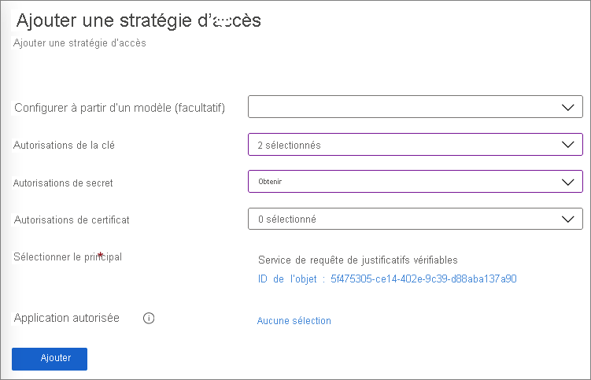
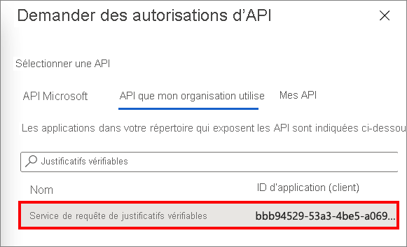
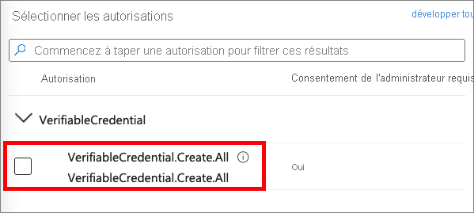
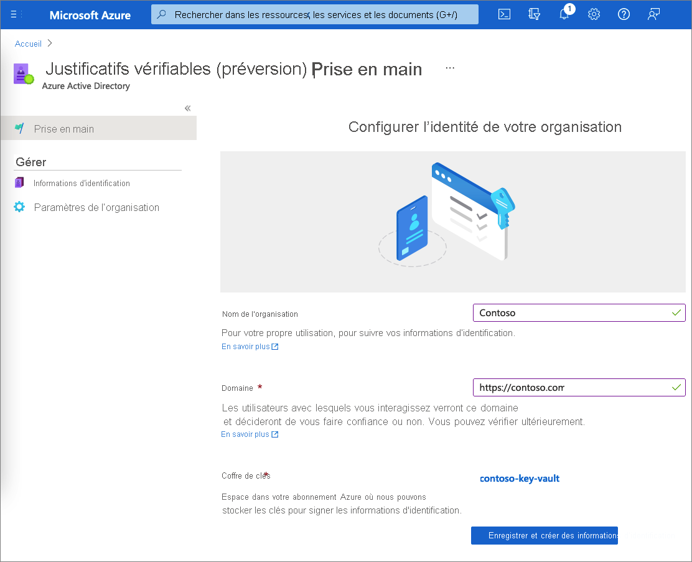

# <a name="configure-your-tenant-for-azure-ad-verifiable-credentials-preview"></a>Configurer votre locataire pour les justificatifs vérifiables Azure AD (préversion)

Justificatifs vérifiables Azure Active Directory (Azure AD) protège votre organisation grâce à une solution d’identité transparente et décentralisée. Ce service vous permet d’émettre et de vérifier des informations d’identification. Pour les émetteurs, Azure AD fournit un service qu’ils peuvent personnaliser et utiliser pour émettre leurs propres justificatifs vérifiables. Pour les vérificateurs, le service fournit une API REST gratuite qui facilite la demande et l’acceptation de justificatifs vérifiables dans vos applications et services.

Dans ce tutoriel, vous apprendrez à configurer votre locataire Azure AD pour qu’il puisse utiliser ce service de justificatifs vérifiables.

Plus précisément, vous apprenez à :

> [!div class="checklist"]
>
> - Configurer un principal de service
> - Créer un coffre de clés dans Azure Key Vault
> - Inscrire une application dans Azure AD
> - Configurer le service Justificatifs vérifiables

Le diagramme suivant illustre l’architecture d’Azure AD Verifiable Credentials et le composant que vous configurez.


## <a name="prerequisites"></a>Prérequis

- Si vous n’avez pas d’abonnement Azure, [créez-en un gratuitement](https://azure.microsoft.com/free/?WT.mc_id=A261C142F).
- Prenez un abonnement aux [éditions Azure Active Directory Premium](../../active-directory/fundamentals/active-directory-get-started-premium.md) dans votre locataire.
- Assurez-vous d’avoir l’autorisation d’[administrateur général](../../active-directory/roles/permissions-reference.md#global-administrator) pour le répertoire que vous souhaitez configurer.
- Assurez-vous d’avoir installé [PowerShell](/powershell/scripting/install/installing-powershell) 7.0.6 LTS-x64, PowerShell 7.1.3-x64 ou une version ultérieure.

## <a name="set-up-a-service-principal"></a>Configurer un principal de service

Créez un principal de service pour l’API du service de demande. L’API de service est le service Microsoft que vous utilisez pour émettre ou vérifier des justificatifs vérifiables Azure AD.

Pour créer le principal de service :

1. Exécutez les commandes PowerShell suivantes. Ces commandes installent et importent le module `AzureAD`. Pour plus d’informations, consultez [Installer le module Azure Az PowerShell](/powershell/azure/install-az-ps#installation).

    ```powershell
    if ((Get-Module -ListAvailable -Name "AzureAD") -eq $null) {  Install-Module "AzureAD" -Scope CurrentUser }  Import-Module AzureAD
    ```

1. Exécutez la commande PowerShell suivante pour vous connecter à votre locataire Azure AD. Remplacez \<*your-tenant-ID*> par l’[ID de votre locataire Azure AD](../../active-directory/fundamentals/active-directory-how-to-find-tenant.md).

    ```powershell
    Connect-AzureAD -TenantId <your-tenant-ID>
    ```

1. Dans la même session PowerShell, exécutez la commande suivante. Le `AppId` `bbb94529-53a3-4be5-a069-7eaf2712b826` fait référence au service Justificatifs vérifiables de Microsoft.

    ```powershell
    New-AzureADServicePrincipal -AppId "bbb94529-53a3-4be5-a069-7eaf2712b826" -DisplayName "Verifiable Credential Request Service" 
    ```

## <a name="create-a-key-vault"></a>Création d’un coffre de clés

[Azure Key Vault](../../key-vault/general/basic-concepts.md) est un service cloud qui permet l’accès et le stockage sécurisés des secrets et des clés. Votre service des justificatifs vérifiables stocke les clés publiques et privées dans Azure Key Vault. Ces clés sont utilisées pour signer et vérifier les justificatifs.

Si vous n’avez pas d’instance d’Azure Key Vault, procédez comme suit pour créer un coffre de clés à l’aide du portail Azure.

>[!NOTE]
>Par défaut, le compte qui crée le coffre de clés est le seul à pouvoir y accéder. Le service Justificatifs vérifiables doit avoir accès au coffre de clés. Vous devez configurer le coffre de clés avec une stratégie d’accès qui autorise le compte utilisé lors de la configuration à créer et à supprimer des clés. Le compte utilisé lors de la configuration doit également avoir l’autorisation de signer pour créer la liaison de domaine pour Justificatifs vérifiables. Si vous utilisez le même compte lors des tests, modifiez la stratégie par défaut pour accorder au compte l’autorisation de signature, en plus des autorisations par défaut accordées aux créateurs de coffres.

### <a name="set-access-policies-for-the-key-vault"></a>Définir des stratégies d’accès pour le coffre de clés

Une fois votre coffre de clés créé, Justificatifs vérifiables génère un jeu de clés utilisé pour assurer la sécurité des messages. Ces clés sont stockées dans le coffre de clés. Vous utilisez un jeu de clés pour signer, mettre à jour et récupérer des justificatifs vérifiables.

Une [stratégie d’accès](../../key-vault/general/assign-access-policy.md) Key Vault détermine si un principal de sécurité donné peut effectuer des opérations sur des clés et des secrets Key Vault. Définissez des stratégies d’accès dans votre coffre de clés pour le compte administrateur du service Justificatifs vérifiables Azure AD et pour le principal d’API du service de demande que vous avez créé.

1. Dans le [portail Azure](https://portal.azure.com/), accédez au coffre de clés que vous utilisez pour ce tutoriel.

1. Sous **Paramètres**, sélectionnez **Stratégies d’accès**.

1. Dans **Ajouter des stratégies d’accès**, sous **UTILISATEUR**, sélectionnez le compte que vous utilisez pour ce tutoriel.

1. Pour **Autorisations de clé**, vérifiez que les autorisations suivantes sont sélectionnées : **Créer**, **Supprimer** et **Signer**. Par défaut, les paramètres **Créer** et **Supprimer** sont déjà activés. **Signer** doit être la seule autorisation de clé que vous devez mettre à jour.

    

1. Pour enregistrer les modifications, sélectionnez **Enregistrer**.

1. Sélectionnez **+ Ajouter une stratégie d’accès** pour ajouter une autorisation au principal de service du service **de demande de justificatifs vérifiables**.

1. Dans **Ajouter une stratégie d’accès** :

    1. Pour **Autorisations de clé**, sélectionnez **Obtenir** et **Signer**.

    1. Pour **Autorisations de secret**, sélectionnez **Obtenir**.

    1. Pour **Sélectionner le principal**, sélectionnez **Service de demande de justificatifs vérifiables**.

    1. Sélectionnez **Ajouter**.  
        
       

1. Sélectionnez **Enregistrer** pour enregistrer la nouvelle stratégie que vous avez créée.

## <a name="register-an-application-in-azure-ad"></a>Inscrire une application dans Azure AD

Le service de demande de justificatifs vérifiables Azure AD doit être en mesure d’obtenir des jetons d’accès à émettre et à vérifier. Pour obtenir des jetons d’accès, inscrivez une application web et accordez une autorisation d’API pour l’API du service de demande de justificatifs vérifiables que vous avez configurée à l’étape précédente.

1. Connectez-vous au [portail Azure](https://portal.azure.com/) avec votre compte d’administrateur.

1. Si vous avez accès à plusieurs locataires, sélectionnez l’icône **Répertoire + abonnement** :::image type="icon" source="media/verifiable-credentials-configure-tenant/portal-directory-subscription-filter.png" border="false":::. Ensuite, recherchez et sélectionnez votre instance **Azure Active Directory**.

1. Sous **Gérer**, sélectionnez **Inscriptions d’applications** > **Nouvelle inscription**.  

   

1. Entrez un nom d’affichage pour votre application. Par exemple : *verifiable-credentials-app*.

1. Pour **Types de comptes pris en charge**, sélectionnez **Comptes dans cet annuaire organisationnel uniquement (Annuaire par défaut uniquement – Locataire unique)** .

1. Sélectionnez **Inscrire** pour créer l’application.

   

### <a name="grant-permissions-to-get-access-tokens"></a>Accorder des autorisations pour obtenir des jetons d’accès

Dans cette étape, vous accordez des autorisations au principal du service de demande de justificatifs vérifiables créé à l’[étape 1](#set-up-a-service-principal).

Pour ajouter les autorisations requises, suivez ces étapes :

1. Restez dans la page des détails de l’application **verifiable-credentials-app**. Sélectionnez **Autorisations de l’API** > **Ajouter une autorisation**.
    
    

1. Sélectionnez **API utilisées par mon organisation**.

1. Recherchez le principal de service que vous avez créé précédemment, **Service de demande de justificatifs vérifiables**, et sélectionnez-le.
    
    

1. Choisissez **Permission d’application** et développez **VerifiableCredential.Create.All**.

    

1. Sélectionnez **Ajouter des autorisations**.

1. Sélectionnez **Accorder le consentement administrateur pour \<your tenant name\>** .

## <a name="set-up-verifiable-credentials"></a>Configurer Justificatifs vérifiables 

Pour configurer Justificatifs vérifiables Azure AD, procédez comme suit :

1. Dans le [portail Azure](https://portal.azure.com/), recherchez des *justificatifs vérifiables*. Ensuite, sélectionnez **Justificatifs vérifiables (préversion)** .

1. Dans le menu de gauche, sélectionnez **Démarrage**.

1. Configurez votre organisation en fournissant les informations suivantes :

    1. **Nom de l’organisation** : entrez un nom pour faire référence à votre entreprise dans le cadre des justificatifs vérifiables. Vos clients ne voient pas ce nom.

    1. **Domaine** : entrez un domaine ajouté à un point de terminaison de service dans votre document d’identité décentralisée (DID). Le domaine est ce qui lie votre DID à un élément tangible que l’utilisateur peut connaître sur votre entreprise. Microsoft Authenticator et d’autres portefeuilles numériques utilisent ces informations pour s’assurer que votre DID est lié à votre domaine. Si le portefeuille peut vérifier le DID, il affiche un symbole vérifié. Dans le cas contraire, il informe l’utilisateur que des justificatifs ont été émis par une organisation qu’il n’a pas pu valider.   
            
        >[!IMPORTANT]
        > Le domaine ne peut pas être une redirection. Dans le cas contraire, le DID et le domaine ne peuvent pas être liés. Veillez à utiliser le protocole HTTPS pour le domaine. Par exemple : `https://contoso.com`.

    1. **Coffre de clés** : entrez le nom du coffre de clés que vous avez créé précédemment.

1. Sélectionnez **Enregistrer et créer un justificatif**.  
    
    

## <a name="next-steps"></a>Étapes suivantes

- [Découvrez comment émettre des justificatifs vérifiables Azure AD à partir d’une application web](verifiable-credentials-configure-issuer.md).
- [Découvrez comment vérifier des justificatifs vérifiables Azure AD](verifiable-credentials-configure-verifier.md).
