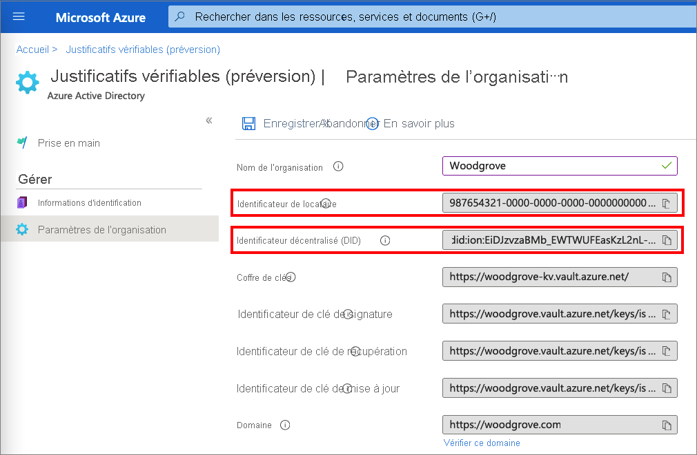
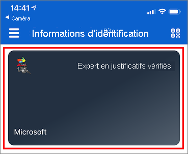
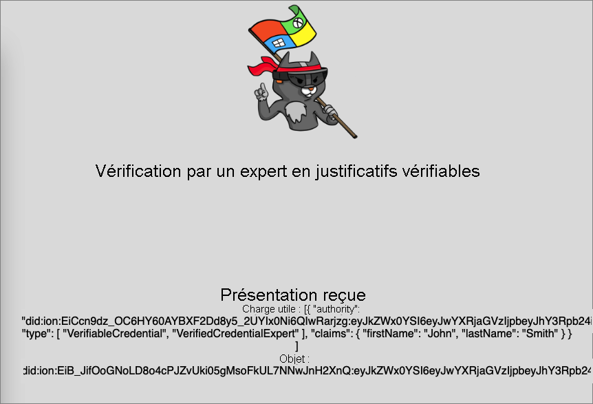

# <a name="configure-azure-ad-verifiable-credentials-verifier-preview"></a>Configurer un vérificateur Justificatifs vérifiables Azure AD (préversion)

Dans [Émettre des justificatifs vérifiables à partir d’une application (préversion)](verifiable-credentials-configure-issuer.md), vous allez apprendre à émettre et à vérifier les justificatifs à l’aide du même locataire Azure Active Directory (Azure AD). Dans ce tutoriel, vous passez en revue les étapes nécessaires à la présentation et à la vérification de votre premier justificatif vérifiable : une carte d’expert en justificatif vérifié.

En tant que vérificateur, vous déverrouillez des privilèges sur les personnes qui détiennent des cartes d’expert en justificatifs vérifiés. Dans ce tutoriel, vous exécutez un exemple d’application à partir de votre ordinateur local qui vous demande de présenter une carte d’expert en justificatif vérifié, puis qui vérifie cette dernière.

Dans cet article, vous apprendrez comment :

> [!div class="checklist"]
>
> - Télécharger le code de l’exemple d’application sur votre ordinateur local
> - Configurer Justificatifs vérifiables Azure AD dans votre locataire Azure AD
> - Collecter les justificatifs vérifiables et les détails sur l’environnement pour configurer votre exemple d’application et le mettre à jour avec les détails de votre carte d’expert en justificatif vérifié
> - Exécuter l’exemple d’application et initialiser un processus d’émission de justificatifs vérifiables

## <a name="prerequisites"></a>Prérequis

- [Configurez un locataire pour Azure AD Verifiable Credentials](verifiable-credentials-configure-tenant.md).
- Si vous voulez cloner le référentiel qui héberge l’exemple d’application, installez [Git](https://git-scm.com/downloads).
- [Visual Studio Code](https://code.visualstudio.com/Download) ou un éditeur de code similaire.
- [.NET 5.0](https://dotnet.microsoft.com/download/dotnet/5.0).
- [ngrok](https://ngrok.com/) (gratuit).
- Un appareil mobile avec Microsoft Authenticator :
  - Android version 6.2108.5654 ou ultérieure installé.
  - iOS version 6.5.82 ou ultérieure installé.

## <a name="gather-tenant-details-to-set-up-your-sample-application"></a>Rassembler les détails du locataire pour configurer votre exemple d’application

Maintenant que vous avez configuré votre service Justificatifs vérifiables Azure AD, vous allez collecter des informations sur votre environnement et les justificatifs vérifiables que vous avez définis. Vous utilisez ces informations pour configurer votre exemple d’application.

1. Dans **Justificatifs vérifiables (préversion)** , sélectionnez **Paramètres de l’organisation**.
1. Copiez la valeur d’**Identificateur de locataire** et enregistrez-la pour plus tard.
1. Copiez la valeur d’**Identificateur décentralisé** et enregistrez-la pour plus tard.

La capture d’écran suivante montre comment copier les valeurs requises :



## <a name="download-the-sample-code"></a>Télécharger l’exemple de code

L’exemple d’application est disponible dans .NET et le code est conservé dans un dépôt GitHub. Téléchargez l’exemple de code à partir du [référentiel GitHub](https://github.com/Azure-Samples/active-directory-verifiable-credentials-dotnet) ou clonez le référentiel sur votre ordinateur local :

```bash
git clone git@github.com:Azure-Samples/active-directory-verifiable-credentials-dotnet.git 
```

## <a name="configure-the-verifiable-credentials-app"></a>Configurer l’application de justificatifs vérifiables

Créez un secret client pour l’application inscrite que vous avez créée. L’exemple d’application utilise le secret client pour prouver son identité lorsqu’elle demande des jetons.

1. Dans Azure AD, accédez à **Inscriptions d’applications**.

1. Sélectionnez l’application **verifiable-credentials-app** que vous avez créée précédemment.

1. Sélectionnez le nom à afficher dans **Détails des inscriptions d’applications**.

1. Copiez la valeur d’**ID d’application (client)** et stockez-la pour plus tard. 

    

1. Dans **Détails des inscriptions d’applications**, dans le menu principal, sous **Gérer**, sélectionnez **Certificats et secrets**.

1. Sélectionnez **Nouveau secret client**.

    1. Dans la zone **Description**, entrez une description pour le secret client (par exemple, vc-sample-secret).

    1. Sous **Expire**, sélectionnez une durée pendant laquelle le secret est valide (par exemple, six mois). Sélectionnez ensuite **Ajouter**.

    1. Enregistrez la **Valeur** du secret. Vous utiliserez cette valeur pour la configuration dans une étape ultérieure. Cette valeur de secret ne sera plus jamais affichée et aucun autre moyen ne permettra de la récupérer. Vous devez donc l’enregistrer dès qu’elle est visible.

À ce stade, vous devez disposer de toutes les informations nécessaires pour configurer votre exemple d’application.

## <a name="update-the-sample-application"></a>Mettre à jour l’exemple d’application

Modifiez maintenant le code de l’émetteur de l’exemple d’application pour le mettre à jour avec l’URL de vos justificatifs vérifiables. Vous pouvez ainsi émettre des justificatifs vérifiables à l’aide de votre propre abonné.

1. Dans le répertoire *active-directory-verifiable-credentials-dotnet-main*, ouvrez **Visual Studio Code**. Sélectionnez le projet dans le répertoire *1. asp-net-core-api-idtokenhint*.

1. Dans le dossier racine du projet, ouvrez le fichier *appsettings.json*. Ce fichier contient des informations sur vos informations d’identification dans Justificatifs vérifiables Azure AD. Mettez à jour les propriétés suivantes avec les informations que vous avez enregistrées au cours des étapes précédentes.

    1. **ID de locataire** : votre ID de locataire
    1. **ID client** : votre ID client
    1. **Clé secrète client** : votre clé secrète client
    1. **VerifierAuthority** : votre identificateur décentralisé
    1. **CredentialManifest** : votre URL d’émission de justificatifs

1. Enregistrez le fichier *appsettings.json*.

Le code JSON suivant illustre un fichier *appsettings.json* complet :

```json
{

 "AppSettings": {
   "Endpoint": "https://beta.did.msidentity.com/v1.0/{0}/verifiablecredentials/request",
   "VCServiceScope": "bbb94529-53a3-4be5-a069-7eaf2712b826/.default",
   "Instance": "https://login.microsoftonline.com/{0}",
   "TenantId": "987654321-0000-0000-0000-000000000000",
   "ClientId": "555555555-0000-0000-0000-000000000000",
   "ClientSecret": "123456789012345678901234567890",
   "VerifierAuthority": "did:ion:EiDJzvzaBMb_EWTWUFEasKzL2nL-BJPhQTzYWjA_rRz3hQ:eyJkZWx0YSI6eyJwYXRjaGVzIjpbeyJhY3Rpb24iOiJyZXBsYWNlIiwiZG9jdW1lbnQiOnsicHVibGljS2V5cyI6W3siaWQiOiJzaWdfMmNhMzY2YmUiLCJwdWJsaWNLZXlKd2siOnsiY3J2Ijoic2VjcDI1NmsxIiwia3R5IjoiRUMiLCJ4IjoiZDhqYmduRkRGRElzR1ZBTWx5aDR1b2RwOGV4Q2dpV3dWUGhqM0N...",
   "CredentialManifest": " https://beta.did.msidentity.com/v1.0/987654321-0000-0000-0000-000000000000/verifiableCredential/contracts/VerifiedCredentialExpert"
 }
}
```

## <a name="run-and-test-the-sample-app"></a>Exécuter et tester l’exemple d’application

Vous êtes maintenant prêt à présenter et à vérifier votre première carte d’expert en justificatif vérifié en exécutant cet exemple d’application.

1. Dans Visual Studio Code, exécutez le projet *Verifiable_credentials_DotNet*. Ou, dans l’interpréteur de commandes, exécutez les commandes suivantes :

    ```bash
    cd active-directory-verifiable-credentials-dotnet/1. asp-net-core-api-idtokenhint  dotnet build "asp-net-core-api-idtokenhint.csproj" -c Debug -o .\bin\Debug\netcoreapp3.1  
    dotnet run
    ```

1. Dans un autre terminal, exécutez la commande ci-dessous. Cette commande exécute [ngrok](https://ngrok.com/) pour configurer une URL sur 3000 et la rendre disponible publiquement sur Internet.

    ```bash
    ngrok http 3000 
    ```
    
    >[!NOTE]
    > Sur certains ordinateurs, vous devrez probablement exécuter la commande dans le format `./ngrok http 3000`

1. Ouvrez l’URL HTTPS générée par ngrok.

    

1. Dans le navigateur web, sélectionnez **Vérifier les informations d’identification**.

    

1. Utilisez Authenticator pour scanner le code QR ou scannez ce dernier directement avec l’appareil photo de votre mobile.

1. Lorsque vous voyez le message d’avertissement *« Cette application ou ce site web peut être risqué(e) »* , sélectionnez **Avancé**. Cet avertissement s’affiche, car votre domaine n’est pas vérifié. Pour ce tutoriel, vous pouvez ignorer l’inscription du domaine.  

    
    

1. Lors de l’avertissement concernant un site web risqué, sélectionnez **Continuer quand même (non sécurisé)** .  
 
    

1. Approuvez la demande en sélectionnant **Autoriser**.

    

1. Une fois que vous avez approuvé la demande, vous pouvez voir que la demande a été approuvée. Vous pouvez également vérifier le journal. Pour voir le journal, sélectionnez le justificatif vérifiable.

    

1. Ensuite, sélectionnez **Activité récente**.  

    

1. **Activité récente** vous montre les activités récentes de vos justificatifs vérifiables.

    

1. Revenez à l’exemple d’application. Il vous indique que la présentation des justificatifs vérifiables a été reçue.

    

## <a name="next-steps"></a>Étapes suivantes

Découvrez [comment personnaliser vos justificatifs vérifiables](credential-design.md).
