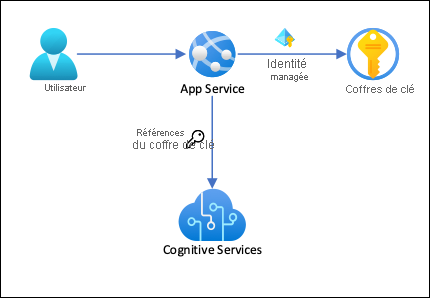
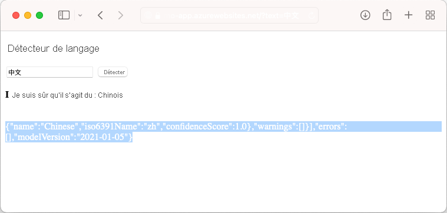

# <a name="tutorial-secure-cognitive-service-connection-from-app-service-using-key-vault"></a>Tutoriel : Sécurisation de la connexion d’App Service à Cognitive Services avec Key Vault

[Azure App Service](overview.md) peut utiliser des [identités managées](overview-managed-identity.md) pour se connecter à des services back-end sans chaîne de connexion, ce qui permet d’éliminer les secrets de connexion à gérer et de sécuriser la connectivité back-end dans un environnement de production. En ce qui concerne les services back-end qui ne prennent pas en charge les identités managées et ont quand même besoin de secrets de connexion, vous pouvez utiliser Key Vault pour gérer les secrets de connexion. Ce tutoriel prend l’exemple de Cognitive Services pour montrer comment cela fonctionne dans la pratique. Lorsque vous aurez terminé, vous disposerez d’une application qui effectue des appels programmatiques à Cognitive Services, sans stocker de secrets de connexion dans App Service.

> [!TIP]
> Même si Azure Cognitive Services [prend en charge l’authentification par identités managées](../cognitive-services/authentication.md#authorize-access-to-managed-identities), ce tutoriel utilise [l’authentification par clé d’abonnement](../cognitive-services/authentication.md#authenticate-with-a-single-service-subscription-key) pour montrer comment se connecter à un service Azure qui ne prend pas en charge les identités managées à partir d’App Services.



Cette architecture présente les caractéristiques suivantes : 

- La connectivité à Key Vault est sécurisée par des identités managées.
- App Service accède aux secrets à l’aide de [références du coffre de clés](app-service-key-vault-references.md) utilisées comme paramètres d’application.
- L’accès au coffre de clés est limité à l’application. Les contributeurs de l’application, par exemple les administrateurs, peuvent disposer d’un contrôle total sur les ressources App Service, mais n’ont pas accès aux secrets Key Vault.
- Si le code de votre application accède déjà aux secrets de connexion avec les paramètres d’application, aucune modification n’est requise.

Contenu :

> [!div class="checklist"]
> * Activer les identités managées
> * Utiliser des identités managées pour se connecter à Key Vault
> * Utiliser des références Key Vault
> * Accéder à Cognitive Services

## <a name="prerequisites"></a>Prérequis

Préparez votre environnement pour l’interface Azure CLI.

[!INCLUDE [azure-cli-prepare-your-environment-no-header.md](../../includes/azure-cli-prepare-your-environment-no-header.md)]

## <a name="create-app-with-connectivity-to-cognitive-services"></a>Création d’une application possédant une connectivité à Cognitive Services

1. Créez un groupe de ressources qui contiendra toutes vos ressources :

    ```azurecli-interactive
    # Save resource group name as variable for convenience
    groupName=myKVResourceGroup
    region=westeurope

    az group create --name $groupName --location $region
    ```

1. Créez une ressource Cognitive Services. Remplacez *\<cs-resource-name>* par le nom unique de votre choix.

    ```azurecli-interactive
    # Save resource name as variable for convenience. 
    csResourceName=<cs-resource-name>

    az cognitiveservices account create --resource-group $groupName --name $csResourceName --location $region --kind TextAnalytics --sku F0 --custom-domain $csResourceName
    ```

    > [!NOTE]
    > `--sku F0` crée une ressource Cognitive Services de niveau Gratuit. Chaque abonnement est limité à un quota d’une ressource `TextAnalytics` de niveau Gratuit. Si vous avez déjà dépassé le quota, utilisez plutôt `--sku S`.

1. Clonez l’exemple de référentiel localement et déployez l’exemple d’application sur App Service. Remplacez *\<app-name>* par un nom unique.

    ### <a name="net-5"></a>[.NET 5](#tab/dotnet)

    ```azurecli-interactive
    # Save app name as variable for convenience
    appName=<app-name>

    # Clone sample application
    git clone https://github.com/Azure-Samples/app-service-language-detector.git
    cd app-service-language-detector/dotnet
    
    az webapp up --sku F1 --resource-group $groupName --name $appName --plan $appName --location $region
    ```

    ### <a name="php"></a>[PHP](#tab/php)

    ```azurecli-interactive
    # Clone and prepare sample application
    git clone https://github.com/Azure-Samples/app-service-language-detector.git
    cd app-service-language-detector/php
    zip default.zip index.php
    
    # Save app name as variable for convenience
    appName=<app-name>

    az appservice plan create --resource-group $groupName --name $appName --sku FREE --location $region
    az webapp create --resource-group $groupName --plan $appName --name $appName
    az webapp deployment source config-zip --resource-group $groupName --name $appName --src ./default.zip
    ```

    -----

1. Configurez les secrets Cognitive Services dans les paramètres d’application `CS_ACCOUNT_NAME` et `CS_ACCOUNT_KEY`.

    ```azurecli-interactive
    # Get subscription key for Cognitive Services resource
    csKey1=$(az cognitiveservices account keys list --resource-group $groupName --name $csResourceName --query key1 --output tsv)

    az webapp config appsettings set --resource-group $groupName --name $appName --settings CS_ACCOUNT_NAME="$csResourceName" CS_ACCOUNT_KEY="$csKey1"
    ````

1. Dans le navigateur, accédez à votre application de déploiement à l’adresse `<app-name>.azurewebsites.net` et essayez le détecteur de langage avec des chaînes exprimées dans différentes langues.

    

    Comme vous pouvez le constater en examinant le code de l’application, la sortie de débogage de la détection se traduit par une police de la couleur de l’arrière-plan. Pour le voir, essayez de mettre en surbrillance l’espace blanc situé juste au-dessous du résultat.

## <a name="secure-back-end-connectivity"></a>Sécurisation de la connectivité back-end

Pour le moment, les secrets de connexion sont stockés sous forme de paramètres d’application dans l’application App Service. Cette approche sécurise déjà les secrets de connexion du codebase de votre application. Toutefois, un contributeur autorisé à gérer votre application peut également voir les paramètres de l’application. Au cours de cette étape, vous allez déplacer les secrets de connexion dans un coffre de clés et verrouiller l’accès afin d’être la seule personne à pouvoir le gérer. Seule l’application App Service pourra le lire à l’aide de son identité managée.

1. Création d’un coffre de clés Remplacez *\<vault-name>* par un nom unique.

    ```azurecli-interactive
    # Save app name as variable for convenience
    vaultName=<vault-name>

    az keyvault create --resource-group $groupName --name $vaultName --location $region --sku standard --enable-rbac-authorization
    ```

    Le paramètre `--enable-rbac-authorization` [définit le contrôle d’accès en fonction du rôle (RBAC, Role-Based Access Control) Azure comme modèle d’autorisation](../key-vault/general/rbac-guide.md#using-azure-rbac-secret-key-and-certificate-permissions-with-key-vault). Ce paramètre invalide par défaut toutes les autorisations des stratégies d’accès.

1. Donnez-vous le rôle RBAC *Responsable des secrets Key Vault* du coffre.
    
    ```azurecli-interactive
    vaultResourceId=$(az keyvault show --name $vaultName --query id --output tsv)
    myId=$(az ad signed-in-user show --query objectId --output tsv)
    az role assignment create --role "Key Vault Secrets Officer" --assignee-object-id $myId --assignee-principal-type User --scope $vaultResourceId
    ```

1. Activez l’identité managée affectée par le système de votre application et donnez-lui le rôle RBAC *Utilisateur des secrets Key Vault* du coffre.

    ```azurecli-interactive
    az webapp identity assign --resource-group $groupName --name $appName --scope $vaultResourceId --role  "Key Vault Secrets User"
    ```

1. Ajoutez le nom de la ressource Cognitive Services et la clé d’abonnement aux secrets du coffre, puis enregistrez leur ID comme variables d’environnement pour l’étape suivante.

    ```azurecli-interactive
    csResourceKVUri=$(az keyvault secret set --vault-name $vaultName --name csresource --value $csResourceName --query id --output tsv)
    csKeyKVUri=$(az keyvault secret set --vault-name $vaultName --name cskey --value $csKey1 --query id --output tsv)
    ```

1. Précédemment, vous avez défini les secrets sous la forme des paramètres d’application `CS_ACCOUNT_NAME` et `CS_ACCOUNT_KEY` dans votre application. À présent, définissez-les comme [références du coffre de clés](app-service-key-vault-references.md).

    ```azurecli-interactive
    az webapp config appsettings set --resource-group $groupName --name $appName --settings CS_ACCOUNT_NAME="@Microsoft.KeyVault(SecretUri=$csResourceKVUri)" CS_ACCOUNT_KEY="@Microsoft.KeyVault(SecretUri=$csKeyKVUri)"
    ```

1. Dans le navigateur, accédez à nouveau à `<app-name>.azurewebsites.net`. Si recevez des résultats de détection, c’est le signe que vous vous connectez au point de terminaison Cognitive Services avec les références du coffre de clés.

Félicitations ! Votre application se connecte maintenant à Cognitive Services avec des secrets conservés dans votre coffre de clés, sans aucune modification du code.

## <a name="clean-up-resources"></a>Nettoyer les ressources

Au cours des étapes précédentes, vous avez créé des ressources Azure au sein d’un groupe de ressources. Si vous ne pensez pas avoir besoin de ces ressources à l’avenir, supprimez le groupe de ressources en exécutant la commande suivante dans Cloud Shell :

```azurecli-interactive
az group delete --name $groupName
```

L’exécution de cette commande peut prendre une minute.

## <a name="next-steps"></a>Étapes suivantes

- [Tutoriel : Isolation des communications back-end avec l’intégration du réseau virtuel](tutorial-networking-isolate-vnet.md)
- [Intégrer votre application à un réseau virtuel Azure](overview-vnet-integration.md)
- [Fonctionnalités de mise en réseau App Service](networking-features.md)