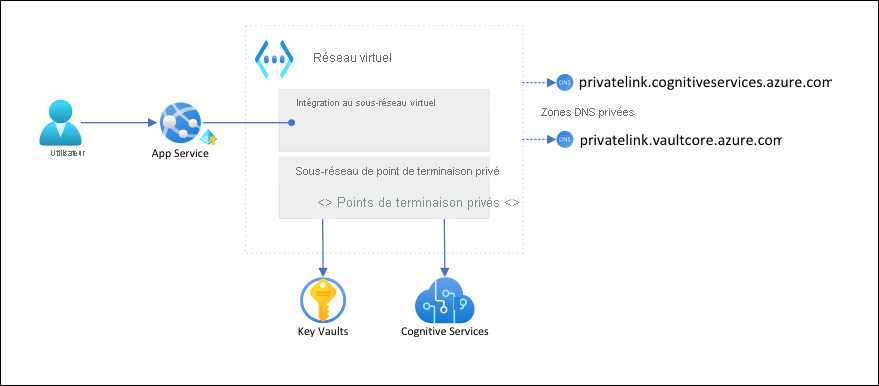

# <a name="tutorial-isolate-back-end-communication-in-azure-app-service-with-virtual-network-integration"></a>Tutoriel : isoler les communications back-end dans Azure App Service avec l’intégration du réseau virtuel

Dans cet article, vous allez configurer une application App Service avec une communication sécurisée, isolée du réseau, aux services principaux. L’exemple de scénario utilisé est dans [Tutorial : connexion de Cognitive Service sécurisé à partir de App service à l’aide de Key Vault](tutorial-connect-msi-key-vault.md). Lorsque vous avez terminé, vous disposez d’une application App Service qui accède à la fois à Key Vault et à Cognitive Services via un [réseau virtuel Azure](../virtual-network/virtual-networks-overview.md) (VNet), et aucun autre trafic n’est autorisé à accéder à ces ressources principales. Tout le trafic sera isolé au sein de votre réseau virtuel à l’aide de l'[intégration VNet](web-sites-integrate-with-vnet.md) et des [points de terminaison privés](../private-link/private-endpoint-overview.md).

En tant que service à plusieurs abonnés, le trafic réseau sortant de votre application App Service vers d’autres services Azure partage le même environnement avec d’autres applications, voire d’autres abonnements. Bien que le trafic lui-même puisse être chiffré, certains scénarios peuvent nécessiter un niveau de sécurité supplémentaire en isolant la communication principale à partir d’un autre trafic réseau. Ces scénarios sont généralement accessibles aux grandes entreprises disposant d’un haut niveau d’expertise, mais App Service les place à la portée de l’intégration au réseau virtuel.  



Dans cette architecture : 

- Le trafic public vers les services principaux est bloqué.
- Le trafic sortant à partir de App Service est acheminé vers le réseau virtuel et peut atteindre les services principaux.
- App Service est en mesure d’effectuer la résolution DNS vers les services principaux via les zones DNS privées.

Contenu :

> [!div class="checklist"]
> * Créer un réseau virtuel et des sous-réseaux pour l’intégration App Service au réseau virtuel
> * Créer des zones DNS privées
> * Créer des points de terminaison privés
> * Configurer l’intégration au réseau virtuel dans App Service

## <a name="prerequisites"></a>Prérequis

Ce tutoriel part du principe que vous avez suivi le [Tutoriel : sécuriser la connexion Cognitive Service de App Service à l’aide de Key Vault](tutorial-connect-msi-key-vault.md) et créez l’application de détecteur de langage. 

Le tutoriel continue à utiliser les variables d’environnement suivantes du tutoriel précédent. Veillez à les définir correctement.

```azurecli-interactive
    groupName=myKVResourceGroup
    region=westeurope
    csResourceName=<cs-resource-name>
    appName=<app-name>
    vaultName=<vault-name>
```

## <a name="create-vnet-and-subnets"></a>Créer un réseau virtuel et des sous-réseaux

1. Créer un réseau virtuel. Remplacez *\<virtual-network-name>* par un nom unique.

    ```azurecli-interactive
    # Save vnet name as variable for convenience
    vnetName=<virtual-network-name>

    az network vnet create --resource-group $groupName --location $region --name $vnetName --address-prefixes 10.0.0.0/16
    ```

1. Créez un sous-réseau pour l’intégration de réseau virtuel App Service.

    ```azurecli-interactive
    az network vnet subnet create --resource-group $groupName --vnet-name $vnetName --name vnet-integration-subnet --address-prefixes 10.0.0.0/24 --delegations Microsoft.Web/serverfarms
    ```

    Pour App Service, le sous-réseau d’intégration de réseau virtuel doit disposer d’un bloc CIDR de `/26` au minimum (consultez [Configuration requise pour le sous-réseau d’intégration de réseau virtuel](overview-vnet-integration.md#subnet-requirements)). `/24` est plus que suffisant. `--delegations Microsoft.Web/serverfarms` spécifie que le sous-réseau est [délégué pour l’intégration de réseau virtuel App Service](../virtual-network/subnet-delegation-overview.md).

1. Créez un autre sous-réseau pour les points de terminaison privés.

    ```azurecli-interactive
    az network vnet subnet create --resource-group $groupName --vnet-name $vnetName --name private-endpoint-subnet --address-prefixes 10.0.1.0/24 --disable-private-endpoint-network-policies
    ```

    Pour les sous-réseaux du point de terminaison privé, vous devez [désactiver les stratégies réseau des points de terminaison privés](../private-link/disable-private-endpoint-network-policy.md).

## <a name="create-private-dns-zones"></a>Créer des zones DNS privées

Étant donné que vos ressources Key Vault et Cognitive Services se trouvent derrière des [points de terminaison privés](../private-link/private-endpoint-overview.md), vous devez définir des [zones DNS privées](../dns/private-dns-privatednszone.md) pour eux. Ces zones sont utilisées pour héberger les enregistrements DNS pour les points de terminaison privés et permettre aux clients de rechercher les services principaux par nom. 

1. Créez deux zones DNS privées, une pour votre ressource Cognitive Services et une pour votre coffre de clés.

    ```azurecli-interactive
    az network private-dns zone create --resource-group $groupName --name privatelink.cognitiveservices.azure.com
    az network private-dns zone create --resource-group $groupName --name privatelink.vaultcore.azure.net
    ```

    Pour plus d’informations sur ces paramètres, consultez [Configuration DNS des points de terminaison privés Azure](../private-link/private-endpoint-dns.md#azure-services-dns-zone-configuration)

1. Liez les zones DNS privées au réseau virtuel.

    ```azurecli-interactive
    az network private-dns link vnet create --resource-group $groupName --name cognitiveservices-zonelink --zone-name privatelink.cognitiveservices.azure.com --virtual-network $vnetName --registration-enabled False
    az network private-dns link vnet create --resource-group $groupName --name vaultcore-zonelink --zone-name privatelink.vaultcore.azure.net --virtual-network $vnetName --registration-enabled False
    ```

## <a name="create-private-endpoints"></a>Créer des points de terminaison privés

1. Dans le sous-réseau de point de terminaison privé de votre réseau virtuel, créez un point de terminaison privé pour votre coffre de clés.

    ```azurecli-interactive
    # Get Cognitive Services resource ID
    csResourceId=$(az cognitiveservices account show --resource-group $groupName --name $csResourceName --query id --output tsv)

    az network private-endpoint create --resource-group $groupName --name securecstext-pe --location $region --connection-name securecstext-pc --private-connection-resource-id $csResourceId --group-id account --vnet-name $vnetName --subnet private-endpoint-subnet
    ```

1. Créez un groupe de zones DNS pour le point de terminaison privé Cognitive Services. Le groupe de zones DNS est un lien entre la zone DNS privée et le point de terminaison privé. Ce lien vous permet de mettre à jour automatiquement la zone DNS privée lorsqu’il existe une mise à jour du point de terminaison privé.  

    ```azurecli-interactive
    az network private-endpoint dns-zone-group create --resource-group $groupName --endpoint-name securecstext-pe --name securecstext-zg --private-dns-zone privatelink.cognitiveservices.azure.com --zone-name privatelink.cognitiveservices.azure.com
    ```

1. Bloquez le trafic public vers la ressource Cognitive Services.

    ```azurecli-interactive
    az rest --uri $csResourceId?api-version=2021-04-30 --method PATCH --body '{"properties":{"publicNetworkAccess":"Disabled"}}' --headers 'Content-Type=application/json'

    # Repeat following command until output is "Succeeded"
    az cognitiveservices account show --resource-group $groupName --name $csResourceName --query properties.provisioningState
    ```

    > [!NOTE]
    > Assurez-vous que l’état d’approvisionnement de votre modification est `"Succeeded"`. Vous pouvez ensuite observer le changement de comportement dans l’exemple d’application. Vous pouvez toujours charger l’application, mais si vous essayez de cliquer sur le bouton **Détecter**, vous recevez une erreur `HTTP 500`. L’application a perdu sa connectivité à la ressource Cognitive Services via la mise en réseau partagée.

1. Répétez les étapes ci-dessus pour le coffre de clés.

    ```azurecli-interactive
    # Create private endpoint for key vault
    vaultResourceId=$(az keyvault show --name $vaultName --query id --output tsv)
    az network private-endpoint create --resource-group $groupName --name securekeyvault-pe --location $region --connection-name securekeyvault-pc --private-connection-resource-id $vaultResourceId --group-id vault --vnet-name $vnetName --subnet private-endpoint-subnet
    # Create DNS zone group for the endpoint
    az network private-endpoint dns-zone-group create --resource-group $groupName --endpoint-name securekeyvault-pe --name securekeyvault-zg --private-dns-zone privatelink.vaultcore.azure.net --zone-name privatelink.vaultcore.azure.net
    # Block public traffic to key vault
    az keyvault update --name $vaultName --default-action Deny
    ```

1. Forcez une récupération immédiate des [références du coffre de clés](app-service-key-vault-references.md) dans votre application en réinitialisant les paramètres de l’application (pour plus d’informations, consultez [Rotation](app-service-key-vault-references.md#rotation)).

    ```azurecli-interactive
    az webapp config appsettings set --resource-group $groupName --name $appName --settings CS_ACCOUNT_NAME="@Microsoft.KeyVault(SecretUri=$csResourceKVUri)" CS_ACCOUNT_KEY="@Microsoft.KeyVault(SecretUri=$csKeyKVUri)"
    ```

    <!-- If above is not run then it takes a whole day for references to update? https://docs.microsoft.com/en-us/azure/app-service/app-service-key-vault-references#rotation -->

    > [!NOTE]
    > À nouveau, vous pouvez observer le changement de comportement dans l’exemple d’application. Vous ne pouvez plus charger l’application, car elle ne peut plus accéder aux références du coffre de clés. L’application a perdu sa connectivité au coffre de clés par le biais de la mise en réseau partagée.

Les deux points de terminaison privés sont accessibles uniquement aux clients dans le réseau virtuel que vous avez créé. Vous ne pouvez même pas accéder aux secrets du coffre de clés via la page **Secrets** du Portail Azure, car le portail y accède via l’Internet public (consultez [Gérer les ressources verrouillées](#manage-the-locked-down-resources)).

## <a name="configure-vnet-integration-in-your-app"></a>Configurer l’intégration au réseau virtuel dans votre application

1. Mettez à l’échelle l’application jusqu’au niveau **Standard**. L’intégration au réseau virtuel nécessite un niveau **Standard** ou une version ultérieure (consultez [Intégrer votre application à un réseau virtuel Azure](overview-vnet-integration.md)).

    ```azurecli-interactive
    az appservice plan update --name $appName --resource-group $groupName --sku S1
    ```

1. Sans rapport avec notre scénario, mais également important, appliquez le protocole HTTPS pour les demandes entrantes.

    ```azurecli-interactive
    az webapp update --resource-group $groupName --name $appName --https-only
    ```

1. Activer l’intégration au réseau virtuel sur votre application.

    ```azurecli-interactive
    az webapp vnet-integration add --resource-group $groupName --name $appName --vnet $vnetName --subnet vnet-integration-subnet
    ```
    
    L’intégration au réseau virtuel permet au trafic sortant de circuler directement dans le réseau virtuel. Par défaut, seul le trafic IP local défini dans [RFC-1918](https://tools.ietf.org/html/rfc1918#section-3) est acheminé vers le réseau virtuel, ce dont vous avez besoin pour les points de terminaison privés. Pour acheminer tout votre trafic vers le réseau virtuel, consultez [Gérer le routage de l' intégration du réseau virtuel](configure-vnet-integration-routing.md). Le routage de tout le trafic peut également être utilisé si vous souhaitez acheminer le trafic Internet via votre réseau virtuel, par exemple via un [NAT VNet Azure](../virtual-network/nat-gateway/nat-overview.md) ou un [Pare-feu Azure](../firewall/overview.md).

1. Dans le navigateur, accédez de nouveau à `<app-name>.azurewebsites.net` et attendez que l’intégration prenne effet. Si vous recevez une erreur HTTP 500, patientez quelques minutes, puis réessayez. Si vous pouvez charger la page et obtenir des résultats de détection, vous vous connectez au point de terminaison Cognitive Services avec les références du coffre de clés.

    >[!NOTE]
    > Si vous continuez à recevoir des erreurs HTTP 500 après un certain temps, il peut être utile de forcer une nouvelle récupération des [références du coffre de clés](app-service-key-vault-references.md), comme suit :
    >
    > ```azurecli-interactive
    > az webapp config appsettings set --resource-group $groupName --name $appName --settings CS_ACCOUNT_NAME="@Microsoft.KeyVault(SecretUri=$csResourceKVUri)" CS_ACCOUNT_KEY="@Microsoft.KeyVault(SecretUri=$csKeyKVUri)"
    > ```


## <a name="manage-the-locked-down-resources"></a>Gérer les ressources verrouillées

Selon vos scénarios, vous ne pourrez peut-être pas gérer les ressources protégées par le point de terminaison privé via le Portail Azure, Azure CLI ou Azure PowerShell (par exemple, Key Vault). Ces outils effectuent tous des appels d’API REST pour accéder aux ressources via l’Internet public et sont bloqués par votre configuration. Voici quelques options pour accéder aux ressources verrouillées :

- Pour Key Vault, ajoutez l’adresse IP publique de votre ordinateur local pour afficher ou mettre à jour les secrets protégés par le point de terminaison privé.
- Si votre réseau local est étendu au réseau virtuel Azure via une [passerelle VPN](../vpn-gateway/vpn-gateway-about-vpngateways.md) ou [ExpressRoute](../expressroute/expressroute-introduction.md), vous pouvez gérer les ressources protégées par le point de terminaison privé directement à partir de votre réseau local. 
- Gérez les ressources protégées par le point de terminaison privé à partir d’un [serveur de saut](https://wikipedia.org/wiki/Jump_server) dans le réseau virtuel.
- [Déployez Cloud Shell dans le réseau virtuel](../cloud-shell/private-vnet.md).

## <a name="clean-up-resources"></a>Nettoyer les ressources

Au cours des étapes précédentes, vous avez créé des ressources Azure au sein d’un groupe de ressources. Si vous ne pensez pas avoir besoin de ces ressources à l’avenir, supprimez le groupe de ressources en exécutant la commande suivante dans Cloud Shell :

```azurecli-interactive
az group delete --name $groupName
```

L’exécution de cette commande peut prendre une minute.

## <a name="next-steps"></a>Étapes suivantes

- [Intégrer votre application à un réseau virtuel Azure](overview-vnet-integration.md)
- [Fonctionnalités de mise en réseau App Service](networking-features.md)