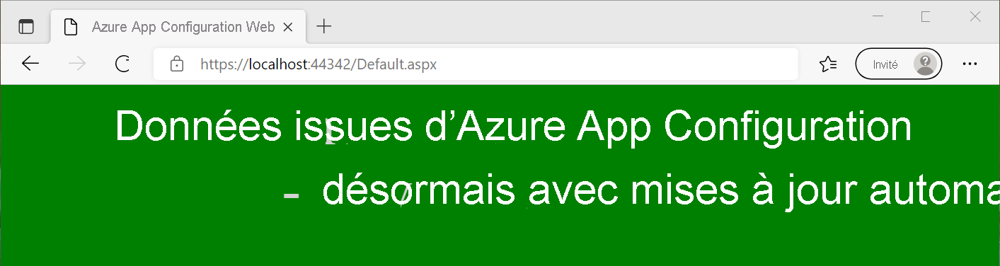

# <a name="tutorial-use-dynamic-configuration-in-an-aspnet-web-application-net-framework"></a>Tutoriel : Utiliser la configuration dynamique dans une application web ASP.NET (.NET Framework)

Les données d’App Configuration peuvent être chargées en tant que paramètres de l’application dans une application .NET Framework. Pour plus d’informations, consultez le [guide de démarrage rapide](./quickstart-dotnet-app.md). Toutefois, comme conçu par le .NET Framework, les paramètres de l’application ne peuvent être actualisés que lors du redémarrage de l’application. Le fournisseur .NET d’App Configuration est une bibliothèque .NET Standard. Il prend en charge la mise en cache et l’actualisation dynamiques de la configuration sans redémarrage de l’application. Ce tutoriel vous montre comment vous pouvez implémenter des mises à jour de configuration dynamiques dans une application ASP.NET Web Forms. La même technique s’applique aux applications MVC.NET Framework .

Dans ce tutoriel, vous allez apprendre à :

> [!div class="checklist"]
> * Configurer votre application web ASP.NET pour mettre à jour sa configuration en réponse aux changements survenant dans un magasin App Configuration.
> * Injecter la configuration la plus récente des demandes dans votre application.

## <a name="prerequisites"></a>Prérequis

- Abonnement Azure : [créez-en un gratuitement](https://azure.microsoft.com/free/)
- [Visual Studio](https://visualstudio.microsoft.com/vs)
- [.NET Framework 4.7.2 ou version ultérieure](https://dotnet.microsoft.com/download/dotnet-framework)

## <a name="create-an-app-configuration-store"></a>Créer un magasin App Configuration

[!INCLUDE[Azure App Configuration resource creation steps](../../includes/azure-app-configuration-create.md)]

7. Sélectionnez **Opérations** > **Explorateur de configurations** > **Créer** > **Clé-valeur** pour ajouter les clés-valeurs suivantes :

    | Clé                                | Valeur                               |
    |------------------------------------|-------------------------------------|
    | *TestApp:Settings:BackgroundColor* | *Blancs*                             |
    | *TestApp:Settings:FontColor*       | *Noir*                             |
    | *TestApp:Settings:FontSize*        | *40*                                |
    | *TestApp:Settings:Message*         | *Data from Azure App Configuration* |
    | *TestApp:Settings:Sentinel*        | *v1*                                |

    Laissez **Étiquette** et **Type de contenu** vides.

## <a name="create-an-aspnet-web-application"></a>Créer une application web ASP.NET

1. Démarrez Visual Studio et sélectionnez **Créer un projet**.

1. Sélectionnez **Application Web ASP.NET (.NET Framework)** avec C# dans la liste des modèles de projet, puis appuyez sur **Suivant**.

1. Dans **Configurer votre nouveau projet** , entrez un nom de projet. Sous **Framework**, sélectionnez **.NET Framework 4.7.2** ou une version ultérieure. Appuyez sur **Créer**.

1. Dans **Créer une application web ASP.NET**, sélectionnez **Web Forms**. Appuyez sur **Créer**.

## <a name="reload-data-from-app-configuration"></a>Recharger des données à partir d’Azure App Configuration

1. Cliquez avec le bouton droit sur votre projet, puis sélectionnez **Gérer les packages NuGet**. Sous l’onglet **Parcourir**, recherchez et ajoutez la dernière version du package NuGet suivant à votre projet.

   *Microsoft.Extensions.Configuration.AzureAppConfiguration*

1. Ouvrez le fichier *Global.asax.cs* et ajoutez les espaces de noms suivants.
    ```csharp
    using Microsoft.Extensions.Configuration;
    using Microsoft.Extensions.Configuration.AzureAppConfiguration;
    ```

1. Ajoutez les variables membres statiques suivantes à la classe `Global`.
    ```csharp
    public static IConfiguration Configuration;
    private static IConfigurationRefresher _configurationRefresher;
    ```

1. Ajoutez une méthode `Application_Start` à la classe `Global`. Si la méthode existe déjà, ajoutez-lui le code suivant.
    ```csharp
    protected void Application_Start(object sender, EventArgs e)
    {
        ConfigurationBuilder builder = new ConfigurationBuilder();
        builder.AddAzureAppConfiguration(options =>
        {
            options.Connect(Environment.GetEnvironmentVariable("ConnectionString"))
                    // Load all keys that start with `TestApp:`.
                    .Select("TestApp:*")
                    // Configure to reload configuration if the registered key 'TestApp:Settings:Sentinel' is modified.
                    .ConfigureRefresh(refresh => 
                    {
                        refresh.Register("TestApp:Settings:Sentinel", refreshAll:true);
                               .SetCacheExpiration(new TimeSpan(0, 5, 0));
                    });
            _configurationRefresher = options.GetRefresher();
        });

        Configuration = builder.Build();
    }
    ```
    La méthode `Application_Start` est appelée lors de la première demande adressée à votre application web. Elle est appelée une seule fois pendant le cycle de vie de l’application. Il s’agit donc de l’endroit approprié pour initialiser votre objet `IConfiguration` et charger des données à partir d’App Configuration.

    Dans la méthode `ConfigureRefresh`, une clé de votre magasin App Configuration est inscrite pour la supervision des changements. Le paramètre `refreshAll` de la méthode `Register` indique que toutes les valeurs de configuration doivent être actualisées si la clé inscrite change. Dans cette exemple, la clé *TestApp:Settings:Sentinel* est une *clé Sentinel* que vous mettez à jour après avoir changé toutes les autres clés. Lorsqu'un changement est détecté, votre application actualise toutes les valeurs de configuration. Cette approche permet de garantir la cohérence de la configuration dans votre application par rapport à la supervision de toutes les clés pour les changements.
    
    La méthode `SetCacheExpiration` spécifie le temps minimum qui doit s'écouler avant qu'une nouvelle requête puisse être adressée à App Configuration pour rechercher les changements de configuration. Dans cet exemple, vous modifiez le délai d’expiration en remplaçant 30 secondes par 5 minutes. Cela réduit le nombre potentiel de demandes adressées à votre magasin App Configuration.


1. Ajoutez une méthode `Application_BeginRequest` à la classe `Global`. Si la méthode existe déjà, ajoutez-lui le code suivant.
    ```csharp
    protected void Application_BeginRequest(object sender, EventArgs e)
    {
        _ = _configurationRefresher.TryRefreshAsync();
    }
    ```
    L’appel de la méthode `ConfigureRefresh` seule n’entraîne pas l’actualisation automatique de la configuration. Vous appelez la méthode `TryRefreshAsync` au début de chaque demande pour signaler une actualisation. Cette conception garantit que votre application envoie des demandes à App Configuration uniquement lorsqu’elle reçoit activement des demandes. 
    
    L’appel de `TryRefreshAsync` n’a aucun effet avant l’expiration du délai du cache configuré. Son impact sur les performances est donc minimal. Quand une demande est soumise à App Configuration, comme vous ne restez pas sur la tâche, la configuration est actualisée de manière asynchrone sans bloquer l’exécution de la demande actuelle. La demande actuelle peut ne pas obtenir les valeurs de configuration mises à jour, contrairement aux demandes suivantes.

    Même en cas d’échec de l’appel de `TryRefreshAsync` pour une raison quelconque, votre application continue à utiliser la configuration mise en cache. Une autre tentative a lieu quand le délai d’expiration du cache configuré est à nouveau écoulé, et l’appel de `TryRefreshAsync` est déclenché par une nouvelle demande soumise à votre application.

## <a name="use-the-latest-configuration-data"></a>Utiliser les données de configuration les plus récentes

1. Ouvrez *Default.aspx* et remplacez son contenu par le balisage suivant. Assurez-vous que l’attribut *Inherits* correspond à l’espace de noms et au nom de classe de votre application.
    ```xml
    <%@ Page Language="C#" AutoEventWireup="true" CodeBehind="Default.aspx.cs" Inherits="WebFormApp.Default" %>

    <!DOCTYPE html>

    <html xmlns="http://www.w3.org/1999/xhtml">
    <head runat="server">
        <title>Azure App Configuration Web Forms Demo</title>
    </head>
    <body id="body" runat="server">
        <form id="form1" runat="server">
            <div style="text-align: center">
                <asp:Label ID="message" runat="server" />
            </div>
        </form>
    </body>
    </html>
    ```

1. Ouvrez le fichier *Default.aspx.cs* et mettez-le à jour avec le code suivant.
    ```cs
    using System;
    using System.Web.UI.WebControls;

    namespace WebFormApp
    {
        public partial class Default : System.Web.UI.Page
        {
            protected void Page_Load(object sender, EventArgs e)
            {
                // Read configuration from the IConfiguration object loaded from Azure App Configuration
                string messageText = Global.Configuration["TestApp:Settings:Message"] ?? "Please add the key \"TestApp:Settings:Message\" in your Azure App Configuration store.";
                string messageFontSize = Global.Configuration["TestApp:Settings:FontSize"] ?? "20";
                string messageFontColor = Global.Configuration["TestApp:Settings:FontColor"] ?? "Black";
                string backgroundColor = Global.Configuration["TestApp:Settings:BackgroundColor"] ?? "White";

                message.Text = messageText;
                message.Font.Size = FontUnit.Point(int.Parse(messageFontSize));
                message.ForeColor = System.Drawing.Color.FromName(messageFontColor);
                body.Attributes["bgcolor"] = backgroundColor;
            }
        }
    }
    ```

## <a name="build-and-run-the-application"></a>Génération et exécution de l’application

1. Définissez une variable d’environnement nommée **ConnectionString** sur la chaîne de connexion de la clé en lecture seule obtenue lors de la création du magasin App Configuration.

    Si vous utilisez l’invite de commandes Windows, exécutez la commande suivante :
    ```console
    setx ConnectionString "connection-string-of-your-app-configuration-store"
    ```

    Si vous utilisez Windows PowerShell, exécutez la commande suivante :
    ```powershell
    $Env:ConnectionString = "connection-string-of-your-app-configuration-store"
    ```

1. Redémarrez Visual Studio pour que la modification soit prise en compte. 

1. Appuyez sur Ctrl+F5 pour générer et exécuter l’application web.

    

1. Dans le portail Azure, accédez à l’**Explorateur de configurations** de votre magasin App Configuration, puis mettez à jour la valeur des clés suivantes. Enfin, n’oubliez pas de mettre à jour la clé Sentinelle *TestApp:Settings:Sentinel*.

    | Clé                                | Valeur                                                        |
    |------------------------------------|--------------------------------------------------------------|
    | *TestApp:Settings:BackgroundColor* | *Vert*                                                      |
    | *TestApp:Settings:FontColor*       | *LightGray*                                                  |
    | *TestApp:Settings:Message*         | *Données provenant d’Azure App Configuration, avec maintenant des mises à jour automatiques !* |
    | *TestApp:Settings:Sentinel*        | *v2*                                                         |

1. Actualisez la page de navigateur pour afficher les nouveaux paramètres de configuration. Vous devrez peut-être effectuer plusieurs actualisations pour que les changements soient pris en compte, ou redéfinir le délai d’expiration de votre cache sur une valeur inférieure à 5 minutes. 

    

> [!NOTE]
> Vous pouvez télécharger l’exemple de code utilisé dans ce tutoriel à partir du [dépôt GitHub Azure App Configuration](https://github.com/Azure/AppConfiguration/tree/main/examples/DotNetFramework/WebFormApp).

## <a name="clean-up-resources"></a>Nettoyer les ressources

[!INCLUDE [azure-app-configuration-cleanup](../../includes/azure-app-configuration-cleanup.md)]

## <a name="next-steps"></a>Étapes suivantes

Dans ce tutoriel, vous avez permis à votre application ASP.NET Web Forms d’actualiser dynamiquement les paramètres de configuration à partir d’App Configuration. Pour savoir comment activer la configuration dynamique dans une application .NET Framework, passez au tutoriel suivant :

> [!div class="nextstepaction"]
> [Activer la configuration dynamique dans des applications .NET Framework](./enable-dynamic-configuration-dotnet.md)

Pour savoir comment utiliser une identité managée Azure de façon à simplifier l’accès à App Configuration, passez au tutoriel suivant :

> [!div class="nextstepaction"]
> [Intégration des identités managées](./howto-integrate-azure-managed-service-identity.md)
