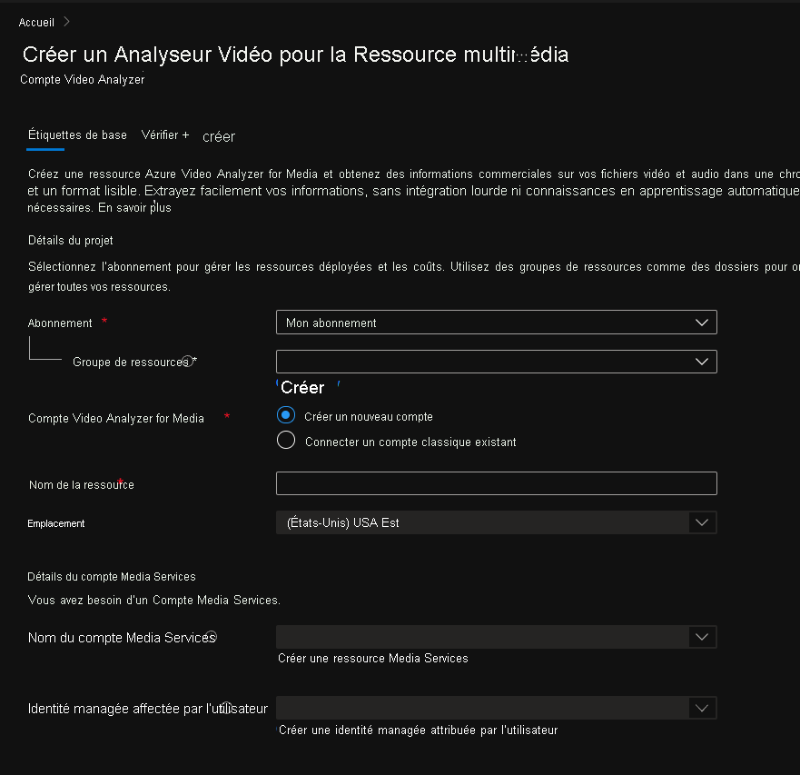

# Prise en main d’Azure Video Analyzer for Media dans le portail Azure

Ce guide de démarrage rapide vous guide tout au long des étapes de prise en main d’Azure Video Analyzer for Media. Vous allez créer un compte Azure Video Analyzer for Media et les ressources qui l’accompagnent en utilisant le portail Azure.

Pour commencer à utiliser Azure Video Analyzer for Media, vous devez créer un compte Video Analyzer for Media. Ce compte doit être associé à un compte de stockage avec une ressource [Media Services][docs-ms] et à une [identité managée affectée par l’utilisateur][docs-uami]. Cette identité managée doit posséder le rôle autorisations de contributeur sur Media Services.

## Prérequis
> [!NOTE]
> Vous allez avoir besoin d’un abonnement Azure dans lequel vous avez accès aux rôles Contributeur et Administrateur de l’accès utilisateur au groupe de ressources sous lequel vous allez créer des ressources et au rôle contributeur sur Azure Media Services et l’identité managée affectée par l’utilisateur. Si vous ne disposez pas des autorisations appropriées, demandez à l’administrateur de compte qu’il vous les octroie. Les services Azure Media Services associés doivent se trouver dans la même région que le compte Video Analyzer for Media.

## Portail Azure

### Créer un compte Video Analyzer for Media dans le portail Azure

1. Connectez-vous au [portail Azure](https://portal.azure.com/).
1. Dans la barre de recherche située en haut, entrez **Video Analyzer for Media**.
1. Sous *Video Analyzer for Media*, cliquez sur *Services*.

    

1. Cliquez sur **Créer**.
1. Dans la section **Créer une ressource Video Analyzer for Media**, entrez les valeurs requises.

    

 
| Nom | Description |
| ---|---|
|**Abonnement**|choisissez l’abonnement sous lequel vous souhaitez créer le compte Video Analyzer for Media.|
|**Groupe de ressources**|choisissez un groupe de ressources pour créer le compte Video Analyzer for Media ou sélectionnez **Créer nouveau** pour créer un groupe de ressources.|
|**Compte Video Analyzer for Media**|Sélectionnez l’option *Créer un compte*.|
|**Nom de la ressource**|Entrez le nom du nouveau compte Video Analyzer for Media. Ce nom peut contenir des lettres, des chiffres et des tirets sans espaces.|
|**Lieu**|Sélectionnez la région géographique qui sera utilisée pour déployer le compte Video Analyzer for Media. Cet emplacement correspond à l’**emplacement du groupe de ressources** que vous avez choisi, si vous souhaitez modifier l’emplacement sélectionné, changer le groupe de ressources sélectionné ou en créer un à l’emplacement de votre choix. [Région Azure dans laquelle Video Analyzer for Media est disponible](https://azure.microsoft.com/global-infrastructure/services/?products=cognitive-services&regions=all)|
|**Nom du compte Media Services**|Sélectionnez un Media Services que le nouveau compte Video Analyzer for Media utilisera pour traiter les vidéos. Vous pouvez sélectionner un Media Services existant ou en créer un nouveau. Le service Media Services doit se trouver au même emplacement que celui que vous avez sélectionné.| 
|**Identité managée affectée par l’utilisateur**|Sélectionnez une identité managée affectée par l’utilisateur, que le nouveau compte Video Analyzer for Media utilisera pour accéder au service Media Services. Vous pouvez sélectionner une identité managée affectée par l’utilisateur existante ou en créer une. L’identité managée affectée par l’utilisateur se verra attribuer les rôles de contributeur pour Media Services.|

1. Au bas du formulaire, cliquez sur **Examiner et créer**.

### Vérifier la ressource déployée

Vous pouvez utiliser le portail Azure pour valider le compte Azure Video Analyzer for Media et les autres ressources qui ont été créées. Une fois le déploiement terminé, sélectionnez **accéder à la ressource** pour afficher votre nouveau compte Video Analyzer for Media.

### Vue d’ensemble

Cliquez sur *Explorer le portail Video Analyzer for Media* pour voir votre nouveau compte sur le [portail Azure Video Analyzer for Media](https://aka.ms/vi-portal-link)

### API de gestion

Utilisez l’onglet *API de gestion* pour générer manuellement des jetons d’accès pour le compte.
Ce jeton peut être utilisé pour authentifier les appels d’API pour ce compte. Chaque jeton est valide une heure.

Choisissez l’un des éléments suivants :
* Type d’autorisation : **contributeur** ou **lecteur**
* Étendue : **compte**, **projet** ou **vidéo**
    * Pour **Project** ou **vidéo** , vous devez également insérer l’ID correspondant
* Cliquez sur **Générer**.

---

### Étapes suivantes

Découvrez comment [Charger une vidéo à l’aide de C#](https://github.com/Azure-Samples/media-services-video-indexer/tree/master/ApiUsage/ArmBased).

<!-- links -->
[docs-uami]: ../../active-directory/managed-identities-azure-resources/overview.md
[docs-ms]: ../../media-services/latest/media-services-overview.md
[docs-role-contributor]: ../../role-based-access-control/built-in-roles.md#contibutor
[docs-contributor-on-ms]: ./add-contributor-role-on-the-media-service.md
