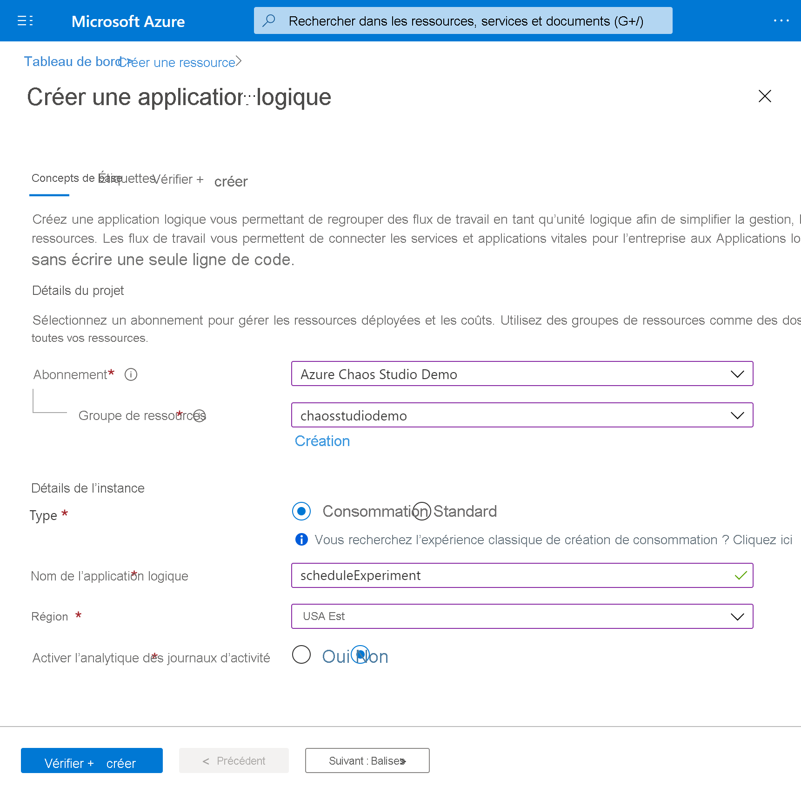
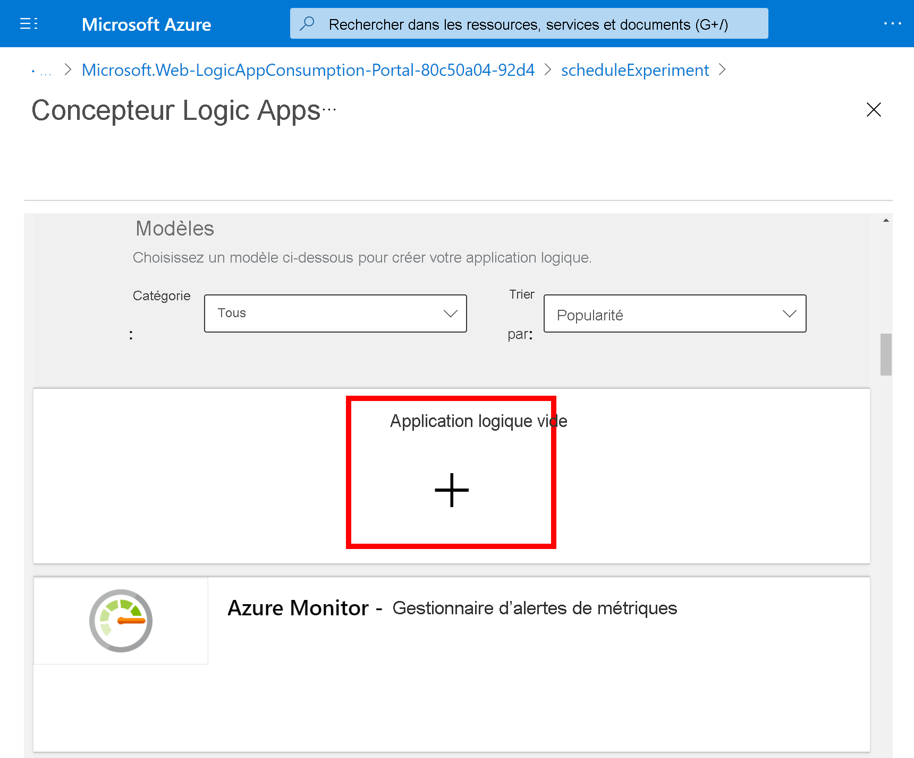
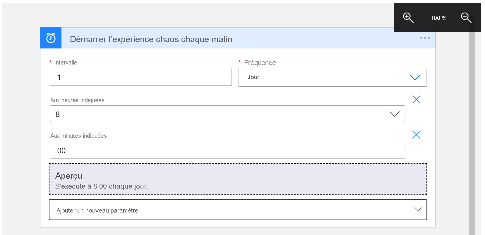
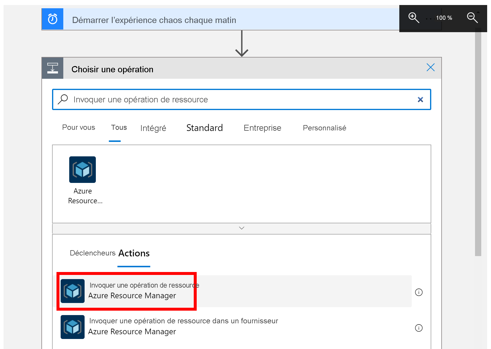
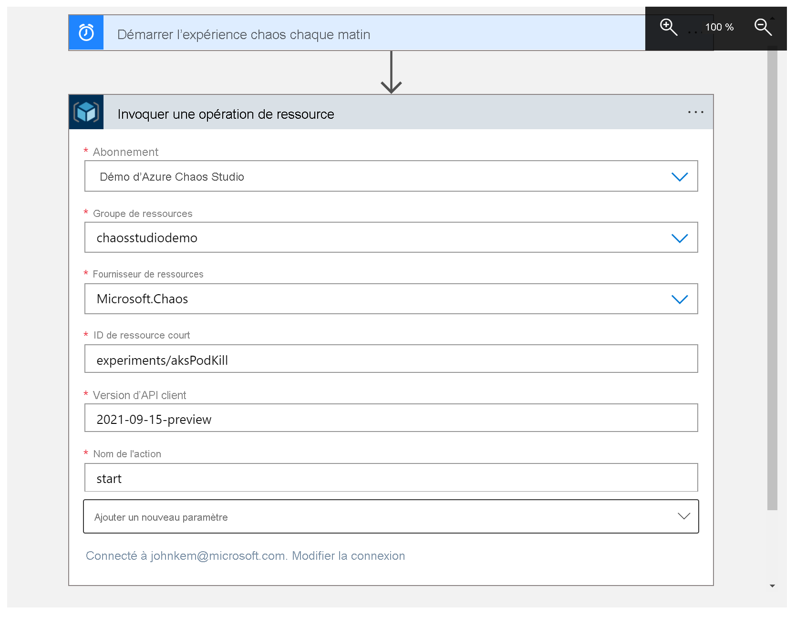

# Tutoriel : Planifier une expérience périodique avec Azure Chaos Studio

Azure Chaos Studio vous permet d’exécuter des expériences de chaos qui font échouer intentionnellement une partie de votre application ou service afin de vérifier qu’il est résilient contre ces échecs. Il peut être utile d’exécuter régulièrement ces expériences de chaos pour s’assurer que la résilience de votre application n’a pas régressé ou que celle-ci répond aux exigences de conformité. Dans ce tutoriel, vous allez utiliser une [application logique](../logic-apps/logic-apps-overview.md) pour déclencher l’exécution d’une expérience une fois par jour.

Dans ce tutoriel, vous allez apprendre à :

> [!div class="checklist"]
> * Créer une application logique 
> * Configurer l’application logique pour déclencher une expérience de chaos une fois par jour
> * Vérifier que l’application logique est correctement configurée

## Prérequis

- Compte Azure avec un abonnement actif. [Créez un compte gratuitement](https://azure.microsoft.com/free/?WT.mc_id=A261C142F).
- Une expérience de chaos. [Créez une expérience de chaos avec le guide de démarrage rapide.](chaos-studio-quickstart-azure-portal.md)
- Toutes les ressources ciblées dans l’expérience de chaos doivent être [intégrées à Chaos Studio](chaos-studio-targets-capabilities.md).

## Créer une application logique
Une application logique est un workflow automatisé qui peut s’exécuter selon une planification. L’application logique utilisée dans ce tutoriel démarre une expérience de chaos en utilisant une planification de périodicité.

1. Connectez-vous au [portail Azure](https://portal.azure.com) avec les informations d’identification de votre compte Azure. Dans la page d’accueil Azure, sélectionnez **Créer une ressource**.

1. Dans le menu Place de marché Azure, sélectionnez **Intégration** > **Application logique**.

   

1. Dans le volet **Application logique**, fournissez les informations décrites ici sur l’application logique que vous souhaitez créer.

   

   | Propriété | Valeur | Description |
   |----------|-------|-------------|
   | **Abonnement** | <*Azure-subscription-name*> | Le nom de votre abonnement Azure. Cet exemple utilise `Azure Chaos Studio Demo`. |
   | **Groupe de ressources** | chaosstudiodemo | Nom du [groupe de ressources Azure](../azure-resource-manager/management/overview.md), qui est utilisé pour organiser les ressources connexes. Cet exemple crée un groupe de ressources nommé `chaosstudiodemo`. |
   | **Type** | Consommation | [Type de ressource d’application logique](../logic-apps/single-tenant-overview-compare.md). Définissez l’option sur **Consommation**. |
   | **Nom** | scheduleExperiment | Nom de votre application logique, qui peut contenir uniquement des lettres, des chiffres, des traits d’union (`-`), des traits de soulignement (`_`), des parenthèses (`(`, `)`) et des points (`.`). Cet exemple utilise `scheduleExperiment`. |
   | **Lieu** | USA Est | Région dans laquelle stocker les informations sur votre application logique. Cet exemple utilise `East US`. |
   | **Activer l’analytique des journaux** | Non | Configurez la journalisation des diagnostics pour l’application logique. Définissez l’option sur **Non**. |

1. Quand vous avez terminé, sélectionnez **Vérifier + créer**. Une fois que Azure a validé les informations relatives à votre application logique, sélectionnez **Créer**.

1. Une fois que Azure a déployé votre application, sélectionnez **Accéder à la ressource**.

   Azure ouvre le volet de sélection du modèle Logic Apps, qui affiche une vidéo de présentation, des déclencheurs couramment utilisés et des modèles de modèle d’application logique.

## Ajouter le déclencheur de périodicité
Ajoutez ensuite le [déclencheur](../logic-apps/logic-apps-overview.md#logic-app-concepts) de périodicité qui exécute le workflow selon une planification spécifiée. Chaque application logique doit commencer par un déclencheur, qui est activé lorsqu’un événement spécifique se produit ou lorsque de nouvelles données respectent une condition particulière.

1. Faites défiler la page vers le bas au-delà de la vidéo et des déclencheurs courants jusqu’à la section **Modèles**, puis sélectionnez **Application logique vide**.

   

1. Dans la zone de recherche du concepteur Logic Apps, entrez `recurrence`, puis sélectionnez le déclencheur **Périodicité**.

   

1. Dans la forme **Périodicité**, sélectionnez le bouton représentant des **points de suspension** ( **...** ), puis **Renommer**. Renommez le déclencheur à l’aide de cette description : `Start chaos experiment every morning`.

   

1. Dans le déclencheur, modifiez ces propriétés comme décrit et montré ici.

   

   | Propriété | Obligatoire | Valeur | Description |
   |----------|----------|-------|-------------|
   | **Intervalle** | Oui | 1 | Nombre d’intervalles d’attente entre les vérifications. |
   | **Fréquence** | Oui | Jour | Unité de temps à utiliser pour la périodicité. |

1. Sous **Intervalle** et **Fréquence**, ouvrez la liste **Ajouter un nouveau paramètre**, puis sélectionnez ces propriétés pour ajouter le déclencheur.

   * **Aux heures indiquées**
   * **Aux minutes indiquées**

   

1. À présent, définissez les valeurs des propriétés comme indiqué et décrit ici.

   

   | Propriété | Valeur | Description |
   |----------|-------|-------------|
   | **Aux heures indiquées** | 8 | Ce paramètre est disponible uniquement lorsque vous définissez **Fréquence** sur **Semaine** ou **Jour**. Sélectionnez les heures de la journée pour cette périodicité. Cet exemple s’exécute à la marque de `8` heures. |
   | **Aux minutes indiquées** | 00 | Ce paramètre est disponible uniquement lorsque vous définissez **Fréquence** sur **Semaine** ou **Jour**. Sélectionnez les minutes de la journée pour cette périodicité. Cet exemple s’exécute une fois à la marque de zéro heure. |

   Ce déclencheur se déclenche tous les jours ouvrables à 8:00. La zone **Aperçu** indique la planification de la périodicité. Pour plus d’informations, voir [Planifier des tâches et flux de travail à exécuter régulièrement avec des applications logiques](../connectors/connectors-native-recurrence.md) et [Actions et déclencheurs de flux de travail](../logic-apps/logic-apps-workflow-actions-triggers.md#recurrence-trigger).

1. Enregistrez votre application logique. Dans la barre d’outils du Concepteur, sélectionnez **Enregistrer**.

## Ajouter une action d’exécution d’expérience de chaos
Maintenant que vous disposez d’un déclencheur, ajoutez une [action](../logic-apps/logic-apps-overview.md#logic-app-concepts) qui démarre l’expérience. Ce tutoriel utilise l’action **Appeler l’opération de la ressource** pour démarrer l’expérience.

1. Dans le Concepteur d’application logique, sous le déclencheur Périodicité, sélectionnez **Nouvelle étape**.

1. Sous **Choisir une opération**, entrez `Invoke resource operation`, puis sous **Actions** sélectionnez l’option **Appeler l’opération de ressource**.

    

1. Définissez le **locataire** approprié dans lequel votre expérience est stockée, puis cliquez sur **Se connecter**.

1. Connectez-vous à votre compte Azure pour ce locataire.

1. À présent, définissez les valeurs des propriétés de l’action comme indiqué et décrit ici.

   

   | Propriété | Valeur | Description |
   |----------|-------|-------------|
   | **Abonnement** | <*Azure-subscription-name*> | Nom de l’abonnement Azure dans lequel votre expérience de chaos est déployée. Cet exemple utilise `Azure Chaos Studio Demo`. |
   | **Groupe de ressources** | <*Nom_groupe_ressources*> | Nom du groupe de ressources dans lequel votre expérience de chaos est déployée. Cet exemple utilise `chaosstudiodemo`. |
   | **Fournisseur de ressources** | `Microsoft.Chaos` | Fournisseur de ressources Chaos Studio. |
   | **ID de ressource abrégé** | `experiments/`<*Nom_groupe_ressources*> | Nom de votre expérience de chaos précédé de `experiments/`. |
   | **Version d’API client** | `2021-09-15-preview` | Version de l’API REST de Chaos Studio. |
   | **Nom de l'action** | `start` | Nom de l’action d’expérience Chaos Studio. Toujours `start`. |

1. Enregistrez votre application logique. Dans la barre d’outils du Concepteur, sélectionnez **Enregistrer**.

## Tester l’application logique
À présent, testez l’application logique pour vous assurer qu’elle démarre correctement votre expérience.

1. Fermez le concepteur de Logic Apps.

1. Dans la vue d’ensemble de l’application logique, sélectionnez **Exécuter le déclencheur**, puis **Exécuter**.

    

1. Accédez à votre expérience de chaos dans le portail Azure et vérifiez que l’**État** est défini sur **En cours d’exécution**.

    

## Nettoyer les ressources

Si vous ne comptez pas continuer à utiliser cette application, supprimez l’application logique en effectuant les étapes suivantes :

1. Dans la vue d’ensemble de l’application logique, cliquez sur **Supprimer**.
1. Entrez le nom de l’application logique, puis cliquez sur **Supprimer**.

## Étapes suivantes

Maintenant que vous avez défini une planification pour votre expérience, vous pouvez...
> [!div class="nextstepaction"]
> [Exécuter et gérer votre expérience](chaos-studio-run-experiment.md)
