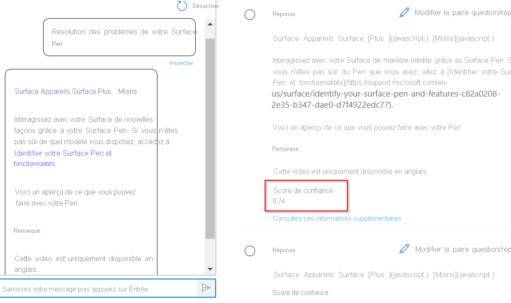
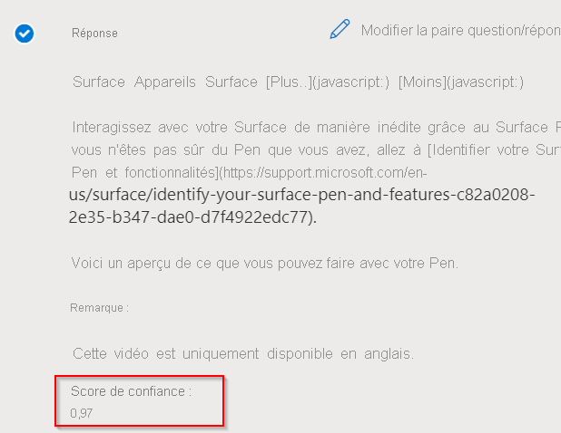

# <a name="improve-quality-of-response-with-synonyms"></a>Améliorer la qualité de la réponse avec les synonymes

Dans ce tutoriel, vous allez apprendre à :

> [!div class="checklist"]
> * Ajouter des synonymes pour améliorer la qualité de vos réponses
> * Évaluer la qualité de la réponse à l’aide de l’option Inspecter du volet Tester

Ce didacticiel vous montre comment vous pouvez améliorer la qualité de vos réponses à l’aide de synonymes. Supposons que les utilisateurs n’obtiennent pas une réponse exacte à leurs requêtes lorsqu’ils utilisent d’autres formes, synonymes ou acronymes d’un mot. Par conséquent, ils décident d’améliorer la qualité de la réponse à l’aide de l’[API Création](/rest/api/cognitiveservices-qnamaker/QnAMaker4.0/Alterations) afin d’ajouter des synonymes pour les mots clés.

## <a name="add-synonyms-using-authoring-api"></a>Ajouter des synonymes à l’aide de l’API Création

Nous allons ajouter les mots suivants et leurs modifications pour améliorer les résultats :

|Word | Alterations|
|--------------|--------------------------------|
| corriger des problèmes | `troubleshoot`, `trouble-shoot`|
| tableau blanc   | `white-board`, `white board`   |
| bluetooth    | `blue-tooth`, `blue tooth`     |

```json
{
    "synonyms": [
        {
            "alterations": [
                "fix problems",
                "troubleshoot",
                "trouble-shoot",
                ]
        },
        {
            "alterations": [
                "whiteboard",
                "white-board",
                "white board"
            ]
        },
        {
            "alterations": [
                "bluetooth",
                "blue-tooth",
                "blue tooth"
            ]
        }
    ]
}

```

Pour la paire question/réponse « Corriger les problèmes avec le stylet Surface », nous comparons la réponse à une demande effectuée à l’aide de son synonyme « résoudre les problèmes ».

## <a name="response-before-addition-of-synonym"></a>Réponse avant l’ajout du synonyme

> [!div class="mx-imgBorder"]
> [  ]( ../media/adding-synonyms/score.png#lightbox)

## <a name="response-after-addition-of-synonym"></a>Réponse après l’ajout d’un synonyme

> [!div class="mx-imgBorder"]
> [  ]( ../media/adding-synonyms/score-improvement.png#lightbox)

Comme vous pouvez le voir, lorsque `troubleshoot` n’a pas été ajouté en tant que synonyme, nous obtenons une réponse de confiance faible à la requête « comment résoudre les problèmes de votre surface Pen ». Toutefois, une fois que nous avons ajouté `troubleshoot` comme synonyme de « résoudre les problèmes », nous avons reçu la réponse correcte à la requête avec un score de confiance plus élevé. Une fois ces synonymes ajoutés, la pertinence des résultats s’est améliorée, ce qui a amélioré l’expérience utilisateur.

> [!NOTE]
> Les synonymes sont insensibles à la casse. Les synonymes peuvent également ne pas fonctionner comme prévu si vous ajoutez des mots vides en tant que synonymes. La liste de mots vides est disponible ici : [liste des mots vides](https://github.com/Azure-Samples/azure-search-sample-data/blob/master/STOPWORDS.md).
> Par exemple, si vous ajoutez l’abréviation **IT** (Information Technology) pour Technologies de l’information, il est possible que le système ne puisse pas reconnaître Technologies de l’information, car **IT** est un mot vide qui est filtré quand une demande est traitée.

## <a name="next-steps"></a>Étapes suivantes

> [!div class="nextstepaction"]
> [Créer des bases de connaissances dans plusieurs langues](multiple-languages.md)
