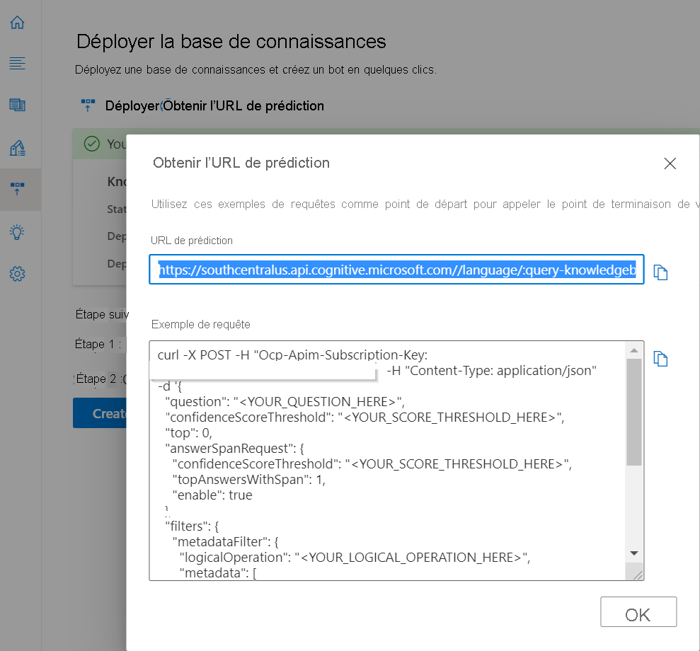
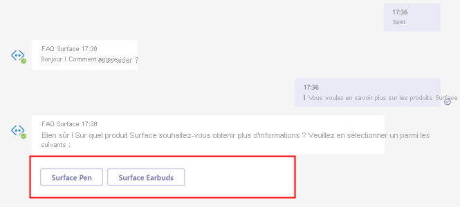
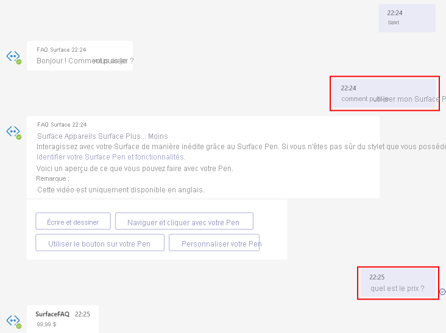
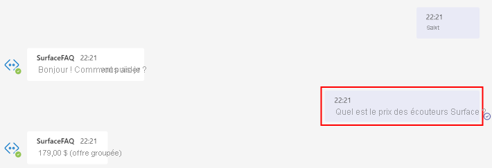

# <a name="add-multiple-categories-to-your-faq-bot"></a>Ajouter plusieurs catégories à votre robot de FAQ

Dans ce tutoriel, vous allez apprendre à :

> [!div class="checklist"]
> * Créer un projet et étiqueter les paires question-réponse dans des catégories distinctes avec des métadonnées
> * Créer un projet distinct pour chaque domaine
> * Créer une ressource de langue distincte pour chaque domaine

Lors de la création d’un bot de forum aux questions, vous pouvez être confronté à des cas d’utilisation qui vous demandent d’adresser des requêtes dans plusieurs domaines. Supposons que l’équipe marketing de Microsoft souhaite créer un bot de service clientèle qui réponde aux demandes les plus fréquentes des utilisateurs sur différents produits Surface. Par souci de simplicité, nous allons utiliser deux URL de FAQ, le [stylet de Surface](https://support.microsoft.com/surface/how-to-use-your-surface-pen-8a403519-cd1f-15b2-c9df-faa5aa924e98)et les [Earbuds de Surface](https://support.microsoft.com/surface/use-surface-earbuds-aea108c3-9344-0f11-e5f5-6fc9f57b21f9) pour créer le projet.

## <a name="create-project-with-domain-specific-metadata"></a>Créer un projet avec des métadonnées spécifiques à un domaine

Les auteurs de contenu peuvent utiliser des documents pour extraire des paires de réponses aux questions ou ajouter des paires de réponses aux questions personnalisées au projet/à la base de connaissances. Pour regrouper ces questions et réponses dans des domaines ou des catégories spécifiques, vous pouvez ajouter des métadonnées.

Pour le bot des produits Surface, vous pouvez effectuer les étapes suivantes en créant un bot qui réponde aux requêtes des deux types de produits :

1. Ajoutez les URL de FAQ suivantes en tant que sources en sélectionnant **Ajouter des sourcs** > **URL** > puis **Tout ajouter** une fois que vous avez ajouté chacune des URL ci-dessous :
   
   [FAQ sur le stylet Surface](https://support.microsoft.com/surface/how-to-use-your-surface-pen-8a403519-cd1f-15b2-c9df-faa5aa924e98)<br>[FAQ sur Surface Earbuds](https://support.microsoft.com/surface/use-surface-earbuds-aea108c3-9344-0f11-e5f5-6fc9f57b21f9)

    >[!div class="mx-imgBorder"]
    >[](../media/multiple-domains/add-url.png#lightbox)

2. Dans cette base de connaissances, nous avons des paires de réponses aux questions sur deux produits et nous aimerions les distinguer afin que nous puissions Rechercher les réponses entre les questions et les réponses pour un produit donné. Pour ce faire, nous pouvons mettre à jour le champ de métadonnées pour les paires de réponses aux questions.

   Comme vous pouvez le voir dans l’exemple ci-dessous, nous avons ajouté une métadonnée avec **produit** en tant que clé, et **surface_pen** ou **surface_earbuds** en tant que valeurs, lorsque cela est nécessaire. Vous pouvez étendre cet exemple pour extraire des données sur plusieurs produits, et ajouter une valeur différente pour chaque produit.

   >[!div class="mx-imgBorder"]
   >[](../media/multiple-domains/product-metadata.png#lightbox)

4. À présent, afin de limiter le système de recherche des réponses dans un produit particulier, vous devez transmettre ce produit sous la forme d’un filtre dans l’API REST de réponses aux questions.

    Vous pouvez récupérer l’URL de prédiction de l’API REST à partir du volet Déployer la base de connaissances :

   >[!div class="mx-imgBorder"]
   >[](../media/multiple-domains/prediction-url.png#lightbox)

    Dans le corps JSON de l’appel d’API, nous avons passé *surface_pen* comme valeur pour le *produit* en métadonnée. Le système recherche alors uniquement la réponse parmi les paires de questions-réponses ayant la même métadonnée.

    ```json
        {
          "question": "What is the price?",
          "top": 3
        },
        "answerSpanRequest": {
          "enable": true,
          "confidenceScoreThreshold": 0.3,
          "topAnswersWithSpan": 1
        },
        "filters": {
          "metadataFilter": {
            "metadata": [
              {
                "key": "product",
                "value": "surface_pen"
              }
            ]
          }
        }
    ```

    Vous pouvez obtenir la valeur de la métadonnée en fonction de l’entrée utilisateur de l’une des manières suivantes : 

    * Acceptez explicitement le domaine comme entrée à partir de l’utilisateur par le biais du client bot. Par exemple, comme illustré ci-dessous, vous pouvez utiliser une catégorie de produit en tant qu’entrée à partir de l’utilisateur lorsque la conversation est lancée.

      

    * Identifiez implicitement le domaine en fonction du contexte du bot. Par exemple, en cas de question précédente posée sur un produit Surface particulier, celui-ci peut être enregistré en tant que contexte par le client. Si l’utilisateur ne précise pas le produit dans la requête suivante, vous pouvez transmettre le contexte du bot comme métadonnées à l’API de génération de réponse.

      

    * Extrayez l’entité à partir de la requête utilisateur permettant d’identifier le domaine à utiliser pour le filtre de métadonnées. Vous pouvez utiliser d’autres Cognitive Services tels que la [Reconnaissance d’entités nommées (NER)](../../named-entity-recognition/overview.md) et [Language understanding de conversation](../../conversational-language-understanding/overview.md) pour l’extraction d’entité.

      

### <a name="how-large-can-our-projects-be"></a>Quelle est la taille de nos projets ?

Vous pouvez ajouter jusqu’à 50 000 paires de réponses aux questions à un seul projet/base de connaissances. Si vos données excèdent 50 000 paires de questions-réponses, vous devez envisager de diviser la base de connaissances.

## <a name="create-a-separate-project-for-each-domain"></a>Créer un projet distinct pour chaque domaine

Vous pouvez également créer un projet/une base de connaissances distincte pour chaque domaine, et gérer séparément les projets. Toutes les API demandent que l’utilisateur transmette l’ID du projet, pour effectuer une mise à jour de la base de connaissances ou pour récupérer une réponse à la question de l’utilisateur.  

Lorsque la question de l’utilisateur est reçue par le service, vous devez transmettre le `projectName` dans le point de terminaison de l’API REST présenté pour extraire une réponse de la base de connaissances concernée. Vous pouvez localiser l’URL dans la page **Déployer la base de connaissances** sous **Obtenir l’URL de prédiction** :

`https://southcentralus.api.cognitive.microsoft.com/language/:query-knowledgebases?projectName=Test-Project-English&api-version=2021-10-01&deploymentName=production`

## <a name="create-a-separate-language-resource-for-each-domain"></a>Créer une ressource de langue distincte pour chaque domaine

Supposons que l’équipe marketing de Microsoft souhaite créer un bot de service clientèle qui réponde aux demandes des utilisateurs concernant les produits Surface et Xbox. Elle envisage d’affecter des équipes distinctes pour accéder aux bases de connaissances du produit Surface et du produit Xbox. Dans ce cas, il est recommandé de créer deux ressources de réponses aux questions, une pour Surface et l’autre pour Xbox. Par contre, vous pouvez définir des rôles distincts pour les utilisateurs qui accèdent à la même ressource.
