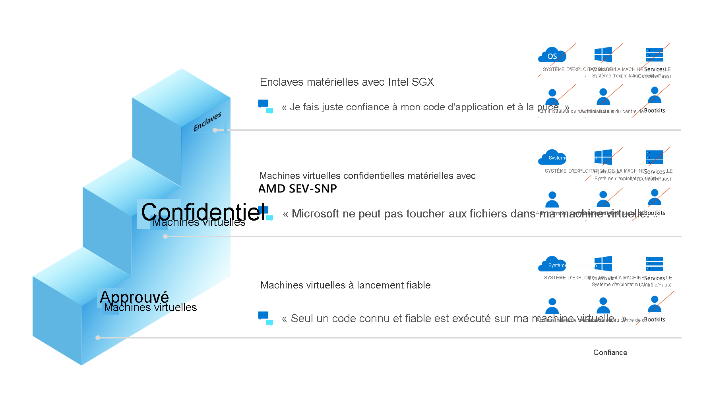

# Informatique confidentielle dans Azure

Aujourd’hui, les clients chiffrent leurs données au repos et en transit, mais pas en cours d’utilisation en mémoire. Le [Confidential Computing Consortium](https://confidentialcomputing.io/) (CCC), cofondé par Microsoft, définit l’informatique confidentielle comme la protection des données en cours d’utilisation à l’aide d’[environnements d’exécution de confiance](https://en.wikipedia.org/wiki/Trusted_execution_environment) (TEE) basés sur le matériel. Ces environnements d’exécution de confiance (TEE) empêchent l’accès ou la modification non autorisés des applications et des données pendant qu’elles sont utilisées, ce qui accroît le niveau de sécurité des organisations qui gèrent des données sensibles et régulées. Les environnements TEE sont des environnements approuvés qui fournissent un niveau d’assurance élevé de l’intégrité des données, de la confidentialité des données et de l’intégrité du code. Le modèle de menace informatique confidentielle vise à supprimer ou à réduire la capacité d’un opérateur de fournisseur de cloud et d’autres acteurs dans le domaine du locataire à accéder au code et aux données lors de leur exécution.

Les technologies telles que les extensions [Intel Software Guard Extensions](https://www.intel.com.au/content/www/au/en/architecture-and-technology/software-guard-extensions-enhanced-data-protection.html) (Intel SGX) ou la virtualisation [AMD Secure Encrypted Virtualization](https://www.amd.com/en/processors/amd-secure-encrypted-virtualization) (SEV-SNP) sont des améliorations récentes du processeur prenant en charge les implémentations informatiques confidentielles. Ces technologies sont conçues comme des extensions de virtualisation et fournissent des ensembles de fonctionnalités incluant le chiffrement et l’intégrité de la mémoire, la confidentialité et l’intégrité de l’état du processeur, et l’attestation, pour la création du modèle de menace informatique confidentielle.

Lorsqu’elle est utilisée avec le chiffrement des données au repos et en transit, l’informatique confidentielle élimine la plus grande barrière du chiffrement en cours d’utilisation, en protégeant les jeux de données sensibles ou hautement réglementés et les charges de travail d’application dans une plateforme cloud publique sécurisée. L’informatique confidentielle s’étend au-delà de la protection des données génériques. Les environnements TEE sont également utilisés pour protéger la logique métier propriétaire, les fonctions analytiques, les algorithmes Machine Learning ou les applications entières.

## Navigation dans l’informatique confidentielle Azure

Les [offres de Microsoft](https://aka.ms/azurecc) pour l’informatique confidentielle s’étendent de l’infrastructure as a service (IaaS) à la plateforme as a service (PaaS), ainsi qu’aux outils de développement pour soutenir le parcours des données et de la confidentialité du code dans le cloud.

## Réduction de la surface d’attaque
Le TCB (Trusted Computing Base) fait référence à l’ensemble des composants matériels, des microprogrammes et des logiciels d’un système qui fournissent un environnement sécurisé. Les composants au sein du TCB sont considérés comme « critiques ». Si un composant au sein du TCB est compromis, toute la sécurité du système peut être en péril. Plus le TCB est petit, plus la sécurité est élevée. Il y a moins de risques d’exposition à différentes vulnérabilités, programmes malveillants, attaques et personnes malveillantes. L’informatique confidentielle Azure vise à réduire le TCB pour vos charges de travail cloud en offrant des environnements TEE. 

### Réduction de votre base TCB dans Azure

Lorsque vous déployez des machines virtuelles confidentielles Azure, vous pouvez réduire votre base TCB. Pour les solutions de déploiement de machines virtuelles confidentielles s’exécutant sur AMD SEV-SNP, vous pouvez déplacer et décaler des charges de travail existantes et protéger les données de l’opérateur cloud avec une confidentialité au niveau de la machine virtuelle. Les machines virtuelles confidentielles avec des enclaves d’application Intel SGX apportent un contrôle de ligne de code dans les applications afin de réduire votre base TCB et de protéger les données des opérateurs cloud et de vos opérateurs.  Les enclaves d’applications Intel SGX peuvent nécessiter des modifications au niveau des stratégies de configuration ou du code d’application.  Vous pouvez également utiliser un partenaire ISV (éditeur de logiciels indépendant) ou un logiciel open source (OSS) pour exécuter vos applications existantes à l’intérieur d’une enclave d’application. 

### Échelle de confiance

Azure propose différents ordinateurs virtuels pour les charges de travail IaaS d’informatique confidentielle, et les clients peuvent choisir celui qui convient le mieux en fonction de leur état de sécurité privilégié. La figure « échelle de confiance » illustre ce que les clients peuvent attendre d’un point de vue de la sécurité sur ces offres IaaS.

## Offres Azure

Nos services actuellement mis à la disposition du public sont les suivants :

- [Machines virtuelles confidentielles avec enclaves d’application Intel SGX](confidential-computing-enclaves.md). Aujourd’hui, Azure propose les séries [DCsv2](../virtual-machines/dcv2-series.md), [DCsv3 et DCdsv3](../virtual-machines/dcv3-series.md), qui exploitent la technologie Intel SGX pour permettre la création d’enclaves basées sur le matériel. Vous pouvez donc créer des applications basées sur des enclaves sécurisées et les exécuter dans une série de machines virtuelles pour protéger les données et le code de votre application en cours d’utilisation.
- [Conteneurs reconnaissant les enclaves](enclave-aware-containers.md) exécutés sur Azure Kubernetes Service (AKS). Les nœuds d’informatique confidentielle sur AKS utilisent Intel SGX pour créer des environnements d’enclaves isolées dans les nœuds entre chaque application conteneur.
- [Always Encrypted avec enclaves sécurisées dans Azure SQL](/sql/relational-databases/security/encryption/always-encrypted-enclaves). La confidentialité des données sensibles est protégée contre les logiciels malveillants et les utilisateurs non autorisés disposant de privilèges élevés en exécutant des requêtes SQL directement à l’intérieur d’un environnement TEE lorsque l’instruction SQL contient des opérations sur des données chiffrées qui nécessitent l’utilisation de l’enclave sécurisée dans laquelle le moteur de base de données s’exécute.
- [Microsoft Azure Attestation](../attestation/overview.md), un service d’attestation à distance pour valider la fiabilité de plusieurs environnements TEE (Trusted Execution Environments) et vérifier l’intégrité des fichiers binaires s’exécutant dans les environnements TEE.
- [Azure Key Vault Managed HSM](/azure/key-vault/managed-hsm/) est un service cloud complètement managé, hautement disponible et monolocataire qui vous permet de protéger les clés de chiffrement de vos applications cloud en utilisant des modules de sécurité matériels (HSM) validés FIPS 140-2 de niveau 3.
- [Azure IoT Edge](../iot-edge/deploy-confidential-applications.md) prend en charge les applications confidentielles exécutées dans des enclaves sécurisées sur un appareil IoT (Internet des objets). Les appareils IoT sont souvent exposés à des falsifications, car ils sont physiquement accessibles aux mauvais acteurs. Les appareils IoT Edge confidentiels ajoutent de la confiance et de l’intégrité à la périphérie en protégeant l’accès aux données capturées et stockées à l’intérieur de l’appareil lui-même avant de les diffuser dans le cloud.

D’autres services sont actuellement en version préliminaire, notamment :

- Les machines virtuelles confidentielles basées sur la [technologie AMD SEV-SNP](https://azure.microsoft.com/blog/azure-and-amd-enable-lift-and-shift-confidential-computing/) sont actuellement en version préliminaire et disponibles pour les clients sélectionnés.
- Le [lancement fiable](../virtual-machines/trusted-launch.md) est disponible sur toutes les machines virtuelles de 2e génération, en offrant des fonctionnalités de sécurité renforcées : le démarrage sécurisé, le module de plateforme sécurisée virtuel et la surveillance de l’intégrité du démarrage, qui protègent contre les kits de démarrage, les rootkits et les logiciels malveillants au niveau du noyau.
- [Registre confidentiel Azure](../confidential-ledger/overview.md). La liste de contrôle d’accès (ACL) est un registre inviolable pour le stockage des données sensibles pour la conservation et l’audit des enregistrements ou pour la transparence des données dans les scénarios multi-tiers. Il offre des garanties en écriture unique et en lectures multiples, qui rendent les données non effaçables et non modifiables. Le service repose sur le [Framework de consortium confidentiel](https://www.microsoft.com/research/project/confidential-consortium-framework/) de Microsoft Research.
- Le [runtime ONNX d’inférence confidentielle](https://github.com/microsoft/onnx-server-openenclave) est un serveur d’inférence de Machine Learning (ML) qui empêche la partie d’hébergement ML d’accéder à la requête d’inférence et à la réponse correspondante.

## Étapes suivantes

- [En savoir plus sur le développement d’enclave d’application](application-development.md)
