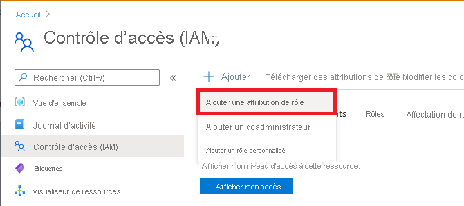

# <a name="add-owners-and-users-in-azure-devtest-labs"></a>Ajouter des propriétaires et des utilisateurs dans Azure DevTest Labs
> [!VIDEO https://channel9.msdn.com/Blogs/Azure/How-to-set-security-in-your-DevTest-Lab/player]
> 
> 

L’accès à Azure DevTest Labs est contrôlé par le [contrôle d’accès en fonction du rôle Azure (Azure RBAC)](../role-based-access-control/overview.md). Avec Azure RBAC, vous pouvez séparer les tâches au sein de votre équipe en *rôles* dans lesquels vous accordez aux utilisateurs uniquement les accès nécessaires pour accomplir leur travail. Trois de ces rôles Azure sont *Propriétaire*, *Utilisateur de DevTest Labs* et *Contributeur*. Dans cet article, vous allez découvrir quelles actions peuvent être effectuées dans chacun des trois rôles Azure principaux. À partir de là, vous allez apprendre à ajouter des utilisateurs à un laboratoire, à la fois via le portail et via un script PowerShell, et à ajouter des utilisateurs au niveau de l’abonnement.

## <a name="actions-that-can-be-performed-in-each-role"></a>Actions qui peuvent être effectuées dans chaque rôle
Il existe trois rôles principaux que vous pouvez attribuer à un utilisateur :

* Propriétaire
* Utilisateur de DevTest Labs
* Contributeur

Le tableau suivant décrit les actions pouvant être effectuées par les utilisateurs dans chacun de ces rôles :

| **Actions que les utilisateurs dans ce rôle peuvent effectuer** | **Utilisateur de DevTest Labs** | **Propriétaire** | **Contributeur** |
| --- | --- | --- | --- |
| **Tâches de laboratoire** | | | |
| Ajouter des utilisateurs à un laboratoire |Non |Oui |Non |
| Mettre à jour les paramètres de coût |Non |Oui |Oui |
| **Tâches de base de machine virtuelle** | | | |
| Ajouter et supprimer des images personnalisées |Non |Oui |Oui |
| Ajouter, mettre à jour et supprimer des formules |Oui |Oui |Oui |
| Activer les images de la Place de marché |Non |Oui |Oui |
| **Tâches de machine virtuelle** | | | |
| Créer des machines virtuelles |Oui |Oui |Oui |
| Démarrer, arrêter et supprimer des machines virtuelles |Seules les machines virtuelles créées par l’utilisateur |Oui |Oui |
| Mettre à jour les stratégies de machine virtuelle |Non |Oui |Oui |
| Ajouter des disques de données à des machines virtuelles ou en supprimer de celles-ci |Seules les machines virtuelles créées par l’utilisateur |Oui |Oui |
| **Tâches d’artefact** | | | |
| Ajouter et supprimer des référentiels d’artefact |Non |Oui |Oui |
| Appliquer des artefacts |Oui |Oui |Oui |

> [!NOTE]
> Lorsqu’un utilisateur crée une machine virtuelle, le rôle **Propriétaire** de la machine virtuelle créée est automatiquement attribué à cet utilisateur.
> 
> 

## <a name="add-an-owner-or-user-at-the-lab-level"></a>Ajouter un utilisateur ou un propriétaire au niveau du laboratoire
Les propriétaires et les utilisateurs peuvent être ajoutés au niveau du laboratoire via le portail Azure. Un utilisateur peut être un utilisateur externe avec un [compte Microsoft (MSA)](./devtest-lab-faq.yml) valide.
Les étapes suivantes vous guident dans le processus d’ajout d’un propriétaire ou d’un utilisateur à un laboratoire dans Azure DevTest Labs :

1. Connectez-vous au [Portail Azure](https://portal.azure.com) avec un [rôle d’administrateur de l’accès utilisateur](../role-based-access-control/built-in-roles.md#user-access-administrator) ou de [propriétaire](../role-based-access-control/built-in-roles.md#owner).

1. Ouvrez le groupe de ressources souhaité et sélectionnez **DevTest Labs**.

1. Dans le menu de navigation, cliquez sur **Contrôle d’accès (IAM)** .

1. Sélectionnez **Ajouter** > **Ajouter une attribution de rôle**.

    

1. Dans l’onglet **Rôle**, sélectionnez le rôle **PROPRIÉTAIRE** ou **UTILISATEUR**.

    

1. Dans l’onglet **Membres**, sélectionnez l’utilisateur auquel vous souhaitez ajouter le rôle souhaité.

1. Dans l’onglet **Passer en revue + affecter**, sélectionnez **Passer en revue + affecter** pour affecter le rôle.


## <a name="add-an-external-user-to-a-lab-using-powershell"></a>Ajouter un utilisateur externe à un laboratoire à l’aide de PowerShell

[!INCLUDE [updated-for-az](../../includes/updated-for-az.md)]

Outre l’ajout d’utilisateurs dans le portail Azure, vous pouvez ajouter un utilisateur externe à votre laboratoire à l’aide d’un script PowerShell. Dans l’exemple suivant, modifiez les valeurs des paramètres sous le commentaire **Valeurs à modifier**.
Vous pouvez récupérer les valeurs `subscriptionId`, `labResourceGroup` et `labName` à partir du panneau de laboratoire dans le portail Azure.

> [!NOTE]
> L’exemple de script suppose que l’utilisateur spécifié a été ajouté en tant qu’invité à Active Directory et échoue si ce n’est pas le cas. Pour ajouter un utilisateur qui ne se trouve pas dans Active Directory à un laboratoire, utilisez le portail Azure pour attribuer un rôle à l’utilisateur, comme illustré dans la section [Ajouter un utilisateur ou un propriétaire au niveau du laboratoire](#add-an-owner-or-user-at-the-lab-level).   
> 
> 

```azurepowershell
# Add an external user in DevTest Labs user role to a lab
# Ensure that guest users can be added to the Azure Active directory:
# https://azure.microsoft.com/documentation/articles/active-directory-create-users/#set-guest-user-access-policies

# Values to change
$subscriptionId = "<Enter Azure subscription ID here>"
$labResourceGroup = "<Enter lab's resource name here>"
$labName = "<Enter lab name here>"
$userDisplayName = "<Enter user's display name here>"

# Log into your Azure account
Connect-AzAccount

# Select the Azure subscription that contains the lab. 
# This step is optional if you have only one subscription.
Select-AzSubscription -SubscriptionId $subscriptionId

# Retrieve the user object
$adObject = Get-AzADUser -SearchString $userDisplayName

# Create the role assignment. 
$labId = ('subscriptions/' + $subscriptionId + '/resourceGroups/' + $labResourceGroup + '/providers/Microsoft.DevTestLab/labs/' + $labName)
New-AzRoleAssignment -ObjectId $adObject.Id -RoleDefinitionName 'DevTest Labs User' -Scope $labId
```

## <a name="add-an-owner-or-user-at-the-subscription-level"></a>Ajouter un utilisateur ou un propriétaire au niveau du laboratoire
Les autorisations Azure sont propagées à partir de l’étendue parent vers l’étendue enfant dans Azure. Par conséquent, les propriétaires d’un abonnement Azure qui contient des laboratoires sont automatiquement les propriétaires de ces laboratoires. Ils sont également propriétaires des machines virtuelles et des autres ressources créées par les utilisateurs du laboratoire et le service Azure DevTest Labs. 

Vous pouvez ajouter des propriétaires supplémentaires à un laboratoire via le panneau du laboratoire dans le [portail Azure](https://go.microsoft.com/fwlink/p/?LinkID=525040). Toutefois, l’étendue d’administration du propriétaire ajouté est plus étroite que l’étendue du propriétaire de l’abonnement. Par exemple, les propriétaires ajoutés n’ont pas un accès complet à certaines ressources qui sont créées dans l’abonnement par le service DevTest Labs. 

Pour ajouter un propriétaire à un abonnement Azure, procédez comme suit :

1. Connectez-vous au [Portail Azure](https://portal.azure.com) avec un [rôle d’administrateur de l’accès utilisateur](../role-based-access-control/built-in-roles.md#user-access-administrator) ou de [propriétaire](../role-based-access-control/built-in-roles.md#owner).

1. Ouvrez le groupe d’abonnement souhaité.

1. Dans le menu de navigation, cliquez sur **Contrôle d’accès (IAM)** .

1. Sélectionnez **Ajouter** > **Ajouter une attribution de rôle**.

    

1. Dans l’onglet **Rôle**, sélectionnez le rôle **PROPRIÉTAIRE**.

    

1. Dans l’onglet **Membres**, sélectionnez l’utilisateur auquel vous souhaitez ajouter le rôle de propriétaire.

1. Dans l’onglet **Passer en revue + affecter**, sélectionnez **Passer en revue + affecter** pour affecter le rôle.


[!INCLUDE [devtest-lab-try-it-out](../../includes/devtest-lab-try-it-out.md)]
