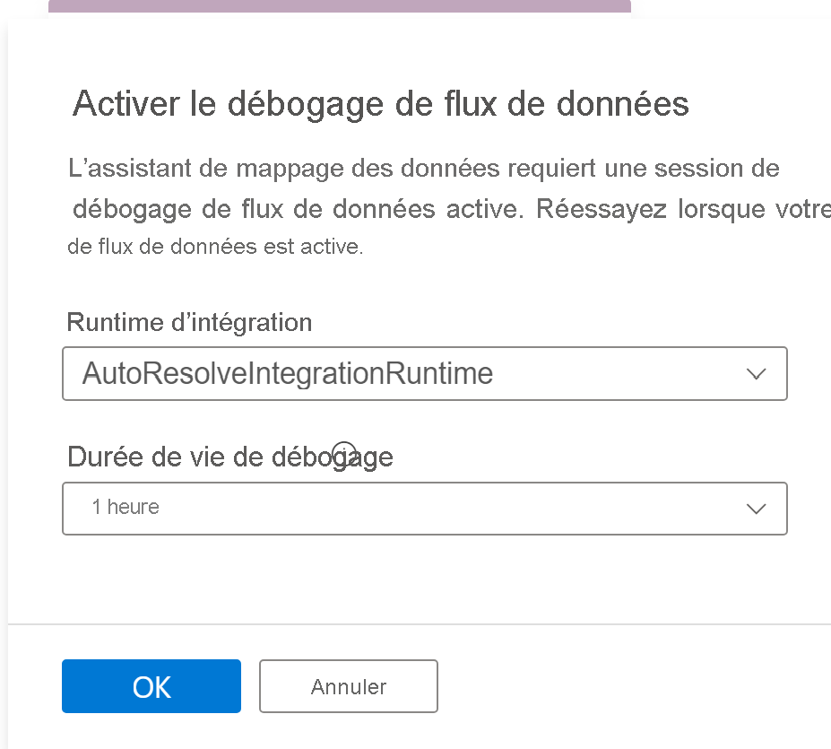
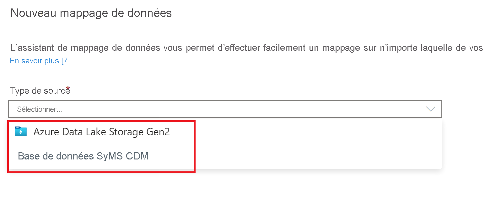
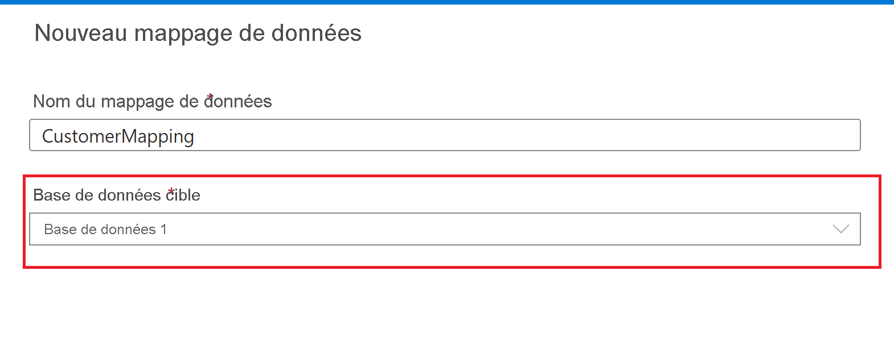

# Mapper les données dans Azure Synapse Analytics

## Qu’est-ce que l’outil Mapper les données ?

L’outil Mapper les données est un processus guidé qui aide les utilisateurs à créer des mappages ETL et des flux de données de mappage depuis leurs données sources vers des tables de bases de données de lac Synapse sans écrire de code. Ce processus commence par le choix des tables de destination par l’utilisateur dans les bases de données de lac Synapse, puis se poursuit par leur mappage à leurs données sources dans ces tables. 

Pour plus d’informations sur les bases de données de lac Synapse, consultez [Vue d’ensemble des modèles de base de données Azure Synapse – Azure Synapse Analytics | Microsoft Docs](overview-database-templates.md)

L’outil Mapper les données offre une expérience guidée qui permet à l’utilisateur de générer un flux de données de mappage sans avoir à démarrer avec un canevas vide ni à générer rapidement un flux de données de mappage scalable et exécutable dans des pipelines Synapse.

> [!NOTE] 
> La fonctionnalité Mapper les données dans les pipelines Synapse Analytics est actuellement en préversion publique.

## Prise en main

L’outil Mapper les données se démarre à partir de l’expérience de base de données de lac Synapse. À partir de là, vous pouvez sélectionner l’outil Mapper les données pour commencer le processus. 

L’outil Mapper les données a besoin du calcul disponible pour aider les utilisateurs à prévisualiser des données et à lire le schéma de leurs fichiers sources. Lors de la première utilisation de l’outil Mapper les données dans une session, vous avez besoin d’initialiser un cluster.

Pour commencer, choisissez la source de données à mapper à vos tables de base de données de lac. Les sources de données actuellement prises en charge sont les bases de données de lac Azure Data Lake Storage Gen 2 et Synapse.

### Options de type de fichier
Quand vous choisissez un magasin de fichiers comme Azure Data Lake Storage Gen 2, les types de fichiers suivants sont pris en charge :

* Common Data Model
* Texte délimité
* Parquet

## Créer un mappage de données
Nommez votre mappage de données et sélectionnez la destination de la base de données de lac Synapse.

## Mappage de la source à la cible
Choisissez une table source principale à mapper à la table de destination de la base de données de lac Synapse.

### Nouveau mappage
Utilisez le bouton Nouveau mappage pour ajouter une méthode de mappage permettant de créer un mappage ou une transformation.

### Source supplémentaire
Utilisez le bouton Source supplémentaire pour rejoindre et ajouter une autre source à votre mappage.

### Aperçu des données
L’onglet **Aperçu des données**  vous donne une capture instantanée interactive des données de chaque transformation. Pour en savoir plus, consultez [Aperçu des données en mode de débogage](../../data-factory/concepts-data-flow-debug-mode.md#data-preview).

### Méthodes de mappage

Les méthodes de mappage suivantes sont prises en charge :

* [Direct](../../data-factory/data-flow-select.md)
* [Clé de substitution](../../data-factory/data-flow-surrogate-key.md)
* [Lookup](../../data-factory/data-flow-lookup.md)
* [Supprimer le tableau croisé dynamique](../../data-factory/data-flow-unpivot.md)
* [Agrégat](../../data-factory/data-flow-aggregate.md)
    * Sum
    * Minimum
    * Maximale
    * Premier
    * Dernier
    * Écart type
    * Moyenne
    * Moyenne
* [Colonne dérivée](../../data-factory/data-flow-derived-column.md)
    * SupprEspace
    * Upper
    * Moins grand
    * Avancé 

## Création d’un pipeline

Une fois que vous avez terminé vos transformations avec l’outil Mapper les données, sélectionnez le bouton Créer un pipeline pour générer un flux de données de mappage et un pipeline afin de déboguer et exécuter votre transformation.