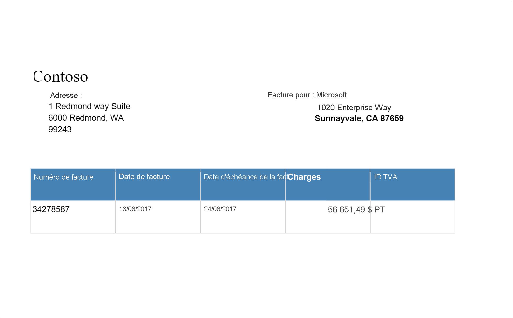

# <a name="tutorial-form-recognizer-with-applied-ai-service"></a>Didacticiel : Form Recognizer avec Applied AI Service

[Azure Form Recognizer](../../applied-ai-services/form-recognizer/index.yml) est un service [Azure Applied AI Services](../../applied-ai-services/index.yml) qui vous permet de générer des applications de traitement de données automatisées à l’aide de la technologie du machine learning. Dans ce didacticiel, vous allez apprendre à enrichir facilement vos données dans Azure Synapse Analytics. Vous allez utiliser [Form Recognizer](../../applied-ai-services/form-recognizer/index.yml) pour analyser vos formulaires et documents, extraire le texte et les données et retourner une sortie JSON structurée. Vous pouvez rapidement obtenir des résultats justes et adaptés à votre contenu en particulier, sans avoir besoin d’une intervention manuelle excessive ou de compétences approfondies en science des données. 

Ce didacticiel montre comment utiliser Form Recognizer avec [MMLSpark](https://github.com/Azure/mmlspark) pour :

> [!div class="checklist"]
> - Extraire du texte et des informations de disposition à partir d’un document donné
> - Détecter et extraire des données à partir de reçus
> - Détecter et extraire des données à partir de cartes de visite
> - Détecter et extraire des données à partir de factures
> - Détecter et extraire des données à partir de documents d’identification


Si vous n’avez pas d’abonnement Azure, [créez un compte gratuit avant de commencer](https://azure.microsoft.com/free/).


## <a name="prerequisites"></a>Prérequis

- [Espace de travail Azure Synapse Analytics](../get-started-create-workspace.md) avec un compte de stockage Azure Data Lake Storage Gen2 configuré comme stockage par défaut. Vous devez être le *contributeur aux données Blob du stockage* du système de fichiers Data Lake Storage Gen2 que vous utilisez.
- Pool Spark dans votre espace de travail Azure Synapse Analytics. Pour plus d’informations, consultez [Créer un pool Spark dans Azure Synapse](../quickstart-create-sql-pool-studio.md).
- Avoir effectué les étapes de pré-configuration décrites dans le tutoriel [Configurer Cognitive Services dans Azure Synapse](tutorial-configure-cognitive-services-synapse.md).


## <a name="get-started"></a>Bien démarrer
Ouvrez Synapse Studio et créez un nouveau notebook. Pour commencer, importez [MMLSpark](https://github.com/Azure/mmlspark). 

```python
import mmlspark
from mmlspark.cognitive import *
```

## <a name="configure-form-recognizer"></a>Configurer Form Recognizer 

Utilisez le module Form Recognizer lié que vous avez configuré dans les [étapes de préconfiguration](tutorial-configure-cognitive-services-synapse.md). 

```python
cognitive_service_name = "<Your linked service for form recognizer>"
```


## <a name="analyze-layout"></a>Analyser la disposition

Extraire des informations de texte et de disposition d’un document donné. Le document d’entrée doit être de l’un des types de contenus pris en charge : « application/pdf », « image/jpeg », « image/png » ou « image/tiff ».

### <a name="example-input"></a>Exemple d’entrée


```python
from pyspark.sql.functions import col, flatten, regexp_replace, explode, create_map, lit

imageDf = spark.createDataFrame([
  ("<replace with your file path>/layout.jpg",)
], ["source",])

analyzeLayout = (AnalyzeLayout()
                 .setLinkedService(cognitive_service_name)
                 .setImageUrlCol("source")
                 .setOutputCol("layout")
                 .setConcurrency(5))


display(analyzeLayout
        .transform(imageDf)
        .withColumn("lines", flatten(col("layout.analyzeResult.readResults.lines")))
        .withColumn("readLayout", col("lines.text"))
        .withColumn("tables", flatten(col("layout.analyzeResult.pageResults.tables")))
        .withColumn("cells", flatten(col("tables.cells")))
        .withColumn("pageLayout", col("cells.text"))
        .select("source", "readLayout", "pageLayout"))
```

### <a name="expected-results"></a>Résultats attendus


## <a name="analyze-receipts"></a>Analyser les reçus

Détecte et extrait des données à partir de reçus à l’aide de la reconnaissance optique de caractères (OCR) et de notre modèle de réception, ce qui vous permet d’extraire facilement des données structurées à partir de reçus, telles que le nom du commerçant, le numéro de téléphone du commerçant, la date de transaction, le total de la transaction, etc.

### <a name="example-input"></a>Exemple d’entrée


```python
imageDf2 = spark.createDataFrame([
  ("<replace with your file path>/receipt1.png",)
], ["image",])

analyzeReceipts = (AnalyzeReceipts()
                 .setLinkedService(cognitive_service_name)
                 .setImageUrlCol("image")
                 .setOutputCol("parsed_document")
                 .setConcurrency(5))


results = analyzeReceipts.transform(imageDf2).cache()
display(results.select("image", "parsed_document"))
```

### <a name="expected-results"></a>Résultats attendus


## <a name="analyze-business-cards"></a>Analyser les cartes de visite
Détecte et extrait des données à partir de cartes de visite à l’aide de la reconnaissance optique de caractères (OCR) et notre modèle de carte de visite, ce qui vous permet d’extraire facilement des données structurées à partir de cartes de visite, telles que des noms de contacts, des noms d’entreprise, des numéros de téléphone, des adresses e-mail, etc.
### <a name="example-input"></a>Exemple d’entrée


```python
imageDf3 = spark.createDataFrame([
  ("<replace with your file path>/business_card.jpg",)
], ["source",])

analyzeBusinessCards = (AnalyzeBusinessCards()
                 .setLinkedService(cognitive_service_name)
                 .setImageUrlCol("source")
                 .setOutputCol("businessCards")
                 .setConcurrency(5))

display(analyzeBusinessCards
        .transform(imageDf3)
        .withColumn("documents", explode(col("businessCards.analyzeResult.documentResults.fields")))
        .select("source", "documents"))
```

### <a name="expected-results"></a>Résultats attendus


## <a name="analyze-invoices"></a>Analyser les factures
Détecte et extrait des données à partir de factures à l’aide de la reconnaissance optique de caractères (OCR) et de nos modèles de Deep Learning comprenant des factures, ce qui vous permet d’extraire facilement des données structurées à partir de factures, telles que le client, le fournisseur, l’ID de facture, la date d’échéance de la facture, le total, le montant dû, le montant des taxes, l’adresse de facturation, les éléments de ligne, etc.
### <a name="example-input"></a>Exemple d’entrée

```python
imageDf4 = spark.createDataFrame([
  ("<replace with your file path>/invoice.png",)
], ["source",])

analyzeInvoices = (AnalyzeInvoices()
                 .setLinkedService(cognitive_service_name)
                 .setImageUrlCol("source")
                 .setOutputCol("invoices")
                 .setConcurrency(5))

display(analyzeInvoices
        .transform(imageDf4)
        .withColumn("documents", explode(col("invoices.analyzeResult.documentResults.fields")))
        .select("source", "documents"))
```
### <a name="expected-results"></a>Résultats attendus


## <a name="analyze-id-documents"></a>Analyser des documents d’identité
Détecte et extrait des données à partir de documents d’identification à l’aide de la reconnaissance optique de caractères (OCR) et de notre modèle de document d’identité, ce qui vous permet d’extraire facilement des données structurées à partir de documents d’identité, telles que le prénom, le nom, la date de naissance, le numéro de document, etc.
### <a name="example-input"></a>Exemple d’entrée


```python
imageDf5 = spark.createDataFrame([
  ("<replace with your file path>/id.jpg",)
], ["source",])

analyzeIDDocuments = (AnalyzeIDDocuments()
                 .setLinkedService(cognitive_service_name)
                 .setImageUrlCol("source")
                 .setOutputCol("ids")
                 .setConcurrency(5))

display(analyzeIDDocuments
        .transform(imageDf5)
        .withColumn("documents", explode(col("ids.analyzeResult.documentResults.fields")))
        .select("source", "documents"))

```
### <a name="expected-results"></a>Résultats attendus


## <a name="clean-up-resources"></a>Nettoyer les ressources
Pour vous assurer que l’instance Spark est arrêtée, mettez fin aux sessions connectées (notebooks). Le pool s’arrête quand la **durée d’inactivité** spécifiée dans le pool Apache Spark est atteinte. Vous pouvez également sélectionner **Arrêter la session** dans la barre d’état en haut à droite du notebook.


## <a name="next-steps"></a>Étapes suivantes

* [Effectuer l’apprentissage d’un modèle Form Recognizer personnalisé](../../applied-ai-services/form-recognizer/label-tool.md)
* [Consultez les exemples de notebooks Synapse](https://github.com/Azure-Samples/Synapse/tree/main/MachineLearning) 
* [Dépôt GitHub MMLSpark](https://github.com/Azure/mmlspark)
