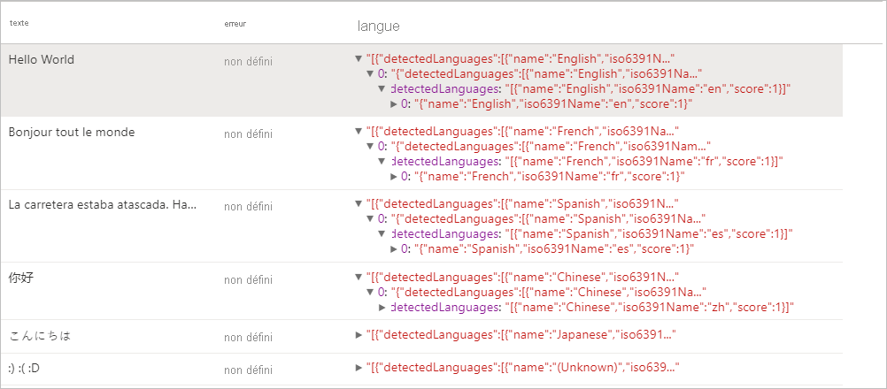
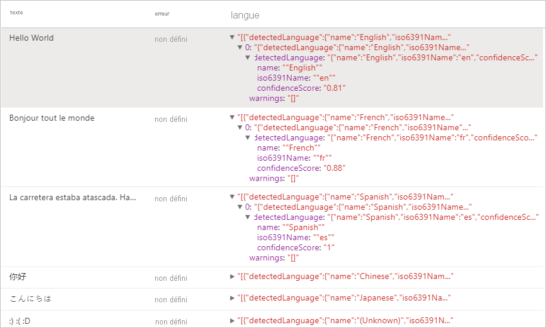
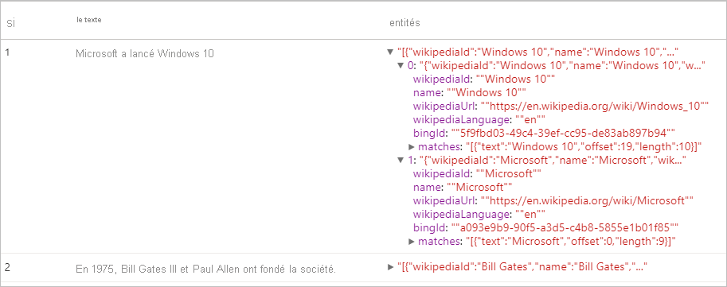
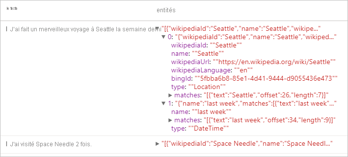
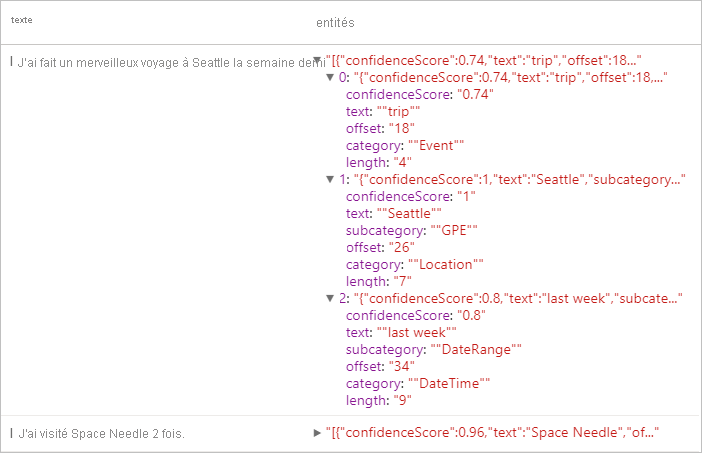
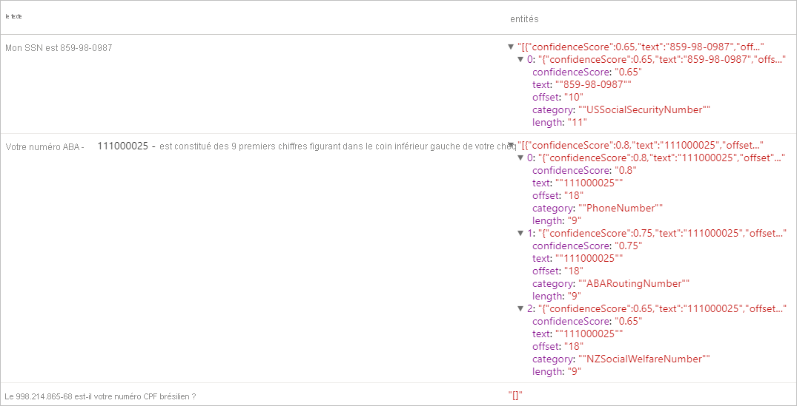

# <a name="tutorial-text-analytics-with-cognitive-service"></a>Didacticiel : Analyse de texte avec Cognitive Service

[Analyse de texte](../../cognitive-services/text-analytics/index.yml) est un [service Azure Cognitive Services](../../cognitive-services/index.yml) qui vous permet de réaliser des opérations d’exploration de texte et d’analyse de texte avec des fonctionnalités de traitement en langage naturel (NLP). Dans ce tutoriel, vous apprendrez à utiliser l’[analyse de texte](../../cognitive-services/text-analytics/index.yml) pour analyser du texte non structuré sur Azure Synapse Analytics.

Ce tutoriel montre comment utiliser l’analyse de texte avec [SynapseML](https://github.com/microsoft/SynapseML) pour :

> [!div class="checklist"]
> - Détecter les étiquettes de sentiment au niveau de la phrase ou du document
> - Identifier la langue pour une entrée de texte donnée
> - Reconnaître les entités d’un texte avec des liens vers une base de connaissances connue
> - Extraire les phases clés d’un texte
> - Identifier des entités différentes dans le texte et les classer dans des classes ou des types prédéfinis
> - Identifier et éditer des entités sensibles dans un texte donné

Si vous n’avez pas d’abonnement Azure, [créez un compte gratuit avant de commencer](https://azure.microsoft.com/free/).

## <a name="prerequisites"></a>Prérequis

- [Espace de travail Azure Synapse Analytics](../get-started-create-workspace.md) avec un compte de stockage Azure Data Lake Storage Gen2 configuré comme stockage par défaut. Vous devez être le *contributeur aux données Blob du stockage* du système de fichiers Data Lake Storage Gen2 que vous utilisez.
- Pool Spark dans votre espace de travail Azure Synapse Analytics. Pour plus d’informations, consultez [Créer un pool Spark dans Azure Synapse](../quickstart-create-sql-pool-studio.md).
- Avoir effectué les étapes de pré-configuration décrites dans le tutoriel [Configurer Cognitive Services dans Azure Synapse](tutorial-configure-cognitive-services-synapse.md).


## <a name="get-started"></a>Bien démarrer
Ouvrez Synapse Studio et créez un nouveau notebook. Pour commencer, importez [SynapseML](https://github.com/microsoft/SynapseML). 

```python
import synapse.ml
from synapse.ml.cognitive import *
from pyspark.sql.functions import col
```

## <a name="configure-text-analytics"></a>Configurer l’analyse de texte

Utilisez l’analyse de texte liée que vous avez configurée dans les [étapes de préconfiguration](tutorial-configure-cognitive-services-synapse.md). 

```python
cognitive_service_name = "<Your linked service for text analytics>"
```

## <a name="text-sentiment"></a>Sentiment du texte
Avec l’analyse textuelle des sentiments, vous pouvez obtenir des étiquettes de sentiment (telles que « négatif », « neutre » et « positif ») et des scores de confiance au niveau de la phrase et du document. Consultez les [langues prises en charge dans l’API Analyse de texte](../../cognitive-services/text-analytics/language-support.md?tabs=sentiment-analysis) pour obtenir la liste des langues activés.

### <a name="v2"></a>V2

```python

# Create a dataframe that's tied to it's column names
df = spark.createDataFrame([
  ("I am so happy today, its sunny!", "en-US"),
  ("I am frustrated by this rush hour traffic", "en-US"),
  ("The cognitive services on spark aint bad", "en-US"),
], ["text", "language"])

# Run the Text Analytics service with options
sentimentv2 = (TextSentimentV2()
    .setLinkedService(linked_service_name)
    .setTextCol("text")
    .setOutputCol("sentiment")
    .setErrorCol("error")
    .setLanguageCol("language"))

# Show the results of your text query in a table format
display(sentimentv2.transform(df).select("text", col("sentiment")[0].getItem("score").alias("positive score")))

```
### <a name="expected-results"></a>Résultats attendus

|texte|score positif|
|---|---|
|I am so happy today, its sunny! (Je suis trop content aujourd’hui, il fait beau !)|0.99511755|
|I am frustrated by this rush hour traffic (Cette circulation aux heures de pointe m’agace)|0.007274598|
|The cognitive services on spark aint bad (Les services Cognitive Services sur Spark ne sont pas mal)|0.9144157|

### <a name="v31"></a>V3.1

```python

# Create a dataframe that's tied to it's column names
df = spark.createDataFrame([
  ("I am so happy today, its sunny!", "en-US"),
  ("I am frustrated by this rush hour traffic", "en-US"),
  ("The cognitive services on spark aint bad", "en-US"),
], ["text", "language"])

# Run the Text Analytics service with options
sentiment = (TextSentiment()
    .setLinkedService(linked_service_name)
    .setTextCol("text")
    .setOutputCol("sentiment")
    .setErrorCol("error")
    .setLanguageCol("language"))

# Show the results of your text query in a table format
display(sentiment.transform(df).select("text", col("sentiment")[0].getItem("sentiment").alias("sentiment")))

```
### <a name="expected-results"></a>Résultats attendus

|texte|sentiment|
|---|---|
|I am so happy today, its sunny! (Je suis trop content aujourd’hui, il fait beau !)|positif|
|I am frustrated by this rush hour traffic (Cette circulation aux heures de pointe m’agace)|négatif|
|The cognitive services on spark aint bad (Les services Cognitive Services sur Spark ne sont pas mal)|positif|

---

## <a name="language-detector"></a>Détecteur de langage

Le Détecteur de langage évalue l’entrée de texte pour chaque document de texte et retourne les identificateurs de langage avec un score qui indique la puissance de l’analyse. Cette capacité est utile pour les magasins de contenu qui collectent du texte arbitraire dont la langue est inconnue. Consultez les [langues prises en charge dans l’API Analyse de texte](../../cognitive-services/text-analytics/language-support.md?tabs=language-detection) pour obtenir la liste des langages activés.

### <a name="v2"></a>V2
```python
# Create a dataframe that's tied to it's column names
df = spark.createDataFrame([
  ("Hello World",),
  ("Bonjour tout le monde",),
  ("La carretera estaba atascada. Había mucho tráfico el día de ayer.",),
  ("你好",),
  ("こんにちは",),
  (":) :( :D",)
], ["text",])

# Run the Text Analytics service with options
languagev2 = (LanguageDetectorV2()
    .setLinkedService(linked_service_name)
    .setTextCol("text")
    .setOutputCol("language")
    .setErrorCol("error"))

# Show the results of your text query in a table format
display(languagev2.transform(df))
```
### <a name="expected-results"></a>Résultats attendus


### <a name="v31"></a>V3.1
```python
# Create a dataframe that's tied to it's column names
df = spark.createDataFrame([
  ("Hello World",),
  ("Bonjour tout le monde",),
  ("La carretera estaba atascada. Había mucho tráfico el día de ayer.",),
  ("你好",),
  ("こんにちは",),
  (":) :( :D",)
], ["text",])

# Run the Text Analytics service with options
language = (LanguageDetector()
    .setLinkedService(linked_service_name)
    .setTextCol("text")
    .setOutputCol("language")
    .setErrorCol("error"))

# Show the results of your text query in a table format
display(language.transform(df))
```
### <a name="expected-results"></a>Résultats attendus
<a name="expected-results-for-language-detector-v31"></a>
---

## <a name="entity-detector"></a>Détecteur d’entité
Le Détecteur d’entité retourne une liste d’entités reconnues avec des liens vers une base de connaissances connue. Consultez les [langues prises en charge dans l’API Analyse de texte](../../cognitive-services/text-analytics/language-support.md?tabs=entity-linking) pour obtenir la liste des langages activés.

### <a name="v2"></a>V2

```python
df = spark.createDataFrame([
    ("1", "Microsoft released Windows 10"),
    ("2", "In 1975, Bill Gates III and Paul Allen founded the company.")
], ["if", "text"])

entityv2 = (EntityDetectorV2()
    .setLinkedService(linked_service_name)
    .setLanguage("en")
    .setOutputCol("replies")
    .setErrorCol("error"))

display(entityv2.transform(df).select("if", "text", col("replies")[0].getItem("entities").alias("entities")))
```
### <a name="expected-results"></a>Résultats attendus



### <a name="v31"></a>V3.1

```python
df = spark.createDataFrame([
    ("1", "Microsoft released Windows 10"),
    ("2", "In 1975, Bill Gates III and Paul Allen founded the company.")
], ["if", "text"])

entity = (EntityDetector()
    .setLinkedService(linked_service_name)
    .setLanguage("en")
    .setOutputCol("replies")
    .setErrorCol("error"))

display(entity.transform(df).select("if", "text", col("replies")[0].getItem("entities").alias("entities")))
```
### <a name="expected-results"></a>Résultats attendus


---

## <a name="key-phrase-extractor"></a>Extraction de phrases clés

L’Extraction de phrases clés évalue un texte non structuré et retourne une liste de phrases clés. Cette fonctionnalité est utile si vous avez besoin d’identifier rapidement les principaux points d’une collection de documents. Consultez les [langues prises en charge dans l’API Analyse de texte](../../cognitive-services/text-analytics/language-support.md?tabs=key-phrase-extraction) pour obtenir la liste des langages activés.

### <a name="v2"></a>V2
```python
df = spark.createDataFrame([
    ("en", "Hello world. This is some input text that I love."),
    ("fr", "Bonjour tout le monde"),
    ("es", "La carretera estaba atascada. Había mucho tráfico el día de ayer.")
], ["lang", "text"])

keyPhrasesv2 = (KeyPhraseExtractorV2()
    .setLinkedService(linked_service_name)
    .setLanguageCol("lang")
    .setOutputCol("replies")
    .setErrorCol("error"))

display(keyPhrasesv2.transform(df).select("text", col("replies")[0].getItem("keyPhrases").alias("keyPhrases")))
```

### <a name="expected-results"></a>Résultats attendus

|texte|keyPhrases|
|---|---|
|Hello World. Il s’agit d’un texte d’entrée que j’aime.|"["input text","world"]"|
|Bonjour tout le monde|"["monde"]"|
|La carretera estaba atascada. Había mucho tráfico el día de ayer.|"["carretera","tráfico","día"]"|


### <a name="v31"></a>V3.1

```python
df = spark.createDataFrame([
    ("en", "Hello world. This is some input text that I love."),
    ("fr", "Bonjour tout le monde"),
    ("es", "La carretera estaba atascada. Había mucho tráfico el día de ayer.")
], ["lang", "text"])

keyPhrase = (KeyPhraseExtractor()
    .setLinkedService(linked_service_name)
    .setLanguageCol("lang")
    .setOutputCol("replies")
    .setErrorCol("error"))

display(keyPhrase.transform(df).select("text", col("replies")[0].getItem("keyPhrases").alias("keyPhrases")))
```

### <a name="expected-results"></a>Résultats attendus

|texte|keyPhrases|
|---|---|
|Hello World. Il s’agit d’un texte d’entrée que j’aime.|"["Hello world","input text"]"|
|Bonjour tout le monde|"["Bonjour","monde"]"|
|La carretera estaba atascada. Había mucho tráfico el día de ayer.|"["mucho tráfico","día","carretera","ayer"]"|

---

## <a name="named-entity-recognition-ner"></a>Reconnaissance d’entité nommée (NER)

La reconnaissance d’entité nommée (NER) est la capacité d’identifier différentes entités dans du texte et de les catégoriser en classes ou types prédéfinis tels que : personne, lieu, événement, produit et organisation. Consultez les [langues prises en charge dans l’API Analyse de texte](../../cognitive-services/text-analytics/language-support.md?tabs=named-entity-recognition) pour obtenir la liste des langages activés.

### <a name="v2"></a>V2
```python
df = spark.createDataFrame([
    ("1", "en", "I had a wonderful trip to Seattle last week."),
    ("2", "en", "I visited Space Needle 2 times.")
], ["id", "language", "text"])

nerv2 = (NERV2()
    .setLinkedService(linked_service_name)
    .setLanguageCol("language")
    .setOutputCol("replies")
    .setErrorCol("error"))

display(nerv2.transform(df).select("text", col("replies")[0].getItem("entities").alias("entities")))
```
### <a name="expected-results"></a>Résultats attendus


### <a name="v31"></a>V3.1

```python
df = spark.createDataFrame([
    ("1", "en", "I had a wonderful trip to Seattle last week."),
    ("2", "en", "I visited Space Needle 2 times.")
], ["id", "language", "text"])

ner = (NER()
    .setLinkedService(linked_service_name)
    .setLanguageCol("language")
    .setOutputCol("replies")
    .setErrorCol("error"))

display(ner.transform(df).select("text", col("replies")[0].getItem("entities").alias("entities")))
```
### <a name="expected-results"></a>Résultats attendus


---

## <a name="personally-identifiable-information-pii-v31"></a>Informations d’identification personnelle (PII) v3.1
La fonctionnalité PII fait partie de la reconnaissance d’entité nommée et peut identifier et éditer des entités sensibles dans du texte qui sont associées à un individu comme les suivantes : numéro de téléphone, adresse e-mail, adresse postale, numéro de passeport. Consultez les [langues prises en charge dans l’API Analyse de texte](../../cognitive-services/text-analytics/language-support.md?tabs=pii) pour obtenir la liste des langages activés.

### <a name="v31"></a>V3.1

```python
df = spark.createDataFrame([
    ("1", "en", "My SSN is 859-98-0987"),
    ("2", "en", "Your ABA number - 111000025 - is the first 9 digits in the lower left hand corner of your personal check."),
    ("3", "en", "Is 998.214.865-68 your Brazilian CPF number?")
], ["id", "language", "text"])

pii = (PII()
    .setLinkedService(linked_service_name)
    .setLanguageCol("language")
    .setOutputCol("replies")
    .setErrorCol("error"))

display(pii.transform(df).select("text", col("replies")[0].getItem("entities").alias("entities")))
```
### <a name="expected-results"></a>Résultats attendus


---

## <a name="clean-up-resources"></a>Nettoyer les ressources
Pour vous assurer que l’instance Spark est arrêtée, mettez fin aux sessions connectées (notebooks). Le pool s’arrête quand la **durée d’inactivité** spécifiée dans le pool Apache Spark est atteinte. Vous pouvez également sélectionner **Arrêter la session** dans la barre d’état en haut à droite du notebook.


## <a name="next-steps"></a>Étapes suivantes

* [Consultez les exemples de notebooks Synapse](https://github.com/Azure-Samples/Synapse/tree/main/MachineLearning) 
* [Dépôt GitHub SynapseML](https://github.com/microsoft/SynapseML)
