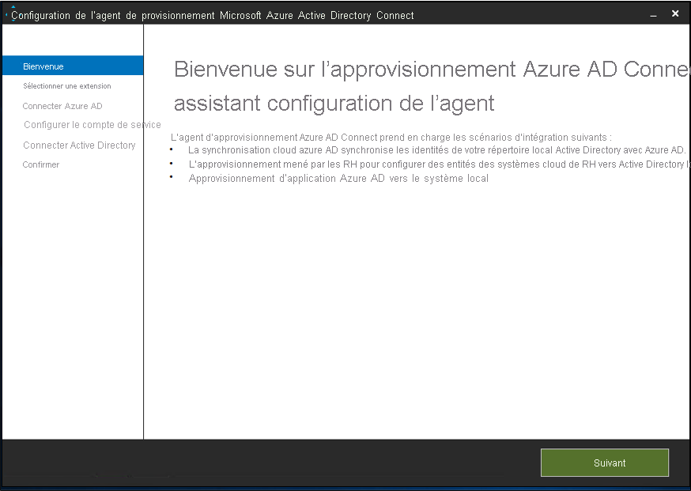

Ce document décrit les étapes à effectuer pour attribuer et désattribuer automatiquement des utilisateurs d’Azure Active Directory (Azure AD) dans un répertoire LDAP. Le document se concentre sur AD LDS, mais vous pouvez approvisionner l’un des répertoires LDAP pris en charge mentionnés ci-dessous. La configuration d’utilisateurs dans Active Directory Domain Services via cette solution n’est pas prise en charge. 
 
Pour découvrir les informations importantes sur ce que fait ce service, comment il fonctionne et consulter le forum aux questions, reportez-vous à l’article [Automatiser l’attribution et l’annulation de l’attribution des utilisateurs dans les applications SaaS avec Azure Active Directory](../articles/active-directory/app-provisioning/user-provisioning.md).

## <a name="prerequisites-for-provisioning-users-into-an-ldap-directory"></a>Conditions préalables pour l’approvisionnement d’utilisateurs dans un répertoire LDAP

>[!IMPORTANT]
> Actuellement, la préversion du provisionnement local n’est disponible que sur invitation. Pour demander l’accès à la fonctionnalité, utilisez le [formulaire de demande d’accès](https://aka.ms/onpremprovisioningpublicpreviewaccess). Nous allons ouvrir la préversion à un plus grand nombre de clients et de connecteurs au cours des prochains mois, car nous préparons la disponibilité générale. La configuration d’utilisateurs dans Active Directory Domain Services n’est pas prise en charge dans cette préversion. 


### <a name="on-premises-prerequisites"></a>Conditions préalables locales

 - Système cible, tel que Active Directory Lightweight Services (AD LDS), dans lequel les utilisateurs peuvent être créés, mis à jour et supprimés. Cette instance AD LDS ne doit pas être utilisée pour approvisionner des utilisateurs dans Azure AD, car elle peut créer une boucle avec Azure AD Connect. 
 - Ordinateur Windows Server 2016 ou version ultérieure disposant d’une adresse TCP/IP accessible via Internet, d’une connectivité au système cible et d’une connectivité sortante vers login.microsoftonline.com. Par exemple, une machine virtuelle Windows Server 2016 hébergée dans Azure IaaS ou derrière un proxy. Le serveur doit disposer d’au moins 3 Go de RAM.
 - Ordinateur avec .NET Framework 4.7.1.
 - Facultatif : bien que cela ne soit pas obligatoire, il est recommandé de télécharger [Microsoft Edge pour Windows Server](https://www.microsoft.com/en-us/edge?r=1) et de l’utiliser sur le site d’Internet Explorer.

Selon les options que vous sélectionnez, certains écrans de l’Assistant peuvent ne pas être disponibles et les informations peuvent être légèrement différentes. Pour les besoins de cette configuration, le type d’objet utilisé est « utilisateur ». Utilisez les informations ci-dessous pour vous guider dans votre configuration. 

#### <a name="supported-systems"></a>Systèmes pris en charge
* OpenLDAP
* Microsoft Active Directory Lightweight Directory Services
* Serveur d’annuaire 389
* Apache Directory Server
* IBM Tivoli DS
* Isode Directory
* NetIQ eDirectory
* Novell eDirectory
* Open DJ
* Open DS
* Open LDAP (openldap.org)
* Oracle (précédemment Sun) Directory Server Enterprise Edition
* RadiantOne Virtual Directory Server (VDS)
* Sun One Directory Server


### <a name="cloud-requirements"></a>Conditions préalables requises du cloud

 - Locataire Azure AD avec Azure AD Premium P1 ou Premium P2 (ou EMS E3 ou E5). 
 
    [!INCLUDE [active-directory-p1-license.md](active-directory-p1-license.md)]
 - Rôle Administrateur hybride pour la configuration de l’agent d’approvisionnement et rôles Administrateur d’application ou Administrateur cloud pour la configuration de l’approvisionnement dans le Portail Azure.

### <a name="more-recommendations-and-limitations"></a>Plus de recommandations et restrictions
Les points suivants sont des recommandations et des restrictions supplémentaires.
- Il n’est pas recommandé d’utiliser le même agent pour la synchronisation cloud et l’approvisionnement des applications locales.  Microsoft recommande d’utiliser un agent distinct pour la synchronisation du cloud et un autre pour l’approvisionnement des applications locales.
- Actuellement, pour les AD LDS, les utilisateurs ne peuvent pas être approvisionnés avec des mots de passe.  Par conséquent, vous devez désactiver la stratégie de mot de passe pour AD LDS ou approvisionner les utilisateurs dans un état désactivé.
- Le provisionnement d’utilisateurs à partir de Azure Active Directory vers Active Directory domaines Services n’est pas pris en charge.
- L’approvisionnement des utilisateurs de LDAP vers Azure AD n’est pas pris en charge.

## <a name="prepare-the-ldap-directory"></a>Préparer l’annuaire LDAP
Les informations suivantes sont fournies pour vous aider à créer un environnement de test AD LDS.  Ce programme d’installation utilise PowerShell et ADAMInstall.exe avec un fichier de réponses.  Ce document ne traite pas des informations détaillées sur AD LDS.  Pour plus d’informations, consultez [Active Directory Lightweight Directory Services](/previous-versions/windows/it-pro/windows-server-2012-r2-and-2012/hh831593(v=ws.11)). 

Si vous disposez déjà d’une configuration AD LDS dans un environnement de test, vous pouvez ignorer les sections suivantes et passer à la section Installation du connecteur hôte ECMA.

### <a name="create-an-ssl-certificate-a-test-directory-and-install-ad-lds"></a>Créez un certificat SSL, un répertoire de test et installez AD LDS.
Utilisez le script PowerShell de l’[Annexe A](#appendix-a---install-ad-lds-powershell-script). Le script effectue les actions suivantes :
  - Crée un certificat auto-signé qui sera utilisé par le connecteur LDAP
  - Crée un répertoire pour le journal d’installation des fonctionnalités
  - Exporte le certificat dans le magasin personnel vers le répertoire
  - Importe le certificat à la racine de confiance de l’ordinateur local
  - Installe le rôle AD LDS sur notre machine virtuelle 

Sur la machine virtuelle Windows Server que vous utilisez pour tester le connecteur LDAP, exécutez le script à l’aide de Windows PowerShell avec des privilèges d’administrateur.  

### <a name="create-an-instance-of-ad-lds"></a>Créer une instance de AD LDS
Maintenant que le rôle a été installé, vous devez créer une instance de AD LDS.  Pour créer une instance, vous pouvez utiliser le fichier de réponses fourni ci-dessous.  Ce fichier va installer l’instance en mode silencieux sans utiliser l’interface utilisateur.

Copiez le contenu de l’[Annexe B](#appendix-b---answer-file) dans le bloc-notes et enregistrez-le en tant que **answer.txt** dans **« C:\Windows\ADAM »** .

Ouvrez une invite de commandes avec des privilèges d’administrateur, puis exécutez la commande suivante :

```
C:\Windows\ADAM> ADAMInstall.exe /answer:answer.txt
```

### <a name="create-containers-and-a-service-account-for-ad-lds"></a>Créer des conteneurs et un compte de service pour AD LDS.
Utilisez le script PowerShell de l’[Annexe C](#appendix-c---populate-ad-lds-powershell-script). Le script effectue les actions suivantes :
  - Crée un conteneur pour le compte de service qui sera utilisé avec le connecteur LDAP
  - Crée un conteneur pour les utilisateurs du cloud.  Ce conteneur est l’emplacement où les utilisateurs seront approvisionnés.
  - Crée le compte de service dans AD LDS
  - Ajoute le compte de service
  - Ajoute le compte de service au rôle Administrateurs AD LDS

Sur la machine virtuelle Windows Server que vous utilisez pour tester le connecteur LDAP, exécutez le script à l’aide de Windows PowerShell avec des privilèges d’administrateur.  

## <a name="grant-the-network-service-read-permissions-to-the-ssl-cert"></a>Accorder des autorisations de lecture au SERVICE RÉSEAU sur le certificat SSL
Pour activer le protocole SSL, vous devez accorder au SERVICE RÉSEAU des autorisations de lecture sur le certificat que vous venez de créer.  Pour accorder des autorisations, procédez comme suit.

 1. Accédez à **C:\Program Data\Microsoft\Crypto\Keys**.
 2. Cliquez avec le bouton droit sur le fichier système situé dans ce dossier.  Il s’agit d’un GUID.  Ce conteneur stocke notre certificat.
    a. Sélectionner les propriétés.
    b. En haut, sélectionnez l’onglet **Sécurité**. Sélectionnez **Modifier**.
    d. Cliquez sur **Add**.
    e. Dans la zone, entrez **Service réseau** et sélectionnez **Vérifier les noms**.
    f. Sélectionnez **SERVICE RÉSEAU** dans la liste, puis cliquez sur **OK**.
    g. Cliquez sur **OK**.
    h. Vérifiez que le compte de service réseau dispose des autorisations de lecture et d’écriture, exécutez les autorisations, puis cliquez sur **Appliquer**, et sur **OK**.

## <a name="verify-ssl-connectivity-with-ad-lds"></a>Vérifier la connectivité SSL avec AD LDS
Maintenant que nous avons configuré le certificat et accordé les autorisations du compte de service réseau, testez la connectivité pour vérifier qu’elle fonctionne.
 1. Ouvrez le Gestionnaire de serveur et sélectionnez AD LDS à gauche
 2. Cliquez avec le bouton droit sur votre instance AD LDS et sélectionnez ldp.exe dans la fenêtre contextuelle.
   [](media/active-directory-app-provisioning-ldap/ldp-1.png#lightbox)</br>
 3. En haut de ldp.exe, sélectionnez **Connexion** et **Se connecter**.
 4. Entrez les informations suivantes et cliquez sur **OK**.
    - Serveur : APP3
    - Port : 636
    - Activez la case à cocher SSL [</br>
 5.  Vous devez voir une réponse similaire à celle de la capture d’écran ci-dessous.
   ](media/active-directory-app-provisioning-ldap/ldp-3.png#lightbox)</br>
 6.  En haut, sous **Connexion**, sélectionnez **Lier**.
 7. Acceptez les valeurs par défaut et cliquez sur **OK**.
   [](media/active-directory-app-provisioning-ldap/ldp-4.png#lightbox)</br>
 8. Vous devez maintenant établir une liaison réussie avec l’instance.
   [](media/active-directory-app-provisioning-ldap/ldp-5.png#lightbox)</br>


## <a name="download-install-and-configure-the-azure-ad-connect-provisioning-agent-package"></a>Télécharger, installer et configurer le package de l’agent d’attribution Azure AD Connect

 1. Connectez-vous au portail Azure.
 2. Accédez à **Applications d’entreprise** > **Ajouter une application**.
 3. Recherchez l’application **ECMA locale** et ajoutez-la à votre locataire.
 4. Sélectionnez l’application **On-premises ECMA app** qui a été ajoutée.
 5. Sous **Démarrage**, dans la zone **3. Provisionner des comptes d’utilisateur**, sélectionnez **Bien démarrer**.
 6. En haut, dans la liste déroulante, remplacez l’approvisionnement par **automatique**.  Cette action permet d’afficher la **connectivité locale** ci-dessous.
 7. Sous **Connectivité locale**, téléchargez le programme d’installation de l’agent.
 8. Exécutez le programme d’installation d’approvisionnement Azure AD Connect **AADConnectProvisioningAgentSetup.msi**.
 9. Sur l’écran **Package Agent d’approvisionnement Microsoft Azure AD Connect**, acceptez les termes du contrat de licence et sélectionnez **Installer**.
     [](media/active-directory-app-provisioning-sql/install-1.png#lightbox)</br>
 10. Une fois cette opération terminée, l’Assistant Configuration démarre. Sélectionnez **Suivant**.
     [](media/active-directory-app-provisioning-sql/install-2.png#lightbox)</br>
 11. Sur l’écran **Sélectionner une extension**, sélectionnez **Approvisionnement d’applications locales (Azure AD à l’application)** . Sélectionnez **Suivant**.
     [](media/active-directory-app-provisioning-sql/install-3.png#lightbox)</br>
 12. Utilisez votre compte d’administrateur général pour vous connecter à Azure AD.
     [](media/active-directory-app-provisioning-sql/install-4.png#lightbox)</br>
 13. Sur l’écran **Agent configuration**, sélectionnez **Confirm**.
     [](media/active-directory-app-provisioning-sql/install-5.png#lightbox)</br>
 14. Une fois l’installation terminée, un message s’affiche au bas de l’Assistant. Sélectionnez **Quitter**.
     [](media/active-directory-app-provisioning-sql/install-6.png#lightbox)</br>
 15. Revenez au portail Azure sous l’application **On-premises ECMA app**, puis sous **Modifier le provisionnement**.
 16. Dans la page **Provisioning**, définissez le mode sur **Automatic**.
     [](.\media\active-directory-app-provisioning-sql\configure-7.png#lightbox)</br>
 17. Dans la section **Connectivité locale**, sélectionnez l’agent que vous venez de déployer, puis **Assigner un ou des agents**.
     [](.\media\active-directory-app-provisioning-ldap\assign-1.png#lightbox)</br>
     >[!NOTE]
     >Après avoir ajouté l’agent, patientez 10 minutes que l’inscription se termine. Le test de connectivité ne fonctionne pas tant que l’inscription n’est pas terminée.
     >
     >Vous pouvez également forcer l’inscription de l’agent en redémarrant l’agent de provisionnement sur votre serveur. Accédez à votre serveur, recherchez **services** dans la barre de recherche Windows, identifiez **Azure AD Connect Provisioning Agent Service**, cliquez avec le bouton droit sur le service, puis redémarrez.

 ## <a name="configure-the-azure-ad-ecma-connector-host-certificate"></a>Configurer le certificat de l’Hôte de connecteur ECMA Azure AD
 1. Sur le Bureau, sélectionnez le raccourci ECMA.
 2. Après le démarrage de la configuration de l’hôte du connecteur ECMA, conservez le port par défaut **8585** et sélectionnez **Generate** pour générer un certificat. Le certificat généré automatiquement est auto-signé dans le cadre de la racine de confiance. Le réseau SAN correspond au nom d’hôte.
     [](.\media\active-directory-app-provisioning-sql\configure-1.png#lightbox)
 3. Sélectionnez **Enregistrer**.


## <a name="configure-a-generic-ldap-connector"></a>Configurer un connecteur LDAP générique
 1. Sélectionnez le raccourci de l’hôte du connecteur ECMA sur le Bureau.
 2. Sélectionnez **Nouveau connecteur**.
     [](.\media\active-directory-app-provisioning-sql\sql-3.png#lightbox)</br>
 3. Dans la page **Properties**, renseignez les zones avec les valeurs spécifiées dans le tableau qui suit l’image, puis sélectionnez **Next**.
     [](.\media\active-directory-app-provisioning-ldap\create-1.png#lightbox)

     |Propriété|Valeur|
     |-----|-----|
     |Nom|LDAP|
     |Minuteur de synchronisation automatique (minutes)|120|
     |Jeton secret|Entrez votre propre clé ici. Elle doit comporter 12 caractères au minimum.|
     |Extension DLL|Pour un connecteur LDAP générique, sélectionnez **Microsoft.IAM.Connector.GenericLdap.dll**.|
4. Dans la page **Connectivity**, renseignez les zones avec les valeurs spécifiées dans le tableau qui suit l’image, puis sélectionnez **Next**.
     [](.\media\active-directory-app-provisioning-ldap\create-2.png#lightbox)</br>
     
     |Propriété|Value|
     |-----|-----|
     |Host|APP3|
     |Port|636|
     |Connection Timeout|180|
     |Liaison|SSL|
     |User Name|CN=svcAccount,CN=ServiceAccounts,CN=App,DC=contoso,DC=lab|
     |Mot de passe|Mot de passe du nom d’utilisateur spécifié|

     >[!NOTE]
     >Si vous rencontrez un problème et que vous essayez de vous connecter, assurez-vous que le compte de service dans AD LDS est activé. 
     
 5. Sur la page **Global**, sélectionnez **Suivant**.
 6. Dans la page **Partitions** , conservez la valeur par défaut, puis sélectionnez **Suivant**.
 7. Dans la page **Run Profiles**, laissez la case **Export** cochée. Cochez la case **Full import** et sélectionnez **Next**.
     [](.\media\active-directory-app-provisioning-ldap\create-3.png#lightbox)</br>
     
     |Propriété|Description|
     |-----|-----|
     |Exporter|Profil d’exécution qui exportera les données vers SQL. Ce profil d’exécution est obligatoire.|
     |Importation intégrale|Profil d’exécution qui importera toutes les données des sources SQL spécifiées précédemment.|
     |Importation différentielle|Profil d’exécution qui importera uniquement les modifications apportées aux sources SQL depuis la dernière importation complète ou différentielle.|
 12. Dans la page **Exporter** , laissez les valeurs par défaut et cliquez sur **Suivant**. 
 13. Dans la page **Importation complète**, laissez les valeurs par défaut et cliquez sur **Suivant**. 
 14. Dans la page **Object Types**, renseignez les zones et sélectionnez **Next**. Utilisez le tableau qui suit l’image pour obtenir des conseils concernant les différentes zones à renseigner.
      - **Objet cible** : cet objet est l’objet cible dans l’annuaire LDAP.
      - **Anchor** : cet attribut doit être unique dans le système cible. Le service de provisionnement Azure AD interrogera l’hôte ECMA à l’aide de cet attribut après le cycle initial. Cette valeur d’ancre doit être la même que celle du schéma 3.
      - **Query Attribute** : utilisé par l’hôte ECMA pour interroger le cache en mémoire. Cet attribut doit être unique.
      - **DN** : nom unique de l’objet cible.
     [](.\media\active-directory-app-provisioning-ldap\create-4.png#lightbox)</br>
     
     |Propriété|Description|
     |-----|-----|
     |Objet cible|Utilisateur|
     |Ancre|objectGUID|
     |Query Attribute|_distingusishedName|
     |DN|dn|
     |Généré automatiquement|unchecked|      
 15. L’hôte ECMA découvre les attributs pris en charge par le système cible. Parmi eux, vous pouvez choisir ceux que vous souhaitez exposer à Azure AD. Ces attributs peuvent alors être configurés dans le portail Azure pour le provisionnement. Dans la page **Sélectionner des attributs**, ajoutez tous les attributs dans la liste déroulante et sélectionnez **Suivant**.
     [](.\media\active-directory-app-provisioning-ldap\create-5.png#lightbox)</br>
      La liste déroulante **Attribute** affiche tout attribut qui a été découvert dans le système cible et qui *n’a pas* été choisi dans la page **Select Attributes** précédente. 
 
 16. Dans la page **Deprovisioning**, sous **Disable flow**, sélectionnez **Delete**. Les attributs sélectionnés sur la page précédente ne pourront pas être sélectionnés sur la page Suppression les privilèges d’accès. Sélectionnez **Terminer**.

## <a name="ensure-ecma2host-service-is-running"></a>Vérifier que le service ECMA2Host est en cours d’exécution
 1. Sur le serveur sur lequel s’exécute l’hôte du connecteur ECMA Azure AD, sélectionnez **Démarrer**.
 2. Entrez **run** et tapez **services.msc** dans la zone.
 3. Dans la liste **Services**, vérifiez que **Microsoft ECMA2Host** est présent et en cours d’exécution. Si ce n’est pas le cas, sélectionnez **Démarrer**.
     [](.\media\active-directory-app-provisioning-sql\configure-2.png#lightbox)


## <a name="test-the-application-connection"></a>Tester la connexion de l’application
 1. Connectez-vous au portail Azure.
 2. Accédez à **Applications d’entreprise**, puis à l’application **On-premises ECMA app**.
 3. Accédez à **Modifier le provisionnement**.
 4. Après 10 minutes, dans la section **Admin credentials**, entrez l’URL suivante. Remplacez la partie `connectorName` par le nom du connecteur sur l’hôte ECMA. Vous pouvez également remplacer `localhost` par le nom d’hôte.

    |Propriété|Valeur|
    |-----|-----|
    |URL de locataire|https://localhost:8585/ecma2host_connectorName/scim|
 
 5. Entrez la valeur **Secret Token** que vous avez définie lors de la création du connecteur.
 6. Sélectionnez **Test Connection** et patientez une minute.
     [](.\media\active-directory-app-provisioning-ldap\test-1.png#lightbox)
 7. Une fois le test de connexion réussi, sélectionnez **Save**.</br>
     [](.\media\active-directory-app-provisioning-sql\configure-9.png#lightbox)
## <a name="assign-users-to-an-application"></a>Affecter des utilisateurs à une application
Maintenant que l’hôte du connecteur ECMA Azure AD est capable de communiquer avec Azure AD, vous pouvez passer à la configuration de l’étendue du provisionnement. 

 1. Dans le portail Azure, sélectionnez **Applications d’entreprise**.
 2. Sélectionnez l’application **Provisionnement local**.
 3. À gauche, sous **Gérer**, sélectionnez **Utilisateurs et groupes**.
 4. Sélectionner **Ajouter un utilisateur/groupe**.
     [](.\media\active-directory-app-provisioning-sql\app-2.png#lightbox)
5. Sous **Utilisateurs**, sélectionnez **Aucun sélectionné**.
     [](.\media\active-directory-app-provisioning-sql\app-3.png#lightbox)
 6. Sélectionnez des utilisateurs à droite, puis cliquez sur le bouton **Sélectionner**.</br>
     [](.\media\active-directory-app-provisioning-sql\app-4.png#lightbox)
 7. Sélectionnez **Affecter**.
     [](.\media\active-directory-app-provisioning-sql\app-5.png#lightbox)


#### <a name="configure-attribute-mapping"></a>Configurer le mappage d’attributs
 1. Dans le portail Azure AD, sous **Applications d’entreprise**, sélectionnez la page **Provisionnement**.
 2. Sélectionnez **Prise en main**.
 3. Développez **Mappages** et sélectionnez **Provisionner les utilisateurs Azure Active Directory**.
 4. Sélectionnez **Ajouter un mappage**.
 5. Spécifiez les attributs source et cible, puis ajoutez tous les mappages indiqués dans le tableau suivant.

     |Type de mappage|Attribut source|Attribut cible|
     |-----|-----|-----|
     |Direct|userPrincipalName|urn:ietf:params:scim:schemas:extension:ECMA2Host:2.0:User:userPrincipalName|
     |Expression|Join("", "CN=", Word([userPrincipalName], 1, "@"), ",CN=CloudUsers,CN=App,DC=Contoso,DC=lab")|urn:ietf:params:scim:schemas:extension:ECMA2Host:2.0:User:-dn-|
     |Direct|isSoftDeleted|urn:ietf:params:scim:schemas:extension:ECMA2Host:2.0:User:msDS-UserAccountDisabled|
     |Direct|displayName|urn:ietf:params:scim:schemas:extension:ECMA2Host:2.0:User:displayName|
     |Direct|objectId|urn:ietf:params:scim:schemas:extension:ECMA2Host:2.0:User:objectGUID|
  
     [](.\media\active-directory-app-provisioning-ldap\map-1.png#lightbox)
 
 6. Sélectionnez **Enregistrer**.

## <a name="disable-the-local-password-policy"></a>Désactiver la stratégie de mot de passe local
Actuellement, le connecteur LDAP approvisionne les utilisateurs avec un mot de passe vide.  Cette configuration ne répond pas à la stratégie de mot de passe locale sur notre serveur. Nous allons donc la désactiver à des fins de test.  Pour désactiver la complexité du mot de passe, procédez comme suit.

>[!IMPORTANT]
>Étant donné que la synchronisation de mot de passe en cours n’est pas une fonctionnalité de l’approvisionnement LDAP local, Microsoft recommande que AD LDS soit utilisé spécifiquement avec les applications fédérées, lorsqu’il est utilisé conjointement avec AD DS ou lors de la mise à jour d’utilisateurs existants dans une instance de AD LDS.
 
 1. Sur le serveur, cliquez sur **Démarrer**, sur **Exécuter**, puis sur **gpedit.msc**
 2. Dans l’**Éditeur de stratégie de groupe locale**, accédez à Configuration de l’ordinateur > Paramètres Windows > Paramètres de sécurité > Stratégies de comptes > Stratégie de mot de passe
 3. Sur la droite, double-cliquez sur **Le mot de passe doit respecter des exigences de complexité**, puis sélectionnez **Désactivé**.
  [](.\media\active-directory-app-provisioning-ldap\local-1.png#lightbox)</br>
 5. Cliquez sur **Applique** r, puis sur **OK**
 6. Ouvrez l’éditeur de stratégie de groupe locale
 
## <a name="test-provisioning"></a>Tester le provisionnement
Maintenant que vos attributs sont mappés, vous pouvez tester le provisionnement à la demande avec l’un de vos utilisateurs.
 
 1. Dans le portail Azure, sélectionnez **Applications d’entreprise**.
 2. Sélectionnez l’application **Provisionnement local**.
 3. Sur la gauche, sélectionnez **Provisionnement**.
 4. Sélectionnez **Approvisionner à la demande**.
 5. Recherchez l’un de vos utilisateurs de test, puis sélectionnez **Provisionner**.
 [](.\media\active-directory-app-provisioning-ldap\test-2.png#lightbox)</br>

## <a name="start-provisioning-users"></a>Démarrer le provisionnement des utilisateurs
 1. Une fois le provisionnement à la demande réussi, revenez à la page de configuration du provisionnement. Vérifiez que l’étendue est définie sur les seuls utilisateurs et groupes affectés, **activez** le provisionnement, puis sélectionnez **Enregistrer**.
 
 2. Attendez que le provisionnement démarre. Cela peut prendre jusqu’à 40 minutes. Une fois le travail de provisionnement terminé, comme décrit dans la section suivante, vous pouvez modifier l’état du provisionnement en **Désactivé** et sélectionner **Enregistrer**. Cette action empêche que le service de provisionnement s’exécute à l’avenir.

## <a name="check-that-users-were-successfully-provisioned"></a>Vérifier que les utilisateurs ont été correctement provisionnés
Après avoir attendu, vérifiez AD LDS pour vous assurer que les utilisateurs sont en cours de provisionnement.

 1. Ouvrez le Gestionnaire de serveur et sélectionnez AD LDS à gauche
 2. Cliquez avec le bouton droit sur votre instance AD LDS et sélectionnez ldp.exe dans la fenêtre contextuelle.
   [](media/active-directory-app-provisioning-ldap/ldp-1.png#lightbox)</br>
 3. En haut de ldp.exe, sélectionnez **Connexion** et **Se connecter**.
 4. Entrez les informations suivantes et cliquez sur **OK**.
   - Serveur : APP3
   - Port : 636
   - Activez la case à cocher SSL [](media/active-directory-app-provisioning-ldap/ldp-2.png#lightbox)</br>
 5. En haut, sous **Connexion**, sélectionnez **Lier**.
 6. Acceptez les valeurs par défaut et cliquez sur **OK**.
 7. En haut, sélectionnez **Affichage** et **Arborescence**
 8. Pour BaseDN, entrez **CN=App,DC=contoso,DC=lab** puis cliquez sur **OK**.
 9. Sur la gauche, développez le DN, puis cliquez sur **CN=CloudUsers,CN=App,DC=contoso,DC=lab**.  Vous devez voir vos utilisateurs cloud.
  [](media/active-directory-app-provisioning-ldap/test-3.png#lightbox)</br>

## <a name="appendix-a---install-ad-lds-powershell-script"></a>Annexe A : Installer le script AD LDS PowerShell
Script PowerShell pour automatiser l’installation de Active Directory Lightweight Directory Services.


```powershell
# Filename:    1_SetupADLDS.ps1
# Description: Creates a certificate that will be used for SSL and installs Active Directory Lighetweight Directory Services.
#
# DISCLAIMER:
# Copyright (c) Microsoft Corporation. All rights reserved. This 
# script is made available to you without any express, implied or 
# statutory warranty, not even the implied warranty of 
# merchantability or fitness for a particular purpose, or the 
# warranty of title or non-infringement. The entire risk of the 
# use or the results from the use of this script remains with you.
#
#
#
#
#Declare variables
$DNSName = 'APP3'
$CertLocation = 'cert:\LocalMachine\MY'
$logpath = "c:\" 
$dirname = "test"
$dirtype = "directory"
$featureLogPath = "c:\test\featurelog.txt" 

#Create a new self-signed certificate
New-SelfSignedCertificate -DnsName $DNSName -CertStoreLocation $CertLocation

#Create directory
New-Item -Path $logpath -Name $dirname -ItemType $dirtype

#Export the certifcate from the local machine personal store
Get-ChildItem -Path cert:\LocalMachine\my | Export-Certificate -FilePath c:\test\allcerts.sst -Type SST

#Import the certificate in to the trusted root
Import-Certificate -FilePath "C:\test\allcerts.sst" -CertStoreLocation cert:\LocalMachine\Root


#Install AD LDS
start-job -Name addFeature -ScriptBlock { 
Add-WindowsFeature -Name "ADLDS" -IncludeAllSubFeature -IncludeManagementTools 
 } 
Wait-Job -Name addFeature 
Get-WindowsFeature | Where installed >>$featureLogPath


 ```

## <a name="appendix-b---answer-file"></a>Annexe B : Fichier de réponses
Ce fichier est utilisé pour automatiser et créer une instance de AD LDS.

>[!IMPORTANT]
> Ce script utilise l’administrateur local pour le compte de service AD LDS et son mot de passe est codé en dur dans les réponses.  Cette action est destinée à des fins de **test uniquement** et ne doit jamais être utilisée dans un environnement de production.

```
 [ADAMInstall]
 InstallType=Unique
 InstanceName=AD-APP-LDAP
 LocalLDAPPortToListenOn=51300
 LocalSSLPortToListenOn=51301
 NewApplicationPartitionToCreate=CN=App,DC=contoso,DC=lab
 DataFilesPath=C:\Program Files\Microsoft ADAM\AD-APP-LDAP\data
 LogFilesPath=C:\Program Files\Microsoft ADAM\AD-APP-LDAP\data
 ServiceAccount=APP3\Administrator
 ServicePassword=Pa$$Word1
 AddPermissionsToServiceAccount=Yes
 Administrator=APP3\Administrator
 ImportLDIFFiles="MS-User.LDF"
 SourceUserName=APP3\Administrator
 SourcePassword=Pa$$Word1
 ```
## <a name="appendix-c---populate-ad-lds-powershell-script"></a>Annexe C : Remplir AD LDS avec un script PowerShell
Script PowerShell pour remplir AD LDS avec des conteneurs et un compte de service.


```powershell
# Filename:    2_PopulateADLDS.ps1
# Description: Populates our AD LDS environment with 2 containers and a service account

# DISCLAIMER:
# Copyright (c) Microsoft Corporation. All rights reserved. This 
# script is made available to you without any express, implied or 
# statutory warranty, not even the implied warranty of 
# merchantability or fitness for a particular purpose, or the 
# warranty of title or non-infringement. The entire risk of the 
# use or the results from the use of this script remains with you.
#
#
#
#
# Create service accounts container
New-ADObject -Name "ServiceAccounts" -Type "container" -Path "CN=App,DC=contoso,DC=lab" -Server "APP3:389"
Write-Output "Creating ServiceAccounts container"

# Create cloud users container
New-ADObject -Name "CloudUsers" -Type "container" -Path "CN=App,DC=contoso,DC=lab" -Server "APP3:389"
Write-Output "Creating CloudUsers container"

# Create a new service account
New-ADUser -name "svcAccountLDAP" -accountpassword  (ConvertTo-SecureString -AsPlainText 'Pa$$1Word' -Force) -Displayname "LDAP Service Account" -server 'APP3:389' -path "CN=ServiceAccounts,CN=App,DC=contoso,DC=lab"
Write-Output "Creating service account"

# Enable the new service account
Enable-ADAccount -Identity "CN=svcAccountLDAP,CN=ServiceAccounts,CN=App,DC=contoso,DC=lab" -Server "APP3:389"
Write-Output "Enabling service account"

# Add the service account to the Administrators role
Get-ADGroup -Server "APP3:389" -SearchBase "CN=Administrators,CN=Roles,CN=App,DC=contoso,DC=lab" -Filter "name -like 'Administrators'" | Add-ADGroupMember -Members "CN=svcAccountLDAP,CN=ServiceAccounts,CN=App,DC=contoso,DC=lab"
Write-Output "Adding service accounnt to Administrators role"


 ```
